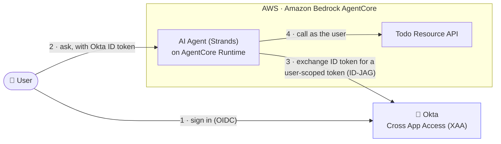
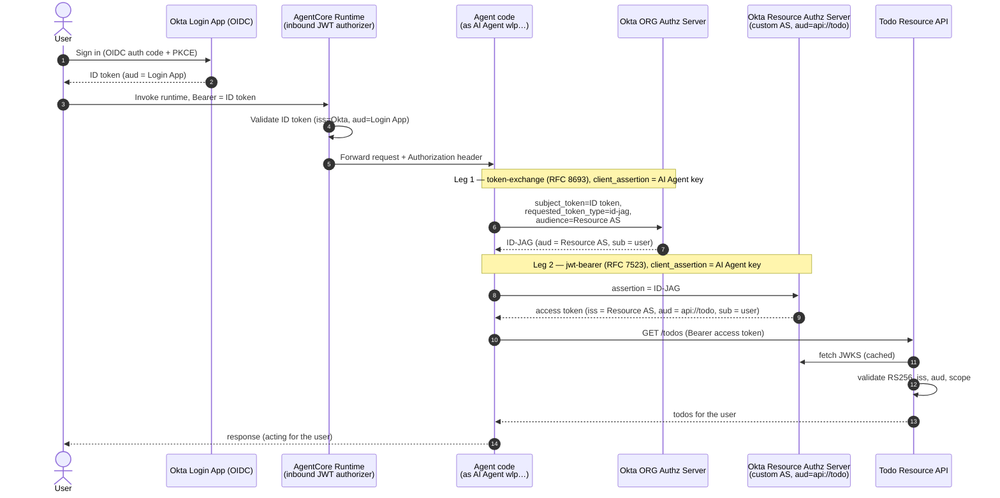
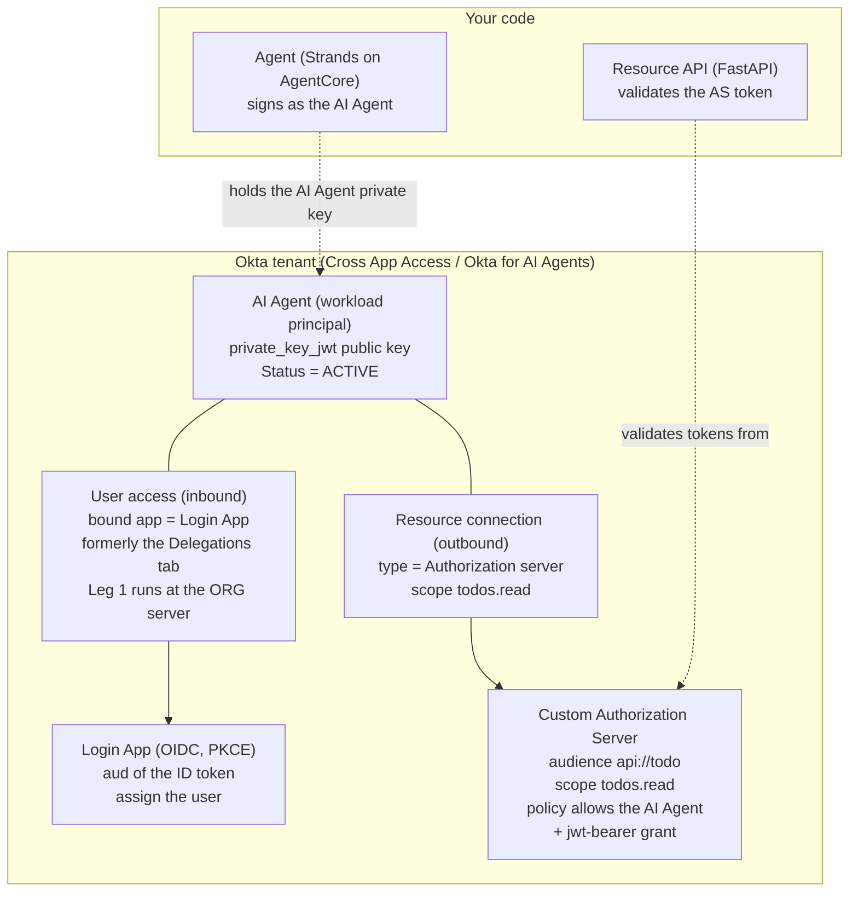

# Okta Cross App Access (XAA) + Amazon Bedrock AgentCore

A working sample where an AI agent securely calls another application's API **on
behalf of a signed-in user**, brokered by Okta using
[Cross App Access (XAA)](https://www.okta.com/solutions/cross-app-access/) — the
Identity Assertion JWT Authorization Grant (**ID-JAG**,
[draft-ietf-oauth-identity-assertion-authz-grant](https://datatracker.ietf.org/doc/html/draft-ietf-oauth-identity-assertion-authz-grant)).

- **Requesting app** — a [Strands](https://strandsagents.com) agent on **Amazon
  Bedrock AgentCore Runtime**, protected by an inbound JWT authorizer that trusts
  your Okta org. The agent is registered in Okta as an **AI Agent** (workload
  principal) and drives the token exchange itself.
- **Resource app** — a small FastAPI "todo" API, fronted by an Okta **custom
  Authorization Server** that mints the downstream access token. The API only
  *validates* that token.
- **IdP** — your Okta tenant with **Cross App Access** / **Okta for AI Agents** enabled.

No static API keys, no per-call consent: the user signs in once with Okta, and
the agent gets a short-lived, user-scoped token for the todo API.

> **Looking for the same thing with the exchange outside the agent?** See
> [`08-okta-xaa-delegation-chain`](../08-okta-xaa-delegation-chain). Here the agent runs
> both ID-JAG legs itself and holds the signing key. That sample moves the exchange into
> an **AgentCore Gateway interceptor**, so the agent never holds a credential that can
> reach the resource API, and adds a browser front end, an OBO hop via AgentCore Identity,
> and per-user **Cedar** policy on the gateway. It also caches the resource token, which
> matters for the ID-JAG quota below — this sample mints a fresh one on every tool call.
>
> Start here to understand ID-JAG itself; go there for the full chain.



*The agent acts **on behalf of the signed-in user** — every call to the todo API
carries the user's identity, brokered by Okta, with no static API keys.*

> **Model note.** This sample uses Okta's productized **AI Agents** model, where
> the resource is an Okta **custom Authorization Server** and the agent redeems
> the ID-JAG there. This was validated end-to-end against a real tenant, both
> locally and deployed to AgentCore Runtime. 

## How it works

Both token-exchange legs are performed **by the agent, authenticating as the AI
Agent** (`wlp…` id) with a single `private_key_jwt` key. Leg 1 mints the ID-JAG
at the **org** server; Leg 2 redeems it at the resource's **custom AS**. The
downstream token's `sub` is still the **user**.



### Who configures what in Okta



### Three identities to keep straight

| Identity | Env var | What it is |
| --- | --- | --- |
| **Login / caller app** | `OKTA_LOGIN_CLIENT_ID` | The OIDC app the **user signs into**. The ID token's `aud` is this client; it's what the AgentCore inbound authorizer allows. This is the app Okta paired with the AI Agent, so the value is the agent's `wlp…` id — see step 1. |
| **AI Agent** (both legs) | `OKTA_CLIENT_ID` | The Okta **AI Agent** (`wlp…`). Authenticates with `private_key_jwt` and performs *both* token-exchange legs. |
| **Resource authz server** | `RESOURCE_AS_ISSUER` | The Okta **custom Authorization Server** for the resource. Mints the downstream token (Leg 2); the resource API validates against its JWKS. |

> They are three *roles*, not necessarily three *client ids*. In the AI Agents model the
> first two are the **same** OAuth client: the agent and its paired login app share one
> `wlp…` id. Keep thinking of them as separate roles — the ID token's `aud` and the client
> driving the exchange genuinely are different concerns — but expect one value in both
> env vars.

## Repository layout

```
Okta-xaa/
├─ resource-app/          # Todo resource API (FastAPI) — validates the AS token
│  ├─ main.py             #   /todos protected by the Okta custom-AS access token
│  ├─ lambda_handler.py   #   Mangum wrapper to run the API on AWS Lambda
│  ├─ requirements.txt
│  └─ .env.example        #   RESOURCE_AS_ISSUER, RESOURCE_API (audience), PORT
├─ agent/                 # Requesting agent for AgentCore Runtime (Strands)
│  ├─ agent.py            #   BedrockAgentCoreApp entrypoint (reads Okta ID token)
│  ├─ xaa_client.py       #   two-leg ID-JAG exchange, as the AI Agent (wlp…)
│  ├─ todo_tools.py       #   list/add/complete tools (http or lambda call mode)
│  ├─ client_auth.py      #   private_key_jwt / client_secret client assertion
│  ├─ requirements.txt
│  └─ .env.example
├─ deploy/
│  └─ patch_agentcore_json.py  # wire the Okta CUSTOM_JWT authorizer into agentcore.json
└─ scripts/
   ├─ test_xaa_flow.py    # Milestone A: full XAA flow from the CLI
   ├─ invoke_runtime.py   # invoke the deployed runtime with a real Okta ID token
   ├─ okta_setup.py       # automate the OIDC login app + test user (Mgmt API)
   ├─ gen_keypair.py      # generate the AI Agent's private_key_jwt keypair
   ├─ cleanup.py          # tear down the AWS (+ optional Okta) resources
   ├─ client_auth.py
   ├─ requirements.txt
   └─ .env.example
```

## Prerequisites

- Python 3.11+
- An Okta tenant with **Cross App Access** / **Okta for AI Agents** enabled (Workforce
  Identity). If Leg 1 rejects `requested_token_type`, this is what is missing — ask Okta
  which subscription or feature flag your tenant needs, rather than hunting for a toggle.

> **ID-JAG quota.** Use of XAA as part of SSO is limited to **250 ID-JAG tokens per user,
> per resource app, per month**, and one is consumed every time the agent uses XAA to
> reach a resource. The "user" must be a licensed SSO user in an Active status, and the
> number of users using XAA cannot exceed the org's purchased SSO seats.
>
> **This sample mints a fresh ID-JAG on every tool call** — there is no token cache — so a
> chatty conversation spends the allowance quickly. Fine for a walkthrough; size real
> usage deliberately, and confirm the current limits and licensing terms against
> [Okta: Cross App Access (agent to app)](https://developer.okta.com/docs/guides/xaa-agent-to-app/main/)
> and [Okta rate limits](https://developer.okta.com/docs/reference/rate-limits/) rather
> than this page.
- For deployment: an AWS account with Bedrock model access and the AWS CLI
  configured.

## Set up a virtual environment

```bash
cd Okta-xaa
python3 -m venv .venv
source .venv/bin/activate            # macOS / Linux  (.venv\Scripts\activate on Windows)
python3 -m pip install --upgrade pip
pip3 install -r requirements.txt
```

## Generate the AI Agent's key (private_key_jwt)

The AI Agent authenticates with an asymmetric key; you register the **public**
JWK on the agent in Okta and keep the private key.

```bash
cd scripts
python3 gen_keypair.py --name okta --kid xaa-agent-okta
cd ..
```

This writes `scripts/keys/okta_private_key.pem` and
`scripts/keys/okta_public_jwk.json`.

> ⚠️ **Treat the keypair as immutable once registered.** If you re-run
> `gen_keypair.py` after registering the public key in Okta, signatures break
> (`invalid_client: client_assertion signature is invalid`). Okta won't let you
> deactivate an agent's only key or reuse a `kid`, so to rotate you must add the
> new public key under a **new `kid`**, repoint `OKTA_PRIVATE_KEY_KID`, then
> deactivate the old one.

## Okta setup (step by step)

> **Okta's AI Agents UI is moving, and this page will drift.** These steps were verified
> against a live tenant, but tab names, field labels and even the shape of the model have
> already changed once during this sample's life — *Delegations* became **User access**,
> and the separate login app became an app Okta pairs with the agent for you. Treat this
> walkthrough as a guide to the *concepts* and check the current mechanics against Okta's
> own documentation:
> [Add AI agents manually](https://help.okta.com/oie/en-us/content/topics/ai-agents/ai-agent-add-manually.htm),
> [Cross App Access (agent to app)](https://developer.okta.com/docs/guides/xaa-agent-to-app/main/).
> If a step does not match what your console shows, believe the console.

> Use the Okta **org** authorization server (`https://<tenant>.okta.com`) for
> Leg 1 — only the org server *mints* ID-JAGs. Leg 2 happens at the resource's
> **custom** Authorization Server.

### 1. The login app — created *for* you, when you register the AI Agent

**Do not create a separate login app.** Registering an AI Agent (step 3) creates a paired
OIDC app and binds it under the agent's **User access** tab, and *that* paired app is the
only issuer of ID tokens Leg 1 will accept. You cannot point User access at an app you
made earlier, so a hand-rolled login app is simply unused.

Two consequences, both of which cost real time to discover:

- **Its OAuth `client_id` is the AI Agent's `wlp…` id**, not the `0oa…` you see in the
  app's URL. The `0oa…` value addresses the app in the Management API
  (`/api/v1/apps/0oa…`) and is *not* a client id. Using it at `/authorize` returns a bare
  **400 Bad Request with no System Log entry at all**, so there is nothing to search for.
  `OKTA_LOGIN_CLIENT_ID` and `OKTA_CLIENT_ID` therefore hold the **same** value.
- **It is a confidential client using `private_key_jwt`**, so the login code exchange has
  to be signed with the same key as the two exchange legs. Set
  `LOGIN_AUTH_METHOD=private_key_jwt`. It cannot be downgraded to a public PKCE client:
  Okta rejects `token_endpoint_auth_method: none` unless `pkce_required` is set, and that
  field is not valid on this app type.

Add `http://localhost:8080/callback` to the paired app's sign-in redirect URIs, and make
sure your test user is assigned to it.

`okta_setup.py` still exists and can create a standalone OIDC app — useful if you are
adapting this sample to a topology where the caller is a normal app rather than an AI
Agent's paired app — but it is **not** part of this walkthrough:

```bash
cd scripts
python3 okta_setup.py --auth-method none \
    --redirect-uri http://localhost:8080/callback \
    --label "Some other login app" --dry-run
```

### 2. Resource custom Authorization Server — automatable via API

Security → API → Authorization Servers → **Add**:
- **Audience**: `api://todo` (this becomes `RESOURCE_API`).
- **Scopes**: add `todos.read` (and `todos.write` if you want writes).
- **Access Policy + Rule**: allow the **`jwt-bearer`** grant, and include the AI
  Agent's `wlp…` client id in the policy's client allowlist.
- Copy the **issuer** (`https://<tenant>.okta.com/oauth2/<as-id>`) → this is
  `RESOURCE_AS_ISSUER`.

<details>
<summary>Automate steps 2 with the Management API (curl-free, via httpx)</summary>

The Management API fully supports authorization servers, scopes, policies, and
rules (`/api/v1/authorizationServers…`): create the AS with an `audience`, add a
`todos.read` scope, then add an access policy whose rule allows the `jwt-bearer`
grant with the AI Agent's `wlp…` client id in the policy's client allowlist.
</details>

### 3. Register the AI Agent — manual (Admin Console)

Directory → **AI Agents** → **Register AI Agent** → *Register manually*. Okta asks for
**Profile**, **Owners**, **Client registration**, **User access** and **Machine access**:

- **Profile**: name it (e.g. `XAA Todo Agent`).
- **Owners**: assign at least one. Okta recommends two, so an agent is never ownerless.
- **Client registration**: the method the agent uses to present its identity. Choose
  **Public key / Private key** and paste `scripts/keys/okta_public_jwk.json`. (Okta also
  offers client secret and a Client ID Metadata Document; this sample uses the keypair,
  because `private_key_jwt` is what both legs authenticate with.)
- Copy the **AI Agent ID** (`wlp…`) → `OKTA_CLIENT_ID`; note the key's **kid** →
  `OKTA_PRIVATE_KEY_KID`.
- **User access**: bind the **Login app**. This is what authorises Leg 1 — the agent may
  act for a user only if that user signed in to the bound app, which is why Leg 1 takes
  the Login app's **ID token** and nothing else. You can bind exactly one app, and the
  app's own page then shows *Linked AI Agent*.
- **Resource connections → Add**: type = **Authorization server** → your custom
  AS (step 2), scope `todos.read`. This authorises Leg 2.
- **Actions → Activate** (the agent must be **Active**, not Staged).

> **If you are following older material, the tab names changed.** What is now **User
> access** was the **Delegations** tab, where you added a *caller* plus an *on behalf of*
> and picked an authorization server. The replacement is a single app binding, and Leg 1
> still runs at the org server — that is no longer something you select here.
>
> Do not reach for **Machine access**: that governs callers that reach this agent
> *without a user* (agent-to-agent), which is the opposite direction from Leg 1 and is
> not used by this sample.
>
> Field names and tabs move, so check
> [Add AI agents manually](https://help.okta.com/oie/en-us/content/topics/ai-agents/ai-agent-add-manually.htm)
> against what your console actually shows.

## Milestone A — run the flow locally

Validates the end-to-end XAA exchange without AWS.

**1. Configure and start the resource app** (`RESOURCE_AS_ISSUER` = the custom AS
issuer, `RESOURCE_API` = its audience):

```bash
cd resource-app
cp .env.example .env        # set RESOURCE_AS_ISSUER + RESOURCE_API=api://todo
python3 main.py             # serves on http://localhost:5001
```

**2. Configure and run the test client** (second terminal, venv active):

```bash
cd scripts
cp .env.example .env        # fill Okta + resource values (see below)
python3 test_xaa_flow.py
```

Fill `scripts/.env` with: `OKTA_ISSUER`, `OKTA_LOGIN_CLIENT_ID`, `OKTA_CLIENT_ID`
(the `wlp…` agent), `RESOURCE_AS_ISSUER`, `RESOURCE_API=api://todo`,
`RESOURCE_API_URL=http://localhost:5001`, `XAA_SCOPES=todos.read`,
`CLIENT_AUTH_METHOD=private_key_jwt`, `OKTA_PRIVATE_KEY_PATH`,
`OKTA_PRIVATE_KEY_KID`.

The script opens a browser for Okta login, then prints each step:

```
Step 0 OK: id_token for you@example.com (aud=<login app>)
Step 1 OK: ID-JAG (aud=<resource AS issuer>, sub=<user>, scope=todos.read)
Step 2 OK: access token (iss=<resource AS>, aud=api://todo, sub=<user>, scp=['todos.read'])
Step 3 OK: todos returned by the resource API:
  [ ] Try Okta Cross App Access
  [ ] Wire up AgentCore Identity
XAA (ID-JAG) flow complete.
```

## Deploy the agent to AgentCore Runtime (agentcore CLI)

Deployed with the Node-based [AgentCore CLI](https://github.com/aws/agentcore-cli)
(`@aws/agentcore` — *not* the deprecated `bedrock-agentcore-starter-toolkit`).
The runtime's **inbound** auth is a `CUSTOM_JWT` authorizer trusting your Okta
**org** server, with `allowedAudience` = the invoking ID token's `aud`, which is
the AI Agent's **`wlp…`** id (see step 1 — that is also the login client). Get this
wrong and the runtime rejects the call at the authorizer with an opaque 403.
The agent reads the ID token from the invoke payload (`id_token`)
or the allow-listed `Authorization` header, then drives the two-leg ID-JAG
exchange as the AI Agent (`OKTA_CLIENT_ID`).

> **CLI version.** This walkthrough was last verified end to end with
> **`@aws/agentcore` 0.25.0**; newer versions exist and the repo pins 0.30.0 elsewhere.
> The generated `agentcore.json` schema has moved between releases — the authorizer
> currently lands under `authorizerConfiguration.customJwtAuthorizer`, and
> `deploy/patch_agentcore_json.py` writes that shape. If `agentcore validate` complains
> after a CLI upgrade, compare the generated file against what the patch script expects
> before assuming the sample is broken.

Prerequisites: Node 20+, `uv`, AWS CLI, `npm install -g @aws/agentcore aws-cdk`,
`cdk bootstrap` once per account/region, and Bedrock model access. `--build CodeZip`
means Docker is **not** required.

**1. Host the resource app** so the runtime can reach it. This sample runs it on
**AWS Lambda** (`resource-app/lambda_handler.py` wraps the FastAPI app with
Mangum). Package with **Linux** wheels and deploy:

```bash
cd resource-app
mkdir -p build && pip3 install --platform manylinux2014_x86_64 --only-binary=:all: \
  --python-version 3.12 --target build fastapi mangum "pyjwt[crypto]" pydantic python-dotenv
cp main.py lambda_handler.py build/ && (cd build && zip -qr ../function.zip .)
# Create (or reuse) an execution role first, and remember its name -- scripts/cleanup.py
# needs it as LAMBDA_ROLE_NAME, and there is no canonical default:
#   aws iam create-role --role-name obo-todo-lambda-role \
#     --assume-role-policy-document '{"Version":"2012-10-17","Statement":[{"Effect":"Allow",
#       "Principal":{"Service":"lambda.amazonaws.com"},"Action":"sts:AssumeRole"}]}'
#   aws iam attach-role-policy --role-name obo-todo-lambda-role \
#     --policy-arn arn:aws:iam::aws:policy/service-role/AWSLambdaBasicExecutionRole
aws lambda create-function --function-name obo-todo-resource --runtime python3.12 \
  --handler lambda_handler.handler --role <lambda-exec-role-arn> \
  --zip-file fileb://function.zip --timeout 20 --memory-size 512 --region us-east-1 \
  --environment "Variables={RESOURCE_AS_ISSUER=<AS issuer>,RESOURCE_API=api://todo}"
```

> The agent calls this Lambda with `lambda:InvokeFunction` (see step 5,
> `RESOURCE_CALL_MODE=lambda`) — **no public Function URL required**, which also
> works in accounts whose SCPs block anonymous Function URLs. A public HTTPS
> resource works too (`RESOURCE_CALL_MODE=http` + `RESOURCE_API_URL`).

**2. Store the AI Agent private key** in Secrets Manager:

```bash
aws secretsmanager create-secret --name agentcore/xaa_private_key \
  --secret-string file://scripts/keys/okta_private_key.pem --region us-east-1
```

**3. Scaffold the project and add the agent code:**

```bash
agentcore create --project-name xaatodoagent --name xaatodoagent \
  --framework Strands --model-provider Bedrock --memory none \
  --build CodeZip --language Python --defaults
cp agent/agent.py       xaatodoagent/app/xaatodoagent/main.py
cp agent/xaa_client.py agent/todo_tools.py agent/client_auth.py xaatodoagent/app/xaatodoagent/
# add boto3, httpx, PyJWT[crypto] to app/xaatodoagent/pyproject.toml, then:
( cd xaatodoagent/app/xaatodoagent && uv lock )
```

**4. Patch `agentcore.json` for Okta inbound auth + env vars** (run from inside
the project, with your `.env` values in the environment):

```bash
cd xaatodoagent
set -a && source ../scripts/.env && set +a
# also export the runtime-only values:
export RESOURCE_CALL_MODE=lambda RESOURCE_LAMBDA_NAME=obo-todo-resource \
       XAA_KEY_SECRET_ID=agentcore/xaa_private_key AWS_REGION=us-east-1
python3 ../deploy/patch_agentcore_json.py
printf '[{"name":"default","account":"%s","region":"us-east-1"}]\n' \
  "$(aws sts get-caller-identity --query Account --output text)" > agentcore/aws-targets.json
```

**5. Deploy and grant the runtime's execution role its permissions:**

```bash
agentcore validate && agentcore deploy -y
# from `agentcore status`, note the runtime ARN and its execution role, then:
aws iam put-role-policy --role-name <exec-role> --policy-name xaa-obo-access \
  --policy-document '{"Version":"2012-10-17","Statement":[
    {"Effect":"Allow","Action":"secretsmanager:GetSecretValue","Resource":"arn:aws:secretsmanager:us-east-1:<acct>:secret:agentcore/xaa_private_key*"},
    {"Effect":"Allow","Action":"lambda:InvokeFunction","Resource":"arn:aws:lambda:us-east-1:<acct>:function:obo-todo-resource"}]}'
```

**6. Invoke** with the user's Okta ID token (both as the bearer — for the
authorizer — and in the payload, which is how the agent reads it):

```bash
# scripts/invoke_runtime.py signs the user in, then calls the runtime:
AGENT_RUNTIME_ARN=<runtime-arn> AWS_REGION=us-east-1 \
  python3 scripts/invoke_runtime.py "what is on my todo list?"
# expected: "You have 2 items on your todo list: 1. Try Okta Cross App Access ..."
```

> **Model note.** `agent.py` defaults to `us.anthropic.claude-sonnet-4-5-20250929-v1:0`
> (override with `BEDROCK_MODEL_ID`). Older Claude models may be marked *Legacy*
> and rejected by Bedrock.

## Troubleshooting (error ladder)

| Symptom | Cause | Fix |
| --- | --- | --- |
| `400 Bad Request` from `/authorize`, **no System Log event at all** | `OKTA_LOGIN_CLIENT_ID` is the `0oa…` app id. That addresses `/api/v1/apps/0oa…`; it is not a client id | Use the AI Agent's **`wlp…`** id. Okta rejects the request before any app-level logging, so the log is silent by design |
| `access_denied: Policy evaluation failed` (Leg 2) **and the client *is* allowlisted** | the access **policy itself is INACTIVE**. Same message as a missing allowlist entry | `GET /api/v1/authorizationServers/<as>/policies` and check `status`; activate with `POST …/policies/<id>/lifecycle/activate`. A policy can end up inactive when its client list is emptied, e.g. after deleting an agent |
| `invalid_client` at the **login** token exchange | the paired app is confidential (`private_key_jwt`), but the login exchange was sent unauthenticated | `LOGIN_AUTH_METHOD=private_key_jwt`, signed with the same key as both legs. The app cannot be made public — Okta requires `pkce_required` with `none`, which is invalid on this app type |
| `requested_token_type is invalid` (Leg 1) | Cross App Access / **Okta for AI Agents** not enabled on the tenant | Confirm the subscription with Okta. Not *Machine access* / agent-to-agent connections — that governs callers reaching the agent without a user |
| `invalid_client: client_assertion signature is invalid` | Local private key ≠ the public key registered on the agent | Register the current public JWK; treat keys as immutable (rotate via a new `kid`) |
| `invalid_client` on every call | AI Agent is **STAGED** | **Activate** the agent |
| `'subject_token' is invalid: … not registered for delegation` (Leg 1) | The ID token was not issued by the app bound under **User access**, or you sent an access token | Bind the Login app under **User access**, and pass that app's **ID token** as `subject_token`. Leg 1 runs at the **org** server. The error still says "delegation" even though the tab is now *User access* |
| `access_denied: Policy evaluation failed` (Leg 2) | Resource AS policy doesn't list the AI Agent | Add the `wlp…` client id to the AS policy's client allowlist |
| `invalid_grant: id-jag already used` | ID-JAGs are single-use | Mint a fresh ID-JAG per attempt (run legs back-to-back) |
| Okta app create 400 (`Invalid signOnMode` / `Missing visibility`) | OIDC app payload missing `name: oidc_client` | Fixed in `okta_setup.py` |
| Runtime → resource `403 Forbidden` on a Lambda **Function URL** | Account SCP blocks Function URLs (both `NONE` and `AWS_IAM`) | Use `RESOURCE_CALL_MODE=lambda` (agent calls the Lambda via `InvokeFunction`) instead of a Function URL |
| Bedrock `ConverseStream` … *model marked Legacy* | Hardcoded model retired | Set `BEDROCK_MODEL_ID` to an active model (e.g. `us.anthropic.claude-sonnet-4-5-20250929-v1:0`) |

## Cleanup

Tear down the resources the sample creates with `scripts/cleanup.py` (dry-run by
default; add `--yes` to actually delete):

```bash
cd scripts
python3 cleanup.py                          # preview what would be deleted
python3 cleanup.py --yes                     # delete the Lambda, secret, and lambda role
python3 cleanup.py --yes --include-runtime   # also delete the AgentCore CloudFormation stack
python3 cleanup.py --yes --include-okta       # also delete the Okta login app + custom AS
```

It reads the same `.env` values used elsewhere. The **AI Agent** (workload
principal) has no stable delete API — remove it manually in the Admin Console
(Directory → AI Agents).

## Security notes (this is a sample)

- The AI Agent's **private key** should live in AWS Secrets Manager (or an
  Okta-managed key), not on disk, in production.
- Prefer short token lifetimes and enforce MFA / step-up policy in Okta.
- The resource API validates `iss`, `aud`, and scope on every request and trusts
  only the custom AS's JWKS.
