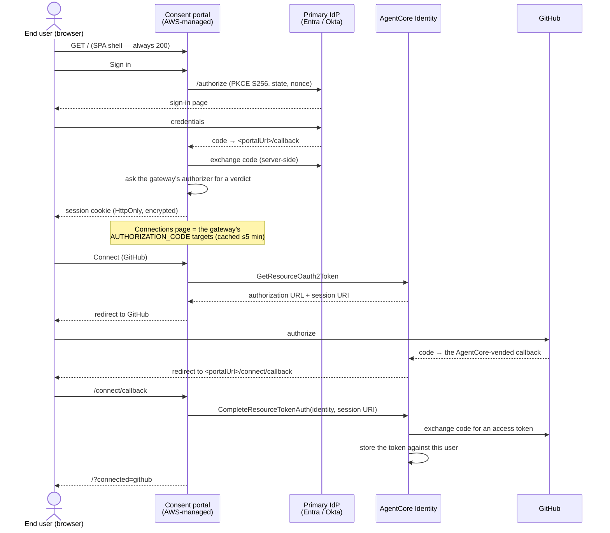
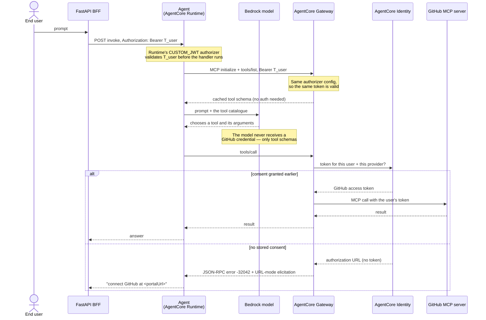

# Architecture

Two flows share one identity. Understanding where they meet is the whole design.

## The consent flow (out of band, once per user)

The user opens the portal directly. Nothing in your code participates.



Two properties fall out of this:

**The browser never holds a token.** The portal is a Backend-For-Frontend: the
OAuth exchange is server-side and the session lives in an encrypted `HttpOnly`
cookie. With no token in `localStorage`, injected script has nothing to read —
with the trade-off that the network tab will not show you the exchange.

**Session binding is why `CompleteResourceTokenAuth` exists.** An authorization
URL on its own could be forwarded to someone else, who would then grant consent
and have *their* token stored against *your* request. AgentCore therefore issues
a session URI alongside the URL and requires both, plus the caller's identity,
before it will exchange the code. Something has to make that call — without a
portal, that something is a callback server you write and operate. This is the
portal's core value.

## The request flow (every invocation)



## Passthrough, and why it is enough here

The agent forwards `T_user` to the gateway **unchanged**. The runtime and the
gateway are configured with the same `discoveryUrl` and the same
`allowedAudience`, so one token satisfies both authorizers.

The alternative is an OBO token exchange at each hop, where the agent swaps
`T_user` for a gateway-audienced token, so each hop's token is only usable
against that hop. That is a real security improvement, and
[`obo-training/3-examples/02-agent-via-gateway/`](../obo-training/3-examples/02-agent-via-gateway/)
teaches it properly. It costs a third IdP application, an agent-actor credential
provider, a workload identity, IAM for the token operations on the runtime role,
and — under Okta — the token-exchange grant.

Passthrough was chosen here for two reasons:

1. **The subject claim has to match, and passthrough makes that structural.**
   Consent is stored against the identity the portal authenticated, and looked
   up against the identity the gateway resolves from the caller's token. Under
   Entra, `sub` is a *pairwise* identifier keyed on the application a token was
   issued for — so if those two tokens were issued for different applications,
   the same human would have two different `sub` values, consent would bind
   under one and be looked up under the other, and every tool call would
   re-prompt forever. With one resource application everywhere, the two values
   are identical by construction rather than by careful configuration.
2. **The subject of this sample is the consent dashboard.** Adding a second
   delegation mechanism would double the setup for a concern already covered by
   a neighbouring sample.

The user-delegated hop is still here, and it is the interesting one: the gateway
calls GitHub **as the end user**, using a consent that user granted personally.

## The `-32042` elicitation

`tools/list` always works — the target was created with its schema upfront, so
the gateway serves a cached catalogue and nobody authorizes anything to browse
it. Only `tools/call` needs the user's GitHub token.

When there is none, the gateway does not fail. It returns a **URL-mode
elicitation** (MCP `2025-11-25`, which is why `supportedVersions` must include
it) as a JSON-RPC error on the `tools/call` response:

```json
{
  "jsonrpc": "2.0", "id": 3,
  "error": {
    "code": -32042,
    "message": "This request requires more information.",
    "data": { "elicitations": [ {
      "mode": "url",
      "elicitationId": "6c649490-…",
      "url": "https://bedrock-agentcore.us-east-1.amazonaws.com/identities/oauth2/authorize?request_uri=urn:ietf:params:oauth:request_uri:…",
      "message": "Please login to this URL for authorization."
    } ] }
  }
}
```

`agent/agent.py` detects this and replies with the **portal** URL rather than
the identity URL in that payload. That substitution is deliberate: the portal
authenticates the user and calls `CompleteResourceTokenAuth` for them, whereas
following the raw URL leaves the session binding to whoever is holding it.

Detection is defensive because the elicitation's exact propagation path through
the MCP client is not a public contract. The agent checks both places it can
arrive — a `toolResult` recorded with `status: "error"` on the Strands message
history, and a raised exception — and matches on the error code plus a few
wording variants. False positives are guarded against by requiring an *error*
status; a successful result that merely mentions the code does not trip it.

If you would rather the elicitation itself carried the portal URL — so any MCP
client, not just this agent, is driven to the portal — there is a Lambda
RESPONSE interceptor that rewrites it at the gateway:
[`consent-portal/README.md`](../../07-centralize-and-govern-your-ai-infrastructure/01-gateway/01-attach-targets/mcp/mcp-servers/01-configure-auth/authorization-code-flow/consent-portal/README.md).

## Resources this sample creates

| Resource | Created by | Notes |
| :--- | :--- | :--- |
| 2 IdP applications | `00_create_*_apps.py` | Gateway resource app (Entra: also the portal login client) + frontend client |
| Gateway service role | `01_create_gateway.py` | The token operations, the identity service's OAuth secrets, CloudWatch Logs |
| AgentCore Gateway | `01_create_gateway.py` | MCP, `CUSTOM_JWT`, `supportedVersions` includes `2025-11-25` |
| Primary IdP credential provider | `02_create_portal.py` | `CustomOauth2`. **Must issue JWTs** |
| Portal execution role | `02_create_portal.py` | Trust pinned to the portal ARN after creation |
| Consent portal | `02_create_portal.py` | One gateway as its only source; `name` and `sources` are immutable |
| GitHub credential provider | `03_create_github_provider.py` | `GithubOauth2`, outbound only |
| Gateway target | `04_create_github_target.py` | MCP server, schema upfront, `AUTHORIZATION_CODE` |
| AgentCore Runtime | AgentCore CLI (CDK) | Patched by `05_patch_agentcore_json.py` |

## Two credential providers, one portal

The distinction the API makes here is the one most worth internalising.

| | Primary IdP provider | Outbound (per-target) provider |
| :--- | :--- | :--- |
| Answers | who the user signs in **as** | what the agent gets consent to act **on** |
| Referenced by | `idpConfig.credentialProviderArn` on the portal | `providerArn` in a target's `credentialProviderConfigurations` |
| Vendor constraint | must issue **JWT** access tokens (`CustomOauth2`, `CognitoOauth2`, `OktaOauth2`, `MicrosoftOauth2`, `Auth0Oauth2`, …) | any vendor, including OAuth2-only ones (`GithubOauth2`, `SlackOauth2`, `AtlassianOauth2`, …) |
| How many | one per portal | one per downstream resource; one can back several targets |
| In this sample | Entra ID or Okta | GitHub |

GitHub is rejected as a primary IdP by construction, not by policy: it issues
no ID token and publishes no OIDC discovery document, so portal sign-in cannot
work with it.

## Ordering, and why it is circular

Each of these needs the previous one to exist, and the last two close a loop
back to the first.

1. IdP app — created with a **placeholder** redirect URI, because the portal
   URL does not exist yet.
2. Primary IdP credential provider — needs the app's client id and secret.
3. Gateway — needs the discovery URL; must be JWT-authorized.
4. Portal execution role — needs the gateway ARN for its permissions policy;
   created with a wildcard `consent-portal/*` in its trust policy because the
   portal ARN is not known yet.
5. Consent portal — needs the provider, the role and the gateway. **Now**
   `portalUrl` exists. Its hostname is derived from the **gateway** id, not the
   portal id: `<gateway-id>.consent-portal.<region>.amazonaws.com`. Do not
   assume its scheme either — it has been observed both with and without the
   `https://` prefix, so normalize before building URLs from it.
6. Back to the IdP app: register `<portalUrl>/callback`.
7. GitHub OAuth App → outbound provider → back to the GitHub app to register
   the `callbackUrl` the provider vends.
8. Gateway target — needs the provider ARN and `<portalUrl>/connect/callback`.

`02_create_portal.py` closes loops 4→5→6 for you (it re-puts the trust policy
pinned to the real ARN, and registers the callback). Loop 7 needs you, because
only you can edit a GitHub OAuth App.
