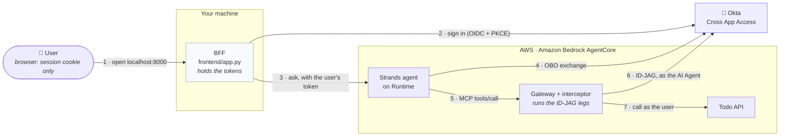
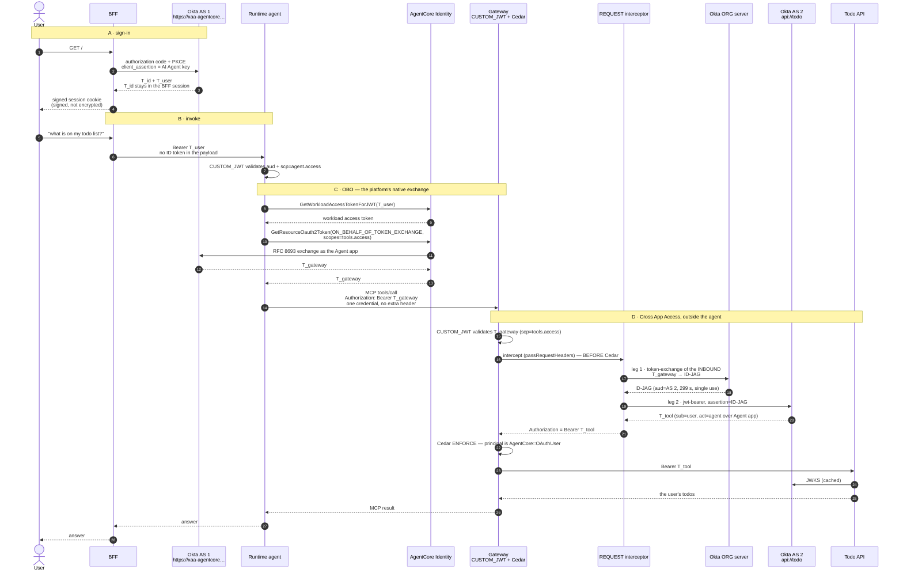
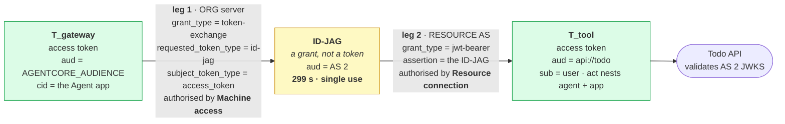

# Okta Cross App Access delegation chain + Amazon Bedrock AgentCore

A working sample where an AI agent reaches another application's API **on behalf of a
signed-in user**, and the **gateway** — not the agent — performs the Okta
[Cross App Access](https://www.okta.com/solutions/cross-app-access/) exchange
(Identity Assertion JWT Authorization Grant, **ID-JAG**,
[draft-ietf-oauth-identity-assertion-authz-grant](https://datatracker.ietf.org/doc/html/draft-ietf-oauth-identity-assertion-authz-grant)).

- **Front end** — a small FastAPI **BFF** (`frontend/app.py`) that signs the user in and
  invokes the agent. It exists so the browser never holds a token: it keeps them
  out of the page and hands the browser a signed, `HttpOnly` session cookie. (That cookie
  is signed, not encrypted, and the tokens are inside it — fine for localhost, not for
  production; `frontend/app.py` explains what to change.)
- **Requesting app** — a [Strands](https://strandsagents.com) agent on **AgentCore
  Runtime**, behind an inbound JWT authorizer. It calls an **AgentCore Gateway** over
  MCP and never holds a credential that can reach the API.
- **Exchange point** — a **gateway REQUEST interceptor** runs both ID-JAG legs and
  injects the resulting token. The AI Agent's signing key lives only here.
- **Resource app** — a FastAPI "todo" API fronted by an Okta **custom authorization
  server**. It only *validates*.
- **IdP** — your Okta tenant with **Cross App Access** / **Okta for AI Agents** enabled.

Two exchanges, deliberately different: a **standard OBO** exchange gets the agent from
the user's token to a gateway-scoped token, then **ID-JAG** crosses into the resource's
authorization server.



*The API receives a token whose `sub` is the **human** and whose `act.sub` is the
**agent** — no static API keys, and no tool credential inside the agent. The resource
credential never leaves the interceptor, and the agent never holds one that opens the API.*

## How it works



### The two ID-JAG legs in detail



The IdP knows *who the user is*; the resource's authorization server owns *that API's*
audience, scopes and signing keys. Neither can do the other's job, so leg 1 produces a
portable **attestation** and leg 2 redeems it for a real token — leaving the resource
owner a veto. The AI Agent's `private_key_jwt` authenticates **both** legs.

A single exchange suffices only when one server both knows the user and owns the
resource, which is exactly why hop **C** needs just one call.

### Five identities to keep straight

| Identity | `.env` | What it is |
| --- | --- | --- |
| **AI Agent + linked app** | `AI_AGENT_CLIENT_ID` = `LOGIN_CLIENT_ID` (`wlp…`) | One client, two jobs: the user **signs in** to it, and it authenticates **both ID-JAG legs** as the client. Note it cannot be leg 1's *subject* — an agent cannot be its own caller. |
| **Agent app** | `AGENT_APP_CLIENT_ID` (`0oa…`) | API Services app with the Token Exchange grant, used by AgentCore Identity for the OBO exchange. Holds a secret the agent never sees. |
| **AS 1** | `AGENTCORE_AS_ISSUER`, `https://xaa-agentcore.example.com` | Issues `T_id`/`T_user` at sign-in and `T_gateway` via OBO. Runtime and Gateway both trust it. |
| **AS 2** | `RESOURCE_AS_ISSUER`, `api://todo` | Redeems the ID-JAG and mints `T_tool`. Separate on purpose: the API trusts **only** this issuer, which is what makes the agent's own tokens useless against it. |
| **Org server** | `OKTA_ORG_URL` | Mints the ID-JAG. Only the org server can. |

## Tokens: what each one is, and where it travels

Five credentials appear in this sample and they are not interchangeable. Most of the
confusion around Cross App Access comes from treating "a token" as one thing, so this
section names each one, says who mints it, who may hold it, and what it proves.

### Three different kinds of artefact

| Kind | Answers | Presented to | In this sample |
| --- | --- | --- | --- |
| **Identity token** (OIDC ID token) | *who signed in* | a token endpoint, as the **subject of an exchange** | `T_id` |
| **Access token** (OAuth 2.0) | *what the bearer may do* | a **resource**, as `Authorization` | `T_user`, `T_gateway`, `T_tool` |
| **Authorization grant** | *that an exchange is permitted* | a token endpoint, to be **redeemed** | the ID-JAG |

An ID token is not a credential for calling an API — its audience is a *client*, not a
resource. An ID-JAG is not an access token either: it is a signed statement that an
exchange may happen, audience-locked to one authorization server, single use, 299
seconds. Only the three access tokens can appear in an `Authorization` header, and only
one of them opens the todo API.

### The five tokens

| Token | Kind | Minted by | `aud` | `sub` | `scp` | TTL | Held by |
| --- | --- | --- | --- | --- | --- | --- | --- |
| `T_id` | ID token | AS 1 at sign-in | the `wlp…` app | user **id** | — | 1 h | BFF → agent → interceptor |
| `T_user` | access | AS 1 at sign-in | `AGENTCORE_AUDIENCE` | **email** | `agent.access` | 1 h | BFF, Runtime |
| `T_gateway` | access | AS 1 via **OBO** | `AGENTCORE_AUDIENCE` | email | `tools.access` | 1 h | agent, Gateway |
| **ID-JAG** | grant | **org server**, leg 1 | AS 2 | user id | `todos.read` | **299 s**, single use | interceptor only |
| **`T_tool`** | access | **AS 2**, leg 2 | **`api://todo`** | **email** | `todos.read` | 1 h | interceptor → API |

`T_tool` additionally carries `cid` and **`act.sub`** naming the AI Agent, plus
`sub_profile = ai_agent web_app`. That is the delegation trail: the API sees *who* the
user is **and** *which agent* acted for them, and can require both.

### Which token is on the wire at each hop

| Hop | On the wire | Validated by | What the receiver learns |
| --- | --- | --- | --- |
| Browser → BFF | *nothing* — a signed session cookie | the BFF | which session this is; tokens never leave the server |
| BFF → Runtime | `Authorization: T_user` | Runtime `CUSTOM_JWT`: `aud`, `scp=agent.access` | a real user asked, through a client we trust |
| Runtime → AgentCore Identity | `T_user` as the exchange subject | Okta, as the Agent app | this user consents to the agent acting |
| Agent → Gateway | `Authorization: T_gateway` | Gateway `CUSTOM_JWT`: `aud`, `scp=tools.access`; then **Cedar** on the claims | the agent is acting, for this specific user |
| Interceptor → org server | **`T_gateway`** as `subject_token` | Okta, via the **Machine access** caller link | this app may act for this user |
| Interceptor → AS 2 | the ID-JAG as `assertion` | Okta, via the **Resource connection** | this agent may reach this resource |
| Gateway → API | `Authorization: T_tool` | the API: `iss`, `aud`, `scp`, then `sub` | the human, and the agent that acted |

Note what is *not* on any wire: `T_id` never leaves the BFF, the agent never receives
`T_tool`, and no token is ever placed in the model's prompt.

> **This used to need two tokens.** Leg 1 originally accepted only an ID token, so the BFF
> forwarded `T_id` in the invoke payload and the agent sent it on as `X-Okta-Id-Token`.
> Okta's **Machine access** configuration lets leg 1 exchange an *access* token, so the
> interceptor now uses the bearer the gateway has already validated and that whole path is
> gone. `XAA_LEG1_SUBJECT=id_token` restores it for orgs without Machine access — see
> [IDP_SETUP_OKTA.md](IDP_SETUP_OKTA.md) step 6.

### Where the `act` claim appears, and where it does not

`act` is the claim that records delegation — "this token is X acting for Y". It is worth
tracing because it is *not* continuous:

| Token | `sub` | `act` |
| --- | --- | --- |
| `T_id` | the user | — |
| `T_user` | the user | the AI Agent (sign-in goes through the agent's paired app) |
| `T_gateway` | the user | **dropped** — the OBO provider sends no actor token (`actorTokenContent: NONE`) |
| ID-JAG | the user | the AI Agent, **nested** over the Agent app |
| `T_tool` | the user | same nested chain, carried through to the API |

So `act` is present, lost, and re-established. The gap at `T_gateway` does not weaken
anything: `sub` survives — which is what Cedar matches on — and the gateway learns which
agent is calling from the validated `cid`. But if you expect an unbroken cryptographic
delegation chain across every hop, `T_gateway` is where it breaks.

On the access-token path the ID-JAG's `act` nests two levels:

```json
"act": { "sub": "wlp…", "sub_profile": "ai_agent web_app",
         "act": { "sub": "0oa…", "sub_profile": "service" } }
```

Read outwards: the Agent app, acting as the AI Agent, acting for the user. The id_token
path yields a single level, so the access-token path actually records *more* provenance.

### Why the agent holding two tokens is safe

The agent handles `T_user` and `T_gateway`. Neither can call the todo API, because the
API trusts **only** AS 2 as issuer and requires `aud=api://todo`, and both of those
tokens come from AS 1 with `aud=AGENTCORE_AUDIENCE`. A fully compromised agent can
therefore do what it was already authorised to do — call the tools Cedar permits, as the
user it was already acting for — and no more.

The credential that *does* open the API, `T_tool`, exists only inside the interceptor and
on the gateway's forwarded request. This is what makes the failure mode
`wrong issuer: this API only trusts …` a **feature** of the sample: try replaying an
agent-held token against the API and it is refused by design.

### Using the wrong token, and the error you get

Each of these was observed while building the sample, which is why they are listed with
their exact text rather than paraphrased.

| Mistake | Error |
| --- | --- |
| access token as ID-JAG leg 1 subject | `'subject_token' is invalid: no delegation policy authorizes this token` (System Log: `invalid_subject_token_no_delegation_link`) |
| replaying `T_user` at the gateway | `insufficient_scope` — it carries `agent.access`, the gateway requires `tools.access` |
| `T_user` or `T_gateway` sent to the API | `403 wrong issuer: this API only trusts <AS 2>` |
| ID token sent to the API | `403 wrong audience` — its `aud` is a client, not a resource |
| reusing an ID-JAG | `invalid_grant: id-jag already used` — single use, so mint one per exchange |
| caching the ID-JAG instead of `T_tool` | works for 299 s then fails; cache the access token, never the grant |
| assuming one `sub` format | `T_id`/ID-JAG carry the Okta **user id**; access tokens carry the **email** |


## Repository layout

```
08-okta-xaa-delegation-chain/
├─ resource-app/          Todo API (FastAPI) — validates the AS 2 token, issues nothing
│  ├─ main.py             /todos, /whoami; checks iss, aud, scp, and optionally act.sub
│  ├─ lambda_handler.py   Mangum wrapper for Lambda
│  └─ requirements.txt · .env.example
├─ interceptors/
│  ├─ request_interceptor.py   both ID-JAG legs; injects Authorization; caches T_tool
│  └─ requirements.txt
├─ agent/                 Strands agent for AgentCore Runtime
│  ├─ agent.py            OBO exchange, then MCP to the gateway
│  └─ requirements.txt
├─ frontend/              FastAPI BFF: Okta sign-in, /ask
├─ gateway/todo-tools.json    OpenAPI for the todo target
├─ policies/*.cedar       per-user, per-tool authorization
├─ deploy/                numbered, idempotent; each writes state back to .env
└─ scripts/               keypair, verification, tracing
```

## Prerequisites

- Python 3.11+, Node 20+ and `npm install -g @aws/agentcore aws-cdk`
- AWS credentials, a bootstrapped account, and Bedrock model access
- An Okta org with **API Access Management** *and* **Cross App Access / AI Agents**
  (often listed as *Agent to Agent Connections* under Settings → Features), plus a
  **Single Sign-On** subscription
- An Okta admin API token, and a test user you can sign in as

> **ID-JAG quota.** Okta limits use of XAA as part of SSO to **250 ID-JAG tokens per
> user, per resource app, per month**, and one token is consumed every time the agent
> uses XAA to reach a resource. Two conditions come with that: the "user" must be a
> licensed SSO user in an Active status, and the number of users using XAA cannot exceed
> the org's purchased SSO seats.
>
> The interceptor caches `T_tool` for its full hour and exchanges only on `tools/call`,
> so ordinary use of this sample stays well clear of the cap. **Check Okta's own
> documentation for the current limits and the exact licensing terms before you size
> anything on them** — see
> [Okta: Cross App Access (agent to app)](https://developer.okta.com/docs/guides/xaa-agent-to-app/main/),
> which is where these figures come from, and
> [Okta rate limits](https://developer.okta.com/docs/reference/rate-limits/) for the
> token endpoints the two legs use.

## Set up a virtual environment

```bash
cd 08-okta-xaa-delegation-chain
python3 -m venv .venv && source .venv/bin/activate
pip install -r requirements.txt
cp config.example.env .env      # then set OKTA_ORG_URL and OKTA_API_TOKEN
```

## Okta setup

```bash
python deploy/00_create_okta_apps.py    # two authorization servers, scopes, apps, policies
python scripts/gen_keypair.py           # the AI Agent's private_key_jwt keypair
```

Then register the **AI Agent** in the Admin Console — the one step with no API — and
run the two follow-ups. Full walkthrough with every field and its failure mode:
**[IDP_SETUP_OKTA.md](IDP_SETUP_OKTA.md)**.

```bash
python deploy/00_relink_login_app.py    # sign-in moves to the agent's linked app
python deploy/00_authorize_agent.py     # authorise the agent on the resource AS
python scripts/verify_ai_agent.py       # confirm everything the API can see
```

## Deploy

```bash
python deploy/01_deploy_resource.py                     # todo API → Lambda + HTTP API
python deploy/02_create_gateway.py           # gateway, interceptor, policy engine, target
python deploy/03_create_policies.py                      # Cedar
python deploy/04_create_obo_provider.py                  # AgentCore Identity provider for hop C
```

### Deploy the agent and the BFF

```bash
agentcore create --project-name xaatodoagent --name xaatodoagent \
  --framework Strands --model-provider Bedrock --memory none \
  --build CodeZip --language Python --defaults
cp agent/agent.py xaatodoagent/app/xaatodoagent/main.py
python deploy/05_patch_agentcore_json.py     # Okta inbound auth + env vars
( cd xaatodoagent && agentcore validate && agentcore deploy -y )
python deploy/06_grant_iam.py                # OBO permissions for the execution role
python deploy/07_enable_observability.py     # transaction search + log retention
python frontend/app.py                       # http://localhost:8000
```

Ask *"what is on my todo list?"* and you should get your own items.

## Sample prompts

Ask these at <http://localhost:8000> once signed in. The target exposes four tools, and
the model picks which one answers the question.

| Prompt | Exercises |
| :--- | :--- |
| `What is on my todo list?` | `list_todos` — the default, and the lightest read |
| `Who am I according to the todo API?` | `whoami` — names **you** and the **agent that acted for you** |
| `Add "buy milk" to my list.` | `add_todo` — a write |
| `Mark item 1 as done.` | `complete_todo` — a write on a specific row |

`Who am I according to the todo API?` is the one to demo. It returns your email as the
user and the AI Agent as `acting_agent`, from a token minted by Okta for
`api://todo` — proving the identity survived three hops while the agent never held that
credential.

### Proving Cedar allows *and* denies

A policy that only ever permits proves very little. To see enforcement, name a user in
`.env` and redeploy the policies:

```bash
# the EMAIL as it appears in the access token's `sub`
echo 'CEDAR_READONLY_USER=you@example.com' >> .env
python deploy/03_create_policies.py --replace
```

That deploys [`policies/forbid_writes_for_readers.cedar`](policies/forbid_writes_for_readers.cedar).
Then, signed in as that user:

| Prompt | What you see | Why |
| :--- | :--- | :--- |
| `What is on my todo list?` | your items | `allow_reads` permits the read tools |
| `Who am I according to the todo API?` | you + the acting agent | same |
| `Add "buy milk" to my list.` | *"I don't have a tool available to add items to your todo list"* | the write tools were **filtered out of `tools/list`**, so the model never saw them |
| `Mark item 1 as done.` | the same refusal | same policy, other write tool |

**The denial is not what you might expect, and the difference is the interesting part.**
The agent does not attempt the write and get refused — it is never offered the tool. The
gateway evaluates the policy against `tools/list` as well as `tools/call`, so a `forbid`
removes the tool from the list the agent is given. The model's reply is then a plain
statement of fact about its own tool set.

Verified on a live run: the target defines four tools, the runtime's telemetry shows the
model was handed exactly two, and the interceptor log for that request has a `tools/list`
with no `tools/call` after it. The three read prompts all show `tools/list` followed by a
`tools/call`.

That is a stronger property than a refused call, and worth noticing if you are designing
something similar: a tool the user may not use is not merely blocked, it is **invisible**,
so no amount of prompt injection can talk the model into trying it. The trade-off is that
the agent cannot explain *why* it cannot help — it has no way to know the tool exists. If
you would rather it could say "you are not allowed to do that", keep the tool listed and
enforce at call time instead.

Reads continuing to work while writes disappear is the proof that the policy engine is
reading **your** identity out of the inbound token — at the same time as the interceptor
is swapping the credential on its way to the API. Remove `CEDAR_READONLY_USER` and
re-run with `--replace` to restore writes.

Inspect what is deployed at any point with:

```bash
python deploy/03_create_policies.py --list
```

## Does ID-JAG take an access token or an ID token?

Asked often enough to deserve its own heading. **Both — and which one you can use is a
question of Okta configuration, not of the protocol.**

| `subject_token` at leg 1 | Needs | Result |
| --- | --- | --- |
| **access token** whose `cid` is a registered caller | **Machine access** on the AI Agent | ✅ ID-JAG minted, `act` nested |
| **ID token** from the app bound under *User access* | the **User access** binding | ✅ ID-JAG minted, `act` single-level |
| access token with **no** matching delegation link | — | ❌ `'subject_token' is invalid: no delegation policy authorizes this token` |
| access token whose `cid` is the **agent itself** | — | ❌ same error — an agent cannot be its own caller |
| the caller app has no **user assignment** | — | ❌ `'subject_token' is invalid: the user is not assigned to the client application` |
| `subject_token_type: jwt` | — | ❌ `'subject_token_type' is invalid or not supported` |

Okta logs the delegation failure as `invalid_subject_token_no_delegation_link`.

The underlying rule is that leg 1 needs a **delegation link** covering the token it is
given. Two tabs create those links, and for a long time only one of them was obvious:

- **User access** creates the link for the bound app's **ID token**.
- **Machine access** creates *non-user* delegation links, which is what authorises an
  **access token** — see [IDP_SETUP_OKTA.md](IDP_SETUP_OKTA.md) step 6. Its UI copy talks
  about callers reaching *into* the agent, which reads like the opposite of leg 1; Okta's
  own guide confirms these are the links that used to live under *Delegations*.

**This sample uses the access token**, because that is the credential the gateway has
already validated and handed to the interceptor. The consequences are worth stating, since
earlier versions of this README argued the opposite:

- **Nothing extra travels with the request.** No ID token in the invoke payload, no second
  header, and the agent never handles an ID token.
- **The provenance is richer.** The ID-JAG's `act` nests the Agent app inside the AI Agent
  inside the user, where the ID-token path records one level. See
  [Where the `act` claim appears, and where it does not](#where-the-act-claim-appears-and-where-it-does-not).
- **It costs an https audience.** Machine access rejects `api://` schemes and an Okta custom
  AS allows exactly one audience, so `AGENTCORE_AUDIENCE` must be an https URL.
- **It needs the Okta for AI Agents subscription.** Without it, run
  `XAA_LEG1_SUBJECT=id_token` and `SEND_ID_TOKEN=true`; that path is still tested.

See [Tokens: what each one is, and where it travels](#tokens-what-each-one-is-and-where-it-travels)
for the full inventory, including which token is on the wire at every hop and the error
each mix-up produces.

## Why the agent does not fetch its own workload access token

A reasonable question, and one the field asked: the agent calls `GetResourceOauth2Token`
but never `GetWorkloadAccessTokenForJWT`. The
[docs](https://docs.aws.amazon.com/bedrock-agentcore/latest/devguide/get-workload-access-token.html)
explain why — Runtime does it for you:

> When an agent is invoked through AgentCore Runtime or Gateway with inbound
> authentication, the service automatically handles workload access token generation […]
> Runtime passes the workload access token to agent code as part of the invocation payload
> header.

So the agent reads it from context:

```python
from bedrock_agentcore.runtime.context import BedrockAgentCoreContext

workload = BedrockAgentCoreContext.get_workload_access_token()
```

In `bedrock-agentcore` the runtime reads `X-Amz-Bedrock-AgentCore-Identity-WAT` or
`WorkloadAccessToken` off the request and stores it for you. That removes an API call, an
IAM action, and a workload identity name to keep in sync.

**The security boundary is unchanged**, which is the part worth being precise about. Per
the [scoping guide](https://docs.aws.amazon.com/bedrock-agentcore/latest/devguide/scope-credential-provider-access.html):

> The IAM role you assign to an agent controls which credential providers the agent can
> call. The service does not enforce additional binding between workload identities and
> credential providers in the same account.

So protection comes from the execution role's policy naming the provider ARN — identical
whether the token was delivered or fetched. `deploy/06_grant_iam.py` scopes to the
Runtime-managed identity **and** the single provider ARN, discovering the identity from the
deployed runtime because its name embeds the runtime id.

### When you would fetch it yourself

Create your own named workload identity and call `GetWorkloadAccessTokenForJWT` when:

- **Code outside Runtime needs the same exchange** — a script, a Lambda, a CI job. There is
  no request header there, so there is no token in context. This is the concrete cost of the
  switch: earlier versions of this sample shipped `scripts/test_chain.py` and
  `scripts/show_token_claims.py`, which drove hop D and decoded every token from a laptop.
  Both became impossible and were removed.
- **One identity must span several callers**, so the same user-agent pair is used from more
  than one place.

And note the asymmetry: a Runtime-managed identity **cannot** fetch its own token —

> Runtime-managed and Gateway-managed workload identities cannot retrieve tokens directly.

— so the two approaches are not interchangeable. If you need the off-Runtime tooling, you
need your own identity; if you do not, the delivered token is strictly simpler.

## Tracing a request

```bash
python scripts/show_trace.py            # stitch one request across all four log groups
python scripts/show_okta_events.py      # the matching Okta System Log token grants
```

The interceptor logs one structured line per step with `trace_id`, and token **claims**
only — never token material. First call for a user costs ~1.7 s for the two legs; after
that it is a cache hit of a few milliseconds.

## Troubleshooting (error ladder)

| Symptom | Cause | Fix |
| --- | --- | --- |
| `insufficient_scope` at the gateway | **`allowedClients` does not work with Okta** — it compares a claim Okta does not emit (`cid` is not matched), and reports the mismatch as a scope error | pin on `allowedScopes` instead; `02_create_gateway.py` does |
| `No module named 'jwt'` as a 500 from a tool call | interceptor shipped without dependencies | rebuild: the bundle needs `pyjwt`+`cryptography` with `--platform manylinux2014_x86_64` |
| `Policy Evaluation Internal Failure` | something non-JWT ended up in `Authorization`; Cedar cannot build a principal | the interceptor must inject a real JWT, and must pass the request through untouched on failure |
| `'subject_token' is invalid: no delegation policy authorizes this token` | no delegation link covers this token. On the access-token path: **Machine access** is missing, or names a different audience/AS, or the token's `cid` is the agent itself (an agent cannot be its own caller). On the id_token path: the ID token did not come from the app bound under **User access** | IDP_SETUP_OKTA.md step 6 (or step 3) |
| `'subject_token' is invalid: the user is not assigned to the client application` | the Machine access **caller app** has no assignment for this user | assign the user to `XAA Todo Agent App`; IDP_SETUP_OKTA.md step 6d |
| `'subject_token_type' is invalid or not supported` | leg 1 takes only `id_token` and `access_token` | the generic `jwt` type is refused; check `XAA_LEG1_SUBJECT` |
| `access_denied: Policy evaluation failed` | the agent is not in the AS 2 policy | `python deploy/00_authorize_agent.py` |
| `invalid_client` on every call | the AI Agent is **STAGED**, or the key is staged not ACTIVE | Actions → Activate; check the ACTIVE badge on Public/private key |
| `invalid_grant: id-jag already used` | ID-JAGs are single-use | mint one per exchange; never cache the ID-JAG (only `T_tool`) |
| `No workload access token in context` | the agent ran outside Runtime, or the runtime has no inbound auth configured | Runtime supplies the token only with `CUSTOM_JWT` inbound. Re-run `deploy/05_patch_agentcore_json.py` and redeploy |
| `WorkloadIdentity is linked to a service and cannot retrieve an access token by the caller` | something called `GetWorkloadAccessTokenForJWT` for a Runtime-managed identity | that call is refused by design; read the token from context instead |
| `not authorized to perform GetResourceOauth2Token on resource: …/token-vault/default` | that action is authorized against **four** resources; naming only the credential provider is not enough, even though its ARN contains the vault as a prefix | `python deploy/06_grant_iam.py` lists all four |
| the agent starts but has no configuration | `agentcore.json` uses **`envVars`**, an ARRAY of `{name, value}`. An `environment` map is **silently ignored** — validate passes, deploy succeeds, the runtime comes up with no variables | `python deploy/05_patch_agentcore_json.py` writes the right shape |
| `authorizerConfiguration with customJwtAuthorizer is required` | the CLI schema spells it **`customJwtAuthorizer`**; boto3 uses `customJWTAuthorizer` | same script handles the casing |
| `404 UnknownOperationException` invoking the runtime | the invoke URL must end with `?qualifier=DEFAULT` | re-read `AGENT_RUNTIME_INVOKE_URL` from `.env` |
| `wrong issuer: this API only trusts …` | a token from AS 1 reached the API | expected — this is the check that makes the agent's tokens useless |
| Cedar denies everything | a policy names one tool action, or is still `CREATING` | `python deploy/03_create_policies.py --list` |
| Policy engine name rejected | names allow **no hyphens** (`^[A-Za-z][A-Za-z0-9_]*$`) | unlike gateway/target names, which do |
| Sign-in stalls on MFA | the linked app's policy defaults to *Any two factors* | enrol a factor or repoint its Sign On policy |

## Cleanup

```bash
python deploy/teardown.py               # preview
python deploy/teardown.py --yes         # delete AWS resources
python deploy/teardown.py --yes --include-runtime   # also the AgentCore stack
python deploy/00_delete_okta_apps.py --yes          # the Okta apps and servers
```

The **AI Agent** has no delete API — remove it in the Admin Console
(Directory → AI Agents).

## Security notes

- **The agent holds no credential that reaches the API.** It handles `T_user` and
  `T_gateway`, both audienced at `AGENTCORE_AUDIENCE`; the API trusts only AS 2 and
  `api://todo`, so those tokens fail there. `T_tool` exists solely in the interceptor
  and on the gateway's forwarded request.

  The control worth enforcing is therefore *the agent never holds a token that can
  reach the resource, and no credential enters the model's context* — not "the agent
  never sees a token at all". Removing tokens from the agent entirely would mean a
  side-channel cache and an agent-supplied user reference, which adds an impersonation
  surface this design does not have. Prefer the stricter variant if the agent runs
  untrusted code, the token is long-lived or broadly scoped, or a rule forbids
  credentials transiting that component.
- **No credential enters the model's context.** Tokens live in headers and variables,
  never in the prompt, and the agent's output is buffered before being yielded.
- **The AI Agent's private key** is in Secrets Manager, read only by the interceptor.
  Treat the keypair as immutable once registered; rotate by adding a new `kid`.
- **`.env` holds plaintext secrets**, including an Okta admin token. It is gitignored
  (`.env` and `.env.*`), but treat it as a sandbox, not a pattern for production.
- **The BFF session cookie** is signed, `HttpOnly` and `SameSite=Lax`, but deliberately
  not `Secure`, because that would break `http://localhost`. Add `https_only=True`
  before serving it anywhere else.
- **Scope the resource API further** by setting `EXPECTED_ACT_SUB`, which requires the
  acting agent to be *your* agent rather than any agent Okta vouches for.
