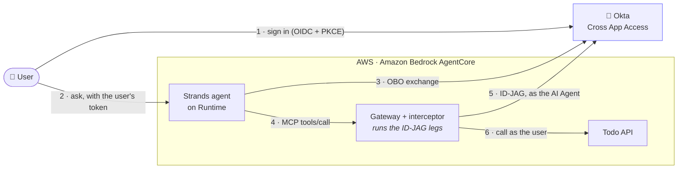
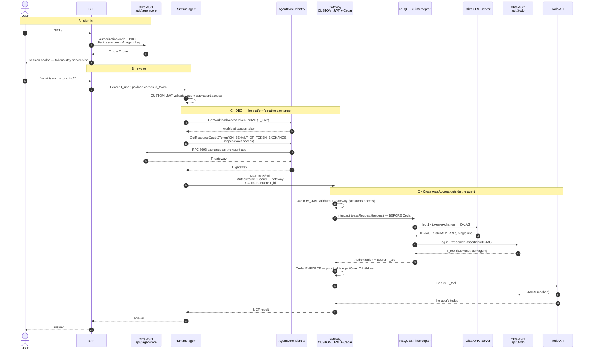
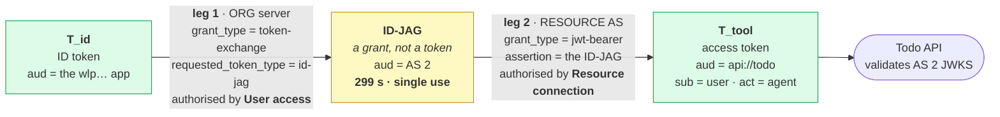

# Okta Cross App Access delegation chain + Amazon Bedrock AgentCore

A working sample where an AI agent reaches another application's API **on behalf of a
signed-in user**, and the **gateway** — not the agent — performs the Okta
[Cross App Access](https://www.okta.com/solutions/cross-app-access/) exchange
(Identity Assertion JWT Authorization Grant, **ID-JAG**,
[draft-ietf-oauth-identity-assertion-authz-grant](https://datatracker.ietf.org/doc/html/draft-ietf-oauth-identity-assertion-authz-grant)).

- **Requesting app** — a [Strands](https://strandsagents.com) agent on **AgentCore
  Runtime**, behind an inbound JWT authorizer. It calls an **AgentCore Gateway** over
  MCP and never holds a credential that can reach the API.
- **Exchange point** — a **gateway REQUEST interceptor** runs both ID-JAG legs and
  injects the resulting token. The AI Agent's signing key lives only here.
- **Resource app** — a FastAPI "todo" API fronted by an Okta **custom authorization
  server**. It only *validates*.
- **IdP** — your Okta tenant with **Cross App Access / AI Agents** enabled.

Two exchanges, deliberately different: a **standard OBO** exchange gets the agent from
the user's token to a gateway-scoped token, then **ID-JAG** crosses into the resource's
authorization server.



*The API receives a token whose `sub` is the **human** and whose `act.sub` is the
**agent** — no static API keys, and no tool credential inside the agent.*

> **Verified end to end** against a real Okta tenant and AWS account: sign-in, the OBO
> exchange, both ID-JAG legs, Cedar enforcement, and the resource API resolving the
> caller. Evidence for every non-obvious claim is in
> [`scripts/spikes/FINDINGS.md`](scripts/spikes/FINDINGS.md).

## How it works



### Why ID-JAG takes two legs



The IdP knows *who the user is*; the resource's authorization server owns *that API's*
audience, scopes and signing keys. Neither can do the other's job, so leg 1 produces a
portable **attestation** and leg 2 redeems it for a real token — leaving the resource
owner a veto. The AI Agent's `private_key_jwt` authenticates **both** legs.

A single exchange suffices only when one server both knows the user and owns the
resource, which is exactly why hop **C** needs just one call.

### Five identities to keep straight

| Identity | `.env` | What it is |
| --- | --- | --- |
| **AI Agent + linked app** | `AI_AGENT_CLIENT_ID` = `LOGIN_CLIENT_ID` (`wlp…`) | One client, three jobs: the user **signs in** to it, and it authenticates **both ID-JAG legs**. Okta's *User access* binding makes it the only app whose ID token leg 1 accepts. |
| **Agent app** | `AGENT_APP_CLIENT_ID` (`0oa…`) | API Services app with the Token Exchange grant, used by AgentCore Identity for the OBO exchange. Holds a secret the agent never sees. |
| **AS 1** | `AGENTCORE_AS_ISSUER`, `api://agentcore` | Issues `T_id`/`T_user` at sign-in and `T_gateway` via OBO. Runtime and Gateway both trust it. |
| **AS 2** | `RESOURCE_AS_ISSUER`, `api://todo` | Redeems the ID-JAG and mints `T_tool`. Separate on purpose: the API trusts **only** this issuer, which is what makes the agent's own tokens useless against it. |
| **Org server** | `OKTA_ORG_URL` | Mints the ID-JAG. Only the org server can. |

### Tokens, with claims observed live

| Token | `iss` | `aud` | `sub` | `scp` | TTL |
| --- | --- | --- | --- | --- | --- |
| `T_id` | AS 1 | the `wlp…` app | user **id** | — | 1 h |
| `T_user` | AS 1 | `api://agentcore` | **email** | `agent.access` | 1 h |
| `T_gateway` | AS 1 | `api://agentcore` | email | `tools.access` | 1 h |
| **ID-JAG** | **org** | AS 2 | user id | `todos.read` | **299 s**, single use |
| **`T_tool`** | **AS 2** | **`api://todo`** | **email** | `todos.read` | 1 h |

`T_tool` also carries `cid` and **`act.sub`** naming the agent, plus
`sub_profile = ai_agent web_app`, so the API sees *who* the user is **and** *which
agent* acted. Note `sub` is the Okta **user id** on `T_id`/ID-JAG but the **email** on
access tokens — never assume they match.

## Repository layout

```
08-okta-xaa-delegation-chain/
├─ resource-app/          Todo API (FastAPI) — validates the AS 2 token, issues nothing
│  ├─ main.py             /todos, /whoami; checks iss, aud, scp, and optionally act.sub
│  ├─ lambda_handler.py   Mangum wrapper for Lambda
│  └─ requirements.txt · .env.example
├─ interceptors/
│  ├─ request_interceptor.py   both ID-JAG legs; injects Authorization; caches T_tool
│  └─ requirements.txt
├─ agent/                 Strands agent for AgentCore Runtime
│  ├─ agent.py            OBO exchange, then MCP to the gateway
│  └─ requirements.txt
├─ frontend/              FastAPI BFF: Okta sign-in, /ask
├─ gateway/todo-tools.json    OpenAPI for the todo target
├─ policies/*.cedar       per-user, per-tool authorization
├─ deploy/                numbered, idempotent; each writes state back to .env
└─ scripts/               keypair, verification, the chain test, tracing, cleanup
```

## Prerequisites

- Python 3.11+, Node 20+ and `npm install -g @aws/agentcore aws-cdk`
- AWS credentials, a bootstrapped account, and Bedrock model access
- An Okta org with **API Access Management** *and* **Cross App Access / AI Agents**
  (often listed as *Agent to Agent Connections* under Settings → Features), plus a
  **Single Sign-On** subscription
- An Okta admin API token, and a test user you can sign in as

> **ID-JAG quota.** Under plain SSO, Okta allows **250 ID-JAGs per user, per resource
> app, per month**. The interceptor caches `T_tool` for its full hour and only
> exchanges on `tools/call`, so normal use is nowhere near the cap.

## Set up a virtual environment

```bash
cd 08-okta-xaa-delegation-chain
python3 -m venv .venv && source .venv/bin/activate
pip install -r requirements.txt
cp config.example.env .env      # then set OKTA_ORG_URL and OKTA_API_TOKEN
```

## Okta setup

```bash
python deploy/00_create_okta_apps.py    # two authorization servers, scopes, apps, policies
python scripts/gen_keypair.py           # the AI Agent's private_key_jwt keypair
```

Then register the **AI Agent** in the Admin Console — the one step with no API — and
run the two follow-ups. Full walkthrough with every field and its failure mode:
**[IDP_SETUP_OKTA.md](IDP_SETUP_OKTA.md)**.

```bash
python deploy/00_relink_login_app.py    # sign-in moves to the agent's linked app
python deploy/00_authorize_agent.py     # authorise the agent on the resource AS
python scripts/verify_ai_agent.py       # confirm everything the API can see
```

## Deploy

```bash
python deploy/01_deploy_resource.py                     # todo API → Lambda + HTTP API
python deploy/02_create_gateway.py --allow-user-scope    # gateway, interceptor, policy engine, target
python deploy/03_create_policies.py                      # Cedar
python deploy/04_create_obo_provider.py                  # AgentCore Identity provider for hop C
```

### Milestone: prove hop D without the agent

```bash
python scripts/test_chain.py
```

Signs you in and calls the gateway directly with the two headers the agent will send.
A pass means the interceptor, both ID-JAG legs, the injection, Cedar and the API all
work. `whoami` should return your email as `user` and the AI Agent as `acting_agent`.

### Deploy the agent and the BFF

```bash
agentcore create --project-name xaatodoagent --name xaatodoagent \
  --framework Strands --model-provider Bedrock --memory none \
  --build CodeZip --language Python --defaults
cp agent/agent.py xaatodoagent/app/xaatodoagent/main.py
python deploy/05_patch_agentcore_json.py     # Okta inbound auth + env vars
( cd xaatodoagent && agentcore validate && agentcore deploy -y )
python deploy/06_grant_iam.py                # OBO permissions for the execution role
python deploy/07_enable_observability.py     # transaction search + log retention
python deploy/02_create_gateway.py           # re-run WITHOUT --allow-user-scope to tighten
python frontend/app.py                       # http://localhost:8000
```

Ask *"what is on my todo list?"* and you should get your own items.

## Tracing a request

```bash
python scripts/show_trace.py            # stitch one request across all four log groups
python scripts/show_okta_events.py      # the matching Okta System Log token grants
```

The interceptor logs one structured line per step with `trace_id`, and token **claims**
only — never token material. First call for a user costs ~1.7 s for the two legs; after
that it is a cache hit of a few milliseconds.

## Troubleshooting (error ladder)

| Symptom | Cause | Fix |
| --- | --- | --- |
| `insufficient_scope` at the gateway | **`allowedClients` does not work with Okta** — it compares a claim Okta does not emit (`cid` is not matched), and reports the mismatch as a scope error | pin on `allowedScopes` instead; `02_create_gateway.py` does |
| `No module named 'jwt'` as a 500 from a tool call | interceptor shipped without dependencies | rebuild: the bundle needs `pyjwt`+`cryptography` with `--platform manylinux2014_x86_64` |
| `Policy Evaluation Internal Failure` | something non-JWT ended up in `Authorization`; Cedar cannot build a principal | the interceptor must inject a real JWT, and must pass the request through untouched on failure |
| `'subject_token' is invalid: no delegation policy authorizes this token` | leg 1 got an **access** token, or an ID token from the wrong app | leg 1 needs the ID token from the agent's **linked** app |
| `access_denied: Policy evaluation failed` | the agent is not in the AS 2 policy | `python deploy/00_authorize_agent.py` |
| `invalid_client` on every call | the AI Agent is **STAGED**, or the key is staged not ACTIVE | Actions → Activate; check the ACTIVE badge on Public/private key |
| `invalid_grant: id-jag already used` | ID-JAGs are single-use | mint one per exchange; never cache the ID-JAG (only `T_tool`) |
| `wrong issuer: this API only trusts …` | a token from AS 1 reached the API | expected — this is the check that makes the agent's tokens useless |
| Cedar denies everything | a policy names one tool action, or is still `CREATING` | `python deploy/03_create_policies.py --list` |
| Policy engine name rejected | names allow **no hyphens** (`^[A-Za-z][A-Za-z0-9_]*$`) | unlike gateway/target names, which do |
| Sign-in stalls on MFA | the linked app's policy defaults to *Any two factors* | enrol a factor or repoint its Sign On policy |

## Cleanup

```bash
python deploy/teardown.py               # preview
python deploy/teardown.py --yes         # delete AWS resources
python deploy/teardown.py --yes --include-runtime   # also the AgentCore stack
python deploy/00_delete_okta_apps.py --yes          # the Okta apps and servers
```

The **AI Agent** has no delete API — remove it in the Admin Console
(Directory → AI Agents).

## Security notes

- **The agent holds no credential that reaches the API.** It handles `T_user` and
  `T_gateway`, both audienced at `api://agentcore`; the API trusts only AS 2 and
  `api://todo`, so those tokens fail there. `T_tool` exists solely in the interceptor
  and on the gateway's forwarded request.

  The control worth enforcing is therefore *the agent never holds a token that can
  reach the resource, and no credential enters the model's context* — not "the agent
  never sees a token at all". Removing tokens from the agent entirely would mean a
  side-channel cache and an agent-supplied user reference, which adds an impersonation
  surface this design does not have. Prefer the stricter variant if the agent runs
  untrusted code, the token is long-lived or broadly scoped, or a rule forbids
  credentials transiting that component.
- **No credential enters the model's context.** Tokens live in headers and variables,
  never in the prompt, and the agent's output is buffered before being yielded.
- **The AI Agent's private key** is in Secrets Manager, read only by the interceptor.
  Treat the keypair as immutable once registered; rotate by adding a new `kid`.
- **`.env` holds plaintext secrets**, including an Okta admin token. It is gitignored
  (`.env` and `.env.*`), but treat it as a sandbox, not a pattern for production.
- **The BFF session cookie** is signed, `HttpOnly` and `SameSite=Lax`, but deliberately
  not `Secure`, because that would break `http://localhost`. Add `https_only=True`
  before serving it anywhere else.
- **Scope the resource API further** by setting `EXPECTED_ACT_SUB`, which requires the
  acting agent to be *your* agent rather than any agent Okta vouches for.
