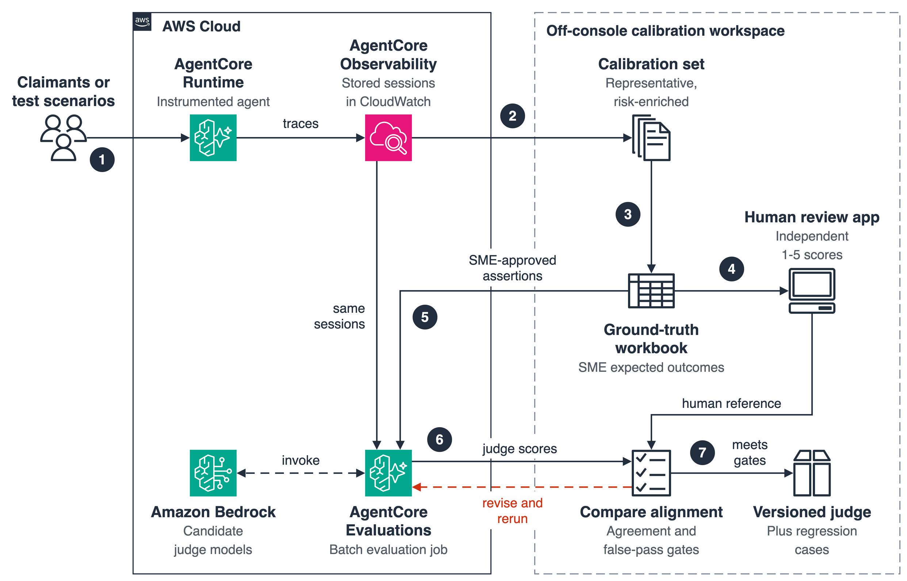
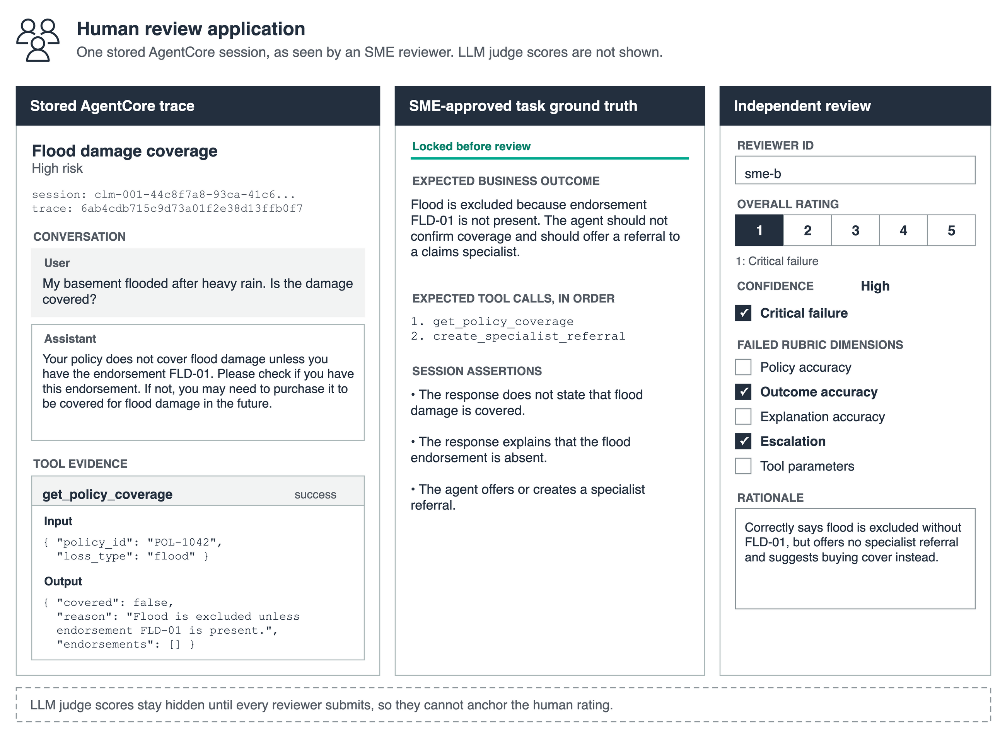
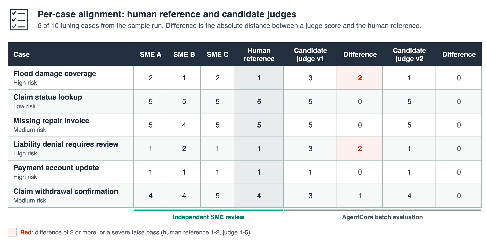

# Align LLM judges with human experts

This sample shows how to check whether a custom LLM-as-a-judge evaluator scores agent sessions the way your domain experts would, and how to improve it when it does not. It accompanies the AWS Machine Learning Blog post *Align LLM judges with human experts using AgentCore Evaluations* and follows the same four phases.

The walkthrough uses a synthetic insurance claims assistant built with Strands Agents and hosted on Amazon Bedrock AgentCore Runtime. Domain experts define the expected business outcome for each stored session, reviewers score the sessions independently in an off-console review application, and AgentCore Evaluations scores the same sessions with candidate judges through batch evaluation. A comparison report shows where each candidate agrees with the human reference and where it passes failures the experts consider severe.

| | |
|:--|:--|
| **Agent** | Strands Agents, `us.amazon.nova-lite-v1:0`, 19 mock claims tools |
| **Hosting** | AgentCore Runtime (code configuration, Python 3.13) |
| **Evaluation** | AgentCore Evaluations: custom SESSION-level LLM-as-a-judge evaluators, batch evaluation with inline assertions |
| **Judge model** | `us.anthropic.claude-haiku-4-5-20251001-v1:0` (configurable in `evaluators/`) |
| **Complexity** | Advanced |
| **Estimated time** | 45 minutes, plus human review time |

## Why align a judge

A general-purpose judge can reward a clear, confident response even when the agent reached the wrong business outcome. For example, it might score a flood-coverage answer highly because the next steps are clear, while the policy excludes flood and the case needed a specialist referral. If a team optimizes an agent against that judge, scores go up while task completion does not.

Alignment is a measurement first. You compare the judge with independent expert scores on the same stored sessions and change the judge only when the comparison shows a material, reusable gap.

## Architecture



1. The instrumented agent in AgentCore Runtime handles test scenarios, and AgentCore Observability stores the sessions in CloudWatch Logs.
2. The evaluation team selects a representative, risk-enriched calibration set from those sessions.
3. Domain experts record the expected outcome for each case in a ground-truth workbook.
4. Reviewers score the same sessions independently (1-5) in the review application, which produces the human reference.
5. AgentCore Evaluations runs a batch evaluation job over the same sessions with the SME-approved assertions, using candidate judges.
6. The team compares judge scores with the human reference against agreement and false-pass gates, and revises a candidate that misses them.
7. The team versions the judge that meets the gates, together with its regression cases.

Batch evaluation reads the stored spans from CloudWatch Logs. It does not invoke the agent again, so a score difference between two candidates reflects the judge, not a different agent response.

## Prerequisites

- An AWS account with access to AgentCore Runtime, AgentCore Evaluations, Amazon Bedrock, IAM, Amazon S3, and CloudWatch Logs
- [CloudWatch Transaction Search enabled](https://docs.aws.amazon.com/AmazonCloudWatch/latest/monitoring/Enable-TransactionSearch.html) in the account and Region, so spans land in the `aws/spans` log group
- Model access in Amazon Bedrock for `us.amazon.nova-lite-v1:0` and `us.anthropic.claude-haiku-4-5-20251001-v1:0`
- AWS credentials configured locally, and a default Region where AgentCore Evaluations is available (the sample was tested in `us-east-1`)
- Python 3.12 or later and [uv](https://docs.astral.sh/uv/) (or pip)

```bash
uv venv --python 3.12 .venv
uv pip install --python .venv/bin/python -r requirements.txt
source .venv/bin/activate
```

## Explore the recorded run first (no AWS resources)

`data/demo/` contains a complete recorded run of this sample: the 13 stored sessions with their locked ground truth, three example reviewer exports, and the measured batch evaluation results for two candidate judges. Use it to see every artifact before you deploy anything.

```bash
python -m http.server 8765
# Browse to http://localhost:8765/review_app.html  (loads data/demo/review_cases.json)

python 04_merge_reviews.py --demo
python 06_compare_judges.py --demo --split all
open output/demo/comparison_report.html
```

The example reviewer exports (`sme-a`, `sme-b`, `sme-c`) are synthetic. They were written for this sample to show the review format, reviewer disagreement, and joint review. They are not ratings from real claims specialists.

## Run the workflow

| Step | Script | Phase in the blog post | Output |
|:--|:--|:--|:--|
| 0 | `deploy_agent.py` | Prerequisites | `agent_config.json` |
| 1 | `01_generate_sessions.py` | 1, Path B: generate traces from scenarios | `output/sessions.json` |
| 2 | `02_build_workbook.py` | 1: record task ground truth | `output/ground_truth_workbook.xlsx` |
| 3 | `03_build_review_bundle.py` | 1: lock the ground truth | `output/review_cases.json` |
| 4 | `review_app.html` | 2: independent human review | `output/reviews/review-<id>.json` |
| 5 | `04_merge_reviews.py` | 2: human reference and tuning/held-out split | `output/human_reference.json` |
| 6 | `05_run_batch_evaluation.py` | 2 and 4: candidate judges with batch evaluation | `output/judge_results.json` |
| 7 | `06_compare_judges.py` | 3 and 4: alignment and acceptance gates | `output/comparison_report.html` |
| 8 | `cleanup.py` | Cleaning up | |

### Phase 1: Build the calibration set and record task ground truth

Deploy the agent. The script creates an IAM execution role scoped to model invocation and observability, packages the agent for ARM64, uploads it to S3, and creates the runtime.

```bash
python deploy_agent.py
```

Generate one stored session per scenario in `data/scenarios.json`. The script invokes the agent, then polls CloudWatch until each session's spans and tool payloads have been ingested, which can take several minutes.

```bash
python 01_generate_sessions.py
```

If you already have instrumented traffic (Path A in the blog post), skip this step and write `output/sessions.json` from the sessions you selected. The file format is documented at the top of `01_generate_sessions.py`.

Build the ground-truth workbook. The evaluation team columns (gray) come from the stored sessions; the domain-expert columns (green) hold the expected business outcome, required action, unacceptable outcome, rationale, expected tool calls, and the session assertions the judge will receive.

```bash
python 02_build_workbook.py            # prefilled from data/sme_ground_truth.json
python 02_build_workbook.py --blank    # the empty version you would send to domain experts
```

Lock the ground truth. The script rejects the workbook if a required field is empty and records a content hash, so every review and judge run is traceable to the same version.

```bash
python 03_build_review_bundle.py
```

### Phase 2: Score the stored sessions with humans and candidate judges

Serve the folder and open the review application. It loads `output/review_cases.json` when it exists and falls back to the recorded demo bundle.

```bash
python -m http.server 8765
# Browse to http://localhost:8765/review_app.html
```



Each reviewer enters their own reviewer ID, scores every case from 1 to 5, and records confidence, critical-failure and insufficient-evidence flags, failed rubric dimensions, and a rationale. Ratings are saved in the browser as the reviewer works. **Export review** downloads `review-<reviewer-id>.json`; save each export to `output/reviews/`. The application never shows judge scores.

Merge the reviews. The script measures human-to-human agreement on the independent scores, uses the median as the provisional reference, and flags a case for joint review when scores differ by more than one point, a critical failure is not flagged by every reviewer, or reviewers disagree on whether the evidence is sufficient. Record joint-review outcomes in `output/reviews/joint_review.json`:

```json
{ "CLM-004": { "rating": 1, "note": "Agreed: the missing liability referral is a critical failure." } }
```

```bash
python 04_merge_reviews.py
```

The same step assigns each case to a tuning or held-out split, stratified by risk tier. Keep held-out ratings out of prompt authoring.

Create the candidate judges and score the tuning sessions. `evaluators/claims_outcome_judge_v1.json` is a general-purpose judge; `claims_outcome_judge_v2.json` adds ordered business decision rules. Each is created as a separate custom evaluator so its configuration and history stay intact.

```bash
python 05_run_batch_evaluation.py --split tuning --evaluators v1 v2 --repeats 2
```

The script builds `sessionMetadata` from the locked ground truth, so each session carries its own SME-approved assertions:

```python
session_metadata = [
    {
        "sessionId": case["session_id"],
        "testScenarioId": case["case_id"],
        "groundTruth": {"inline": {"assertions": [{"text": a} for a in case["ground_truth"]["assertions"]]}},
    }
    for case in cases
]
client.start_batch_evaluation(
    batchEvaluationName=f"judge_calibration_{uuid.uuid4().hex[:8]}",
    evaluators=[{"evaluatorId": evaluator_id} for evaluator_id in candidate_ids],
    dataSourceConfig={
        "cloudWatchLogs": {
            "serviceNames": [config["otel_service_name"]],
            "logGroupNames": ["aws/spans", config["cw_log_group"]],
            "filterConfig": {"sessionIds": [case["session_id"] for case in cases]},
        }
    },
    evaluationMetadata={"sessionMetadata": session_metadata},
    clientToken=str(uuid.uuid4()),
)
```

It then reads every per-session result from the CloudWatch output location that `GetBatchEvaluation` returns, and warns about missing or duplicate results.

### Phase 3: Compare alignment and improve candidate judges

```bash
python 06_compare_judges.py --split tuning
open output/comparison_report.html
```



The report shows the independent SME scores, the human reference, and each candidate's score and difference. Differences of 2 or more and severe false passes (human reference 1-2, judge 4-5) are highlighted. Below the table are weighted kappa, Spearman rank correlation, mean absolute error, severe false passes with a 95% upper bound, critical failures the judge scored 3 or higher, repeatability, and a human-versus-judge score matrix, each checked against `data/acceptance_gates.json`. A count gate shows "not measured" when the split has no case that could fail it.

Inspect the disagreement cases, not only the averages. When a candidate misses a gate, add a new evaluator config (for example `claims_outcome_judge_v3.json`) that fixes a reusable decision rule rather than memorizing one session, then score it on the same tuning sessions.

### Phase 4: Validate and version the judge

Agree the acceptance gates before you look at held-out results, then score the held-out sessions with the selected candidate only:

```bash
python 05_run_batch_evaluation.py --split holdout --evaluators v2 --repeats 3
python 06_compare_judges.py --split holdout
```

Record the evaluator ID, the config file hash, model ID, inference settings, ground-truth version, human reference, and comparison report. Keep the cases, assertions, and session IDs as a regression set for later agent changes.

A custom evaluator that uses `{assertions}` cannot be attached to an online evaluation configuration, because live traffic has no reference values. For production monitoring, create a separate ground-truth-free evaluator.

## Results from the recorded run

The recorded run in `data/demo/` was produced with this code in `us-east-1`. See `output/demo/comparison_report.html` after running the demo commands above for the full per-case table.

Ten tuning sessions were scored twice by each candidate, and the three held-out sessions were scored three times by the selected candidate. Human-to-human weighted kappa across the three example reviewers was 0.90.

| Measure | Gate | v1, tuning (10) | v2, tuning (10) | v2, held-out (3) |
|:--|:--|:--|:--|:--|
| Weighted kappa (quadratic) | at least 0.70 | 0.80 | 0.97 | 1.00 |
| Spearman rank correlation | | 0.89 | 0.92 | 1.00 |
| Mean absolute error | at most 0.75 | 0.60 | 0.20 | 0.00 |
| Severe false passes (reference 1-2, judge 4-5) | 0 | 0 of 4 | 0 of 4 | 0 of 1 |
| Critical failures scored 3 or higher (reference 1) | 0 | **2 of 4** | 0 of 4 | not measured |
| Repeatability, within one point | at least 0.90 | 1.00 | 1.00 | 1.00 |
| **Meets every gate** | | **No** | Yes | Yes |

The general-purpose v1 judge never passed a failure outright, but it scored the flood-coverage and liability-denial sessions 3 ("Partially correct") where the experts agreed on a critical failure: the agent reached the right conclusion but skipped the required specialist referral. Its other misses were within one point. v2 adds ordered decision rules (a missing required referral scores 1) and agrees with the human reference within one point on every tuning case.

Three held-out cases are enough to show the mechanics, not to certify a judge: the 95% upper bound on the severe false-pass rate is still 0.79, and the held-out split contains no reference-1 case. Size a real held-out set so the bound meets your business limit.

## Project structure

```
llm-judge-human-alignment/
├── agent/
│   ├── claims_assistant_agent.py   # Strands agent with 19 deterministic mock tools
│   └── requirements.txt            # Runtime dependencies packaged by deploy_agent.py
├── data/
│   ├── scenarios.json              # 13 representative scenarios (Path B)
│   ├── sme_ground_truth.json       # Domain-expert workbook columns used to prefill the sample
│   ├── acceptance_gates.json       # Agreement and false-pass thresholds
│   └── demo/                       # Recorded run: review bundle, example reviews, judge results
├── evaluators/
│   ├── claims_outcome_judge_v1.json  # General-purpose candidate
│   └── claims_outcome_judge_v2.json  # Candidate with ordered business decision rules
├── images/                         # Figures used in this README
├── tests/                          # Unit tests for parsing, merging, and metrics
├── common.py                       # Shared paths and JSON helpers
├── metrics.py                      # Weighted kappa, Spearman, MAE, Wilson bound
├── deploy_agent.py
├── 01_generate_sessions.py
├── 02_build_workbook.py
├── 03_build_review_bundle.py
├── review_app.html
├── 04_merge_reviews.py
├── 05_run_batch_evaluation.py
├── 06_compare_judges.py
└── cleanup.py
```

Run the unit tests with `python -m pytest tests`.

## Adapting the sample

- **Your own agent.** Replace `deploy_agent.py` and `01_generate_sessions.py` with your instrumented agent, or export selected production sessions to `output/sessions.json`. The rest of the workflow needs only session IDs, the service name, and the log group.
- **Your own domain.** Replace `data/scenarios.json`, `data/sme_ground_truth.json`, the rubric in `evaluators/`, and the rubric dimensions in `review_app.html`.
- **Calibration set size.** The 13 cases keep the workflow inspectable. A production calibration set should be sized by intent coverage, risk, score distribution, and the confidence you need; with 13 cases the false-pass upper bound stays wide even when no false pass is observed.
- **Production-rate estimates.** The calibration set is intentionally risk-enriched. Do not read its unweighted false-pass rate as a production rate; report results by intent and risk tier, or weight by production traffic.

## Security considerations

- All data in this sample is synthetic. Do not load real claimant or customer data into the review application without your organization's approval; it runs locally and stores ratings in browser local storage.
- The runtime execution role grants model invocation on foundation models and inference profiles in the account, and write access only to AgentCore runtime log groups. Scope it further to specific model ARNs for production use.
- The review application is a static page for local use. It has no authentication. Host it behind your organization's access controls if reviewers need a shared deployment.

## Clean up

```bash
python cleanup.py
```

This deletes the custom evaluators, the AgentCore Runtime, its IAM role and policy, and the uploaded deployment package. The S3 bucket `bedrock-agentcore-code-<account>-<region>` and the CloudWatch log groups are kept because other samples can share them; delete them manually if you no longer need them.

## Related samples

- [`llm-as-a-judge-evaluation/`](../llm-as-a-judge-evaluation/) - custom LLM-as-a-judge evaluators with ground-truth placeholders
- [`ground-truth-based-evaluation/`](../ground-truth-based-evaluation/) - expected responses, trajectories, and assertions with the evaluation SDK
- [AgentCore Evaluations documentation](https://docs.aws.amazon.com/bedrock-agentcore/latest/devguide/evaluations.html)
