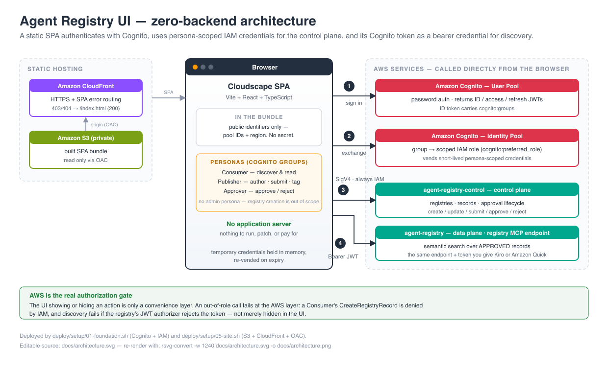
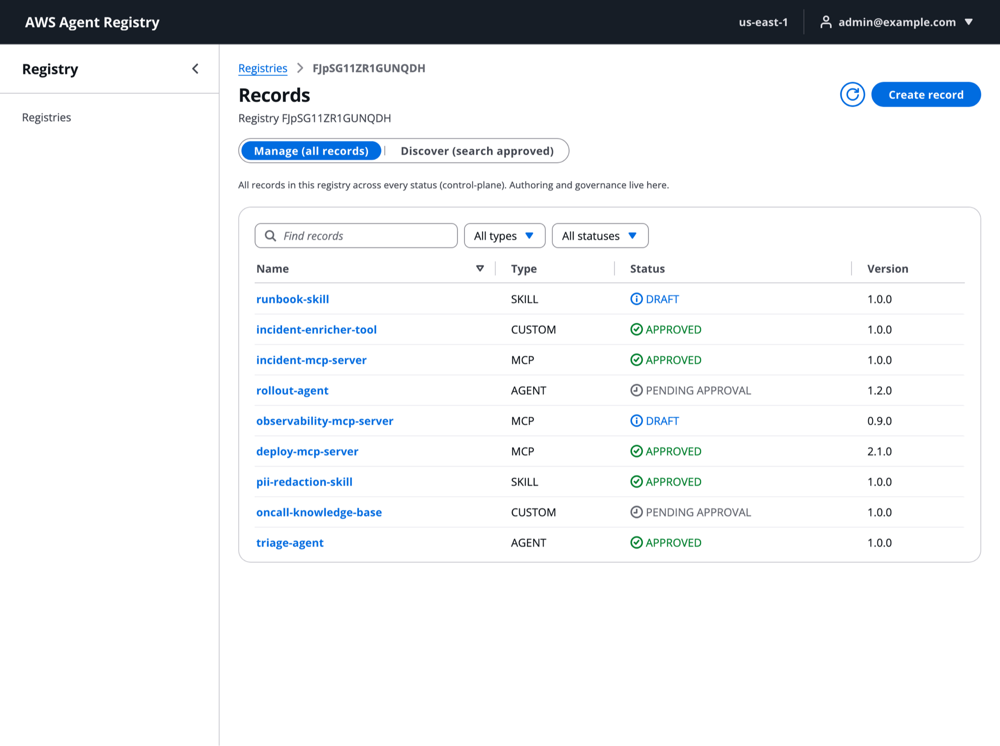
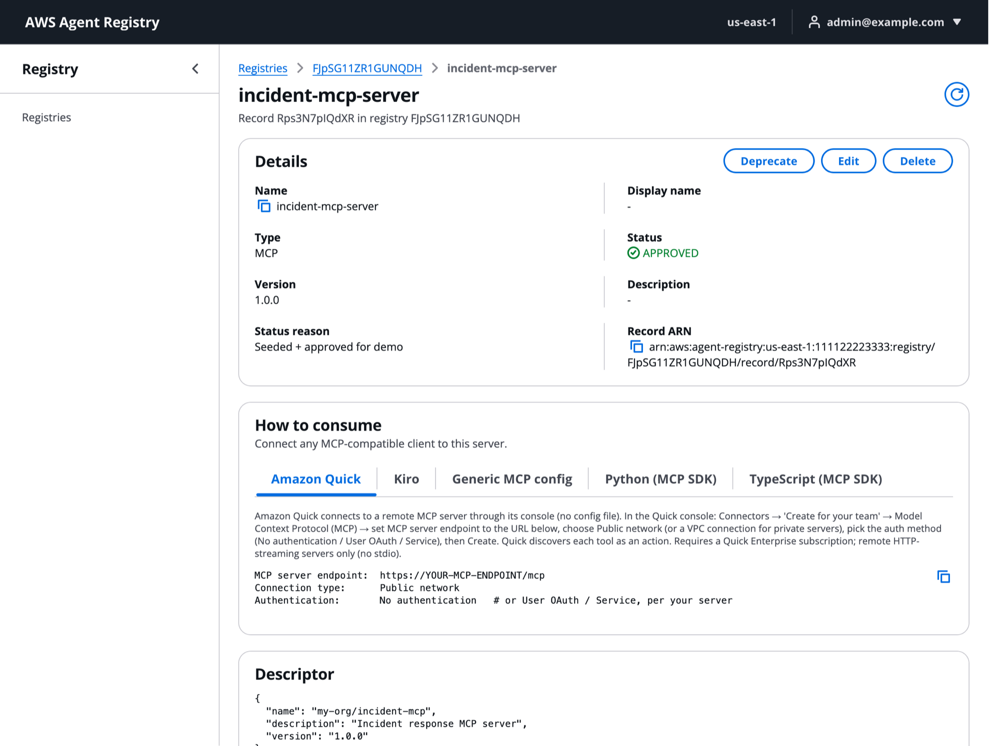

<!-- Copyright Amazon.com, Inc. or its affiliates. All Rights Reserved. -->
<!-- SPDX-License-Identifier: Apache-2.0 -->

# AWS Agent Registry Web UI — Publisher, Approver and Consumer Console

> **⚠️ CAUTION:** The examples provided in this repository are for experimental and educational purposes only. They demonstrate concepts and techniques but are not intended for direct use in production environments.

A zero-backend, password-protected single-page app that gives
[AWS Agent Registry](https://docs.aws.amazon.com/bedrock-agentcore/latest/devguide/registry.html)
a console-style UI for discovering, browsing, and publishing the agents, MCP
servers, and skills registered in it. The browser authenticates against Amazon
Cognito, exchanges the token for short-lived **persona-scoped IAM credentials**
for control-plane work, and uses its **Cognito access token as a bearer token**
against the registry's MCP endpoint for discovery — there is no application
server to run or pay for.

Built with the [Cloudscape](https://cloudscape.design/) design system
(Vite + React + TypeScript). See [`DESIGN.md`](DESIGN.md) for the full
architecture, verified API surface, and persona model.

> **Registry version.** This sample targets the **new (GA) AWS Agent Registry** in the
> dedicated `agent-registry` service namespace: the `@aws-sdk/client-agent-registry` and
> `@aws-sdk/client-agent-registry-control` SDK clients, the `aws agent-registry-control`
> CLI, `agent-registry:*` IAM actions, and the
> `https://agent-registry.<region>.api.aws/registry/<id>/mcp` endpoint. It does **not**
> use the public-preview registry APIs in the `bedrock-agentcore` namespace. If you have
> preview registries, see [`04-migrate-to-new-namespace`](../../04-migrate-to-new-namespace/)
> and the [registry migration guide](https://docs.aws.amazon.com/bedrock-agentcore/latest/devguide/registry-faq.html).
> Other AgentCore services used here (AgentCore Gateway and AgentCore Identity in the
> optional sample MCP server) keep their `bedrock-agentcore` namespace.

## Tutorial Details

| Information              | Details                                                                                                  |
|:-------------------------|:---------------------------------------------------------------------------------------------------------|
| Tutorial type            | Full-stack sample (static web UI + deployment scripts)                                                   |
| AgentCore components     | AWS Agent Registry (control plane + discovery/MCP endpoint); AgentCore Gateway and AgentCore Identity (optional sample MCP server) |
| Record types             | MCP, AGENT (A2A agent card), SKILL (agent skills), CUSTOM                                                |
| Tutorial components      | Amazon Cognito (user pool + identity pool), AWS IAM, AWS CloudFormation, Amazon S3 + Amazon CloudFront (optional public site), AWS Lambda (optional sample MCP server) |
| Tutorial vertical        | Cross-vertical                                                                                           |
| Example complexity       | Advanced                                                                                                 |
| SDK used                 | AWS SDK for JavaScript v3 (`@aws-sdk/client-agent-registry*` 3.1126.0), AWS CLI v2, Cloudscape, Vite + React + TypeScript |

## Scope: the three day-to-day personas

This UI is deliberately **not** an admin console. It serves **Publishers**,
**Approvers**, and **Consumers** — the people who register, review, and find
things in a registry.

Creating a registry is an administrator/infrastructure action and stays out of the
app: it picks the registry's **immutable** authorization model, provisions an
AgentCore workload identity, and is normally done once in the AWS console, the CLI,
or IaC. In this sample `deploy/setup/03-registry.sh` does it with the deployer's own
credentials. There is no `CreateRegistry`, `DeleteRegistry`, or admin persona in the
frontend at all.

## Architecture



```
Browser (Cloudscape SPA)
  1. password auth    ─►  Cognito User Pool (groups: Publisher/Approver/Consumer)
  2. token exchange   ─►  Cognito Identity Pool (group → scoped IAM role)
  3. SigV4 SDK calls  ─►  agent-registry-control        CONTROL PLANE (always IAM)
                          publish / approve / tag
  4. Bearer JWT       ─►  registry MCP endpoint         DATA PLANE (CUSTOM_JWT)
                          agent-registry.<region>.api.aws/registry/<id>/mcp
```

The registry is created with a **`CUSTOM_JWT`** authorizer whose OIDC discovery URL
is this sample's own Cognito user pool, and whose `allowedClients` is the SPA's app
client. That has a useful consequence: the endpoint and token the app itself uses for
discovery are exactly what you paste into Kiro or Amazon Quick, so the app's
"Connect your tools" instructions are exercised rather than merely documented.

A registry's `discoveryConfiguration.authorizerType` controls **only** the
discovery/data plane (`SearchDiscoverableRegistryRecords`,
`ListDiscoverableRegistryRecords`, `BatchGetDiscoverableRegistryRecord`,
`InvokeRegistryMcp`). Every control-plane call always requires IAM, whichever
authorizer the registry uses. Set `REGISTRY_AUTH_MODE=AWS_IAM` before seeding to
build the SigV4 variant instead — see
[Authorization models](#authorization-models-jwt-vs-iam).

No secret is shipped in the bundle — only public identifiers (User Pool ID, App
Client ID, Identity Pool ID, region). Authorization is enforced by AWS, not by the
UI: the show/hide is a convenience layer over real enforcement. An out-of-role
action fails at the AWS layer — a Consumer's `CreateRegistryRecord` is denied by
IAM, not merely hidden in the UI.

## Key Features

- Browse registries and their registered records (agents, MCP servers, skills, custom).
- View record metadata, lifecycle status, tags, and the full descriptor JSON.
- Natural-language semantic search plus keyword/type/status filtering.
- Author records through a type-aware wizard (MCP / A2A agent card / skill / custom),
  **including tags applied at creation**, and either an inline descriptor or a
  **descriptor synchronized from a live endpoint** with an outbound credential provider.
- A deployable **sample MCP server** on an AgentCore Gateway, registered in the registry
  through that synchronization path.
- Full approval lifecycle: submit for approval, approve / reject / deprecate.
- **"Connect your tools"**: per-registry, copy-paste instructions for Kiro, Amazon
  Quick, Claude/generic MCP clients, and curl, plus how to mint the bearer token.
- A per-record "How to consume" guide with copyable connection snippets.
- Three personas (Consumer / Publisher / Approver) backed by scoped IAM roles.

## Personas (Cognito group → scoped IAM role)

| Group | Can |
|---|---|
| `AgentRegistryConsumer` | Discover & read (search / list / get / read tags) |
| `AgentRegistryPublisher` | + create/update records, submit for approval, tag records |
| `AgentRegistryApprover` | + approve / reject / deprecate records |

Registry administration (create / delete a registry) is intentionally absent — see
[Scope](#scope-the-three-day-to-day-personas).

## Prerequisites

- An AWS account in a Region where AWS Agent Registry is available (see
  [Supported AWS Regions](https://docs.aws.amazon.com/bedrock-agentcore/latest/devguide/agentcore-regions.html)).
  The scripts use `AWS_REGION` and default to `us-east-1`.
- Node.js 18.18+ and npm (`engines.node` in `frontend/package.json`)
- AWS CLI v2, recent enough to include the `agent-registry-control` commands, configured
  with credentials (`aws configure`)
- `jq` and `zip` (used by `06-sample-mcp-gateway.sh`)
- Python 3.10+ (only for the optional `deploy/mcp_client_tester.py` and for running the
  sample Lambda locally)
- Permission to create Cognito pools, IAM roles, CloudFormation stacks, Agent Registry
  resources and, for the optional layers, S3/CloudFront and Lambda/AgentCore Gateway
- Required IAM permissions for the **deploying operator**: the managed
  `AgentRegistryFullAccess` policy (or equivalent). `CreateRegistry` asynchronously
  provisions an AgentCore workload identity, so `agent-registry:*` alone is not
  enough — without the workload-identity permissions the registry silently reaches
  `CREATE_FAILED`. None of the three persona roles in the app need this.

## AWS Resources Created

| Layer | Script | Resources |
|---|---|---|
| 01 | `01-foundation.sh up` | CloudFormation stack `agentregistry-ui` (`deploy/cognito-stack.yaml`): Cognito user pool + SPA app client, Cognito identity pool + role attachment, 3 persona IAM roles, 3 user-pool groups |
| 02 | `02-config.sh up` | No AWS resources. Writes `deploy/state/outputs.env` and `frontend/.env` (both gitignored) |
| 03 | `03-registry.sh up` | AWS Agent Registry `AgentRegistryDemo` (`CUSTOM_JWT` or `AWS_IAM`), 9 seeded records, 3 Cognito persona users |
| 05 | `05-site.sh up` (optional) | Private S3 bucket, CloudFront Origin Access Control, CloudFront distribution, bucket policy |
| 06 | `06-sample-mcp-gateway.sh up` (optional) | Lambda function + execution role, AgentCore Gateway + target + gateway role, AgentCore Identity OAuth2 credential provider, Cognito resource server + machine-to-machine app client + user-pool domain, one more registry record |

## Project Structure

```
agent-registry-web-ui/
├── README.md
├── DESIGN.md                       # architecture, verified API surface, persona model
├── docs/
│   ├── architecture.png / .svg
│   └── screenshots/                # browse.png, detail.png
├── deploy/
│   ├── cognito-stack.yaml          # Cognito + persona IAM roles (CloudFormation)
│   ├── seed-registry.sh            # registry + records + persona users (called by 03)
│   ├── mcp_client_tester.py        # optional: end-to-end MCP client check of layer 06
│   ├── requirements-test.txt
│   ├── sample-mcp-server/          # Lambda tools + inline tool schema for layer 06
│   └── setup/                      # 00-preflight … 06-sample-mcp-gateway, 99-all, _lib.sh
└── frontend/
    ├── .env.example                # placeholders only
    ├── package.json / package-lock.json
    ├── src/
    │   ├── api/                    # SDK clients, registry MCP client, error mapping
    │   ├── auth/                   # Cognito sign-in + identity-pool credentials
    │   ├── components/             # wizard steps, consumption guide, tags, source editor
    │   ├── pages/                  # registries, records, record create/edit/detail
    │   └── personas/               # persona → capability map
    └── tests/                      # Vitest suites
```

## Quick Start

### 1. Deploy the Cognito + IAM foundation

The CloudFormation template creates the User Pool, app client, Identity Pool
(group → role mapping), the 3 persona IAM roles, and the 3 user-pool groups in
one shot:

```bash
git clone https://github.com/awslabs/agentcore-samples.git
cd agentcore-samples/01-features/07-centralize-and-govern-your-ai-infrastructure/03-registry/03-advanced/agent-registry-web-ui/deploy/setup

./00-preflight.sh        # read-only: check tooling + AWS identity + current state
./01-foundation.sh up    # CloudFormation: User Pool, Identity Pool, 3 persona IAM roles, groups
```

Each script prints what it is about to do and the exact AWS command it runs, so
nothing happens invisibly.

### 2. Write the local config from the stack outputs

```bash
./02-config.sh up        # writes deploy/state/outputs.env + frontend/.env
```

### 3. Create the registry + seed persona users

```bash
./03-registry.sh up                                   # generates a password, prints it once
# or reuse your own:  PERSONA_PASSWORD='<strong>' ./03-registry.sh up
# or build the SigV4 variant: REGISTRY_AUTH_MODE=AWS_IAM ./03-registry.sh up
```

This is the administrator step the UI deliberately does not perform. It creates the
demo registry **with a `CUSTOM_JWT` authorizer pointed at the user pool from step 1**,
seeds tagged MCP/AGENT/SKILL/CUSTOM records across the lifecycle (some approved, some
pending, some draft), creates one user per persona
(`approver@ / publisher@ / consumer@example.com`), and writes both
`VITE_REGISTRY_ID` and `VITE_REGISTRY_AUTH_MODE` into `frontend/.env`. The password
(>=12 chars, upper+lower+digit+symbol) is printed once and saved to
`deploy/state/persona-password.txt` (chmod 600, gitignored).

It also prints the registry's MCP endpoint and the `initiate-auth` command that mints
a bearer token for it — the same pair the app shows under "Connect your tools".

### 4. Run the UI locally

```bash
./04-run-local.sh        # npm install + build + preview on http://127.0.0.1:4173
```

### 5. Deploy the public site

```bash
./05-site.sh up          # private S3 bucket + CloudFront + OAC + bucket policy
```

Prints the public `https://<distribution>.cloudfront.net` URL. It sets
`DefaultRootObject=index.html`, `redirect-to-https`, and CloudFront custom error
responses `403/404 → /index.html (200)` so client-side routes resolve. Allow
~10-15 min for the first distribution deploy.

### 6. Stand up the sample MCP server (optional)

```bash
./06-sample-mcp-gateway.sh up
```

Creates a Lambda-backed MCP server on an AgentCore Gateway, an AgentCore Identity
credential provider over the same Cognito pool, and a registry record whose descriptor
is synchronized from the gateway — see
[Sample MCP server](#sample-mcp-server-on-agentcore-gateway).

Or run every layer at once with `./99-all.sh up` (`SKIP_SAMPLE=1` leaves step 6 out).

### Screenshots

| Registries & records | Record detail |
|:---:|:---:|
|  |  |

## Sample Walkthrough

This sample has no LLM prompts. Use these persona walkthroughs instead, signing in with
the users and password printed by `03-registry.sh up`:

1. **Consumer — discover.** Sign in as `consumer@example.com`, open `AgentRegistryDemo`,
   switch to **Discover (search approved)** and search for `incident response`. Only
   APPROVED records are returned. **Create record** is not offered, and calling
   `CreateRegistryRecord` with these credentials is denied by IAM.
2. **Publisher — author and submit.** Sign in as `publisher@example.com`, choose
   **Create record**, pick MCP, paste an inline `server.json`, add tags such as
   `owner=my-team`, create it, and then **Submit for approval**. The record moves from
   DRAFT to PENDING_APPROVAL.
3. **Approver — govern.** Sign in as `approver@example.com`, open the pending record
   and **Approve** it (or **Reject** with a reason). Then **Deprecate** an approved record
   and confirm it no longer appears in discovery.
4. **Consumer — connect a tool.** As the consumer, open the registry's **Connect your
   tools** tab, mint a token with the printed `initiate-auth` command, and add the
   registry MCP endpoint to Kiro or another MCP client.
5. **Publisher — synchronize from an endpoint (optional, needs layer 06).** Create an MCP
   record with **Synchronize from endpoint**, using the sample gateway URL and the
   pre-filled OAuth credential provider. The record goes from CREATING to DRAFT with its
   tools filled in by the registry.

   The registry renames a synchronized record after what it finds at the endpoint (here
   `<APP_NAME>-sample-mcp`, version `1.0.0`), and layer 06 has already registered that
   gateway. So on a default deployment this step lands in CREATE_FAILED with "A record
   with name ... already exists". To see a finished synchronization, open the record
   layer 06 created. To repeat it from the UI, first delete that record with the
   deployer's credentials (`aws agent-registry-control delete-registry-record
   --registry-id <id> --record-id <SAMPLE_RECORD_ID from deploy/state/outputs.env>`).

## Scripts

Run from `frontend/`:

| Command | What |
|---|---|
| `npm run dev` | Local dev server (127.0.0.1:5173) |
| `npm run build` | Type-check + production build to `dist/` |
| `npm run typecheck` | `tsc --noEmit` |
| `npm run lint` | ESLint |
| `npm test` | Vitest behaviour suite (persona/descriptor/error/API/tags/config/routing) |

Run from `deploy/setup/` — each layer takes `up` or `down`, so create and destroy
of a resource live in the same script and cannot drift:

| Command | What |
|---|---|
| `./00-preflight.sh` | Read-only: verify tooling, AWS identity, current state |
| `./01-foundation.sh up\|down` | CloudFormation: Cognito pools + Identity Pool + 3 IAM roles |
| `./02-config.sh up\|down` | Write / reset `deploy/state/outputs.env` + `frontend/.env` |
| `./03-registry.sh up\|down` | Registry (CUSTOM_JWT) + 9 tagged records + 3 persona users |
| `./04-run-local.sh` | Build + preview the SPA on 127.0.0.1:4173 |
| `./05-site.sh up\|down` | Public site: S3 + CloudFront + OAC (+ bucket policy) |
| `./06-sample-mcp-gateway.sh up\|down` | Sample MCP server: Lambda + AgentCore Gateway + AgentCore Identity credential provider + a synchronized registry record |
| `./99-all.sh up\|down` | Every layer in order (`up`) / reverse (`down`) |

See [`deploy/setup/README.md`](deploy/setup/README.md) for the environment
overrides (`AWS_REGION`, `APP_NAME`, `STACK_NAME`, `REGISTRY_NAME`, `PERSONA_PASSWORD`,
`SITE_BUCKET`, `FORCE`, `DIRECT`).

## Descriptor schema versions

The service validates each record's `data` against the official protocol schema
for the declared version:

| Record type | Descriptor | `dataSchemaVersion` | `data` shape |
|---|---|---|---|
| MCP | `mcpServer` | `2025-12-11` | MCP server.json (`name`/`description`/`version`) |
| AGENT | `a2aAgentCard` | `0.3` | A2A agent card (`protocolVersion`/`url`/`skills`…) |
| SKILL | `agentSkillsDefinition` | `0.1.0` | `{websiteUrl, repository:{url,source}}` |
| CUSTOM | `custom` | (none) | any valid JSON |

## Record sources: inline vs synchronized

A record's descriptor content comes from exactly one of two places, chosen on the
wizard's **Source & authentication** step:

- **Inline** — you author the descriptor JSON yourself.
- **Synchronize from endpoint** — you give the registry a URL. **That URL is the live
  endpoint, not a link to a `server.json`**: the registry invokes it, introspects the
  server and tool definitions, and populates the descriptor for you (it may also
  overwrite the record's name, description and version with what it finds). This is how
  you register an AgentCore Gateway or Runtime.

Only the `mcpServer` and `a2aAgentCard` descriptors have a `source` field, so
synchronization is offered for **MCP** and **AGENT** records only — `SKILL` and
`CUSTOM` are always inline. A synchronized record enters `CREATING` while the registry
fetches, then `DRAFT`; a failed fetch lands in `CREATE_FAILED` with the reason on the
record page. Re-fetch later with `UpdateRegistryRecord`'s `triggerSynchronization`.

Because the registry calls the endpoint *on your behalf*, it needs an outbound
credential:

| Outbound auth | Use when | Extra IAM on the publisher |
|---|---|---|
| **OAuth 2.0 via AgentCore Identity** (default) | the endpoint expects a bearer token — e.g. a Gateway with `CUSTOM_JWT` | `bedrock-agentcore:GetWorkloadAccessToken` + `GetResourceOauth2Token` |
| **IAM SigV4** | the endpoint expects SigV4 — e.g. a Gateway/Runtime with `AWS_IAM`. Signing service is `bedrock-agentcore`; the role must trust `agent-registry.amazonaws.com` | `iam:PassRole` with `iam:PassedToService=agent-registry.amazonaws.com` |
| **None** | the endpoint is public | — |

Both extra permissions are already granted to the Publisher role in
`deploy/cognito-stack.yaml`.

The OAuth default points at an **AgentCore Identity OAuth 2.0 credential provider**
configured against **the same Cognito user pool** the app signs in to, so a record
pointing at the sample gateway authenticates with a machine-to-machine token and
nothing to fill in. `deploy/setup/06-sample-mcp-gateway.sh` creates it and writes its
ARN into `frontend/.env` as `VITE_OAUTH_CREDENTIAL_PROVIDER_ARN`.

## Sample MCP server on AgentCore Gateway

`deploy/setup/06-sample-mcp-gateway.sh up` stands up a working MCP server and registers
it, end to end:

```
Lambda (the tools)
  └─ AgentCore Gateway  ── protocolType MCP, inbound CUSTOM_JWT on the same Cognito pool
       │                    → this IS the MCP server; it terminates the protocol
       │
AgentCore Identity OAuth2 credential provider (same Cognito pool, client_credentials)
       │
       └─ Registry record "sample-agentcore-gateway"
            descriptors.mcpServer.source.fromUrl → the gateway's MCP endpoint
            authenticated with the credential provider above
```

The Gateway is the MCP server; the Lambda is its *target* and only implements the tools
(`deploy/sample-mcp-server/lambda_function.py`, two tools: `echo` and
`describe_registry_record_types`). The Gateway hands the Lambda a flat dict of the tool
arguments and puts the tool name in
`context.client_context.custom['bedrockAgentCoreToolName']`, prefixed
`<targetName>___<toolName>` — stripping that prefix is the classic Gateway-Lambda bug,
so the sample does it in one place. Run the file directly (`python3 lambda_function.py`)
to exercise both tools with no AWS.

The script also creates the Cognito pieces `client_credentials` requires (a resource
server with an `invoke` scope, a confidential machine-to-machine app client, and the
pool domain that exposes `/oauth2/token`). The client secret is never printed — it is
written only into a `0600` request file that is deleted on exit. Read it yourself with
`aws cognito-idp describe-user-pool-client` if you want to call the gateway by hand; the
script prints the exact curl.

Skip it with `SKIP_SAMPLE=1 ./99-all.sh up`, or tear it down on its own with
`./06-sample-mcp-gateway.sh down`.

## Authorization models: JWT vs IAM

`discoveryConfiguration.authorizerType` is chosen at `CreateRegistry` and controls
**only** the discovery/data plane plus the registry's MCP endpoint. Control-plane
operations always require IAM.

| | `CUSTOM_JWT` (this sample's default) | `AWS_IAM` |
|---|---|---|
| Consumer credential | `Authorization: Bearer <Cognito access token>` | SigV4 with the persona IAM role |
| How the SPA discovers | JSON-RPC to the registry's MCP endpoint | `@aws-sdk/client-agent-registry` |
| External MCP client | Works with a token — paste URL + token into Kiro | Needs a SigV4-signing MCP proxy |
| Control plane | IAM (unchanged) | IAM (unchanged) |

> **Immutable.** `authorizerType` and, for JWT, the `discoveryUrl` **cannot be changed
> after the registry is created**. Only `allowedClients` / `allowedAudience` /
> `allowedScopes` / `customClaims` can be updated later. Switching models means
> creating a new registry — which is why `REGISTRY_AUTH_MODE` is a seed-time variable,
> not a runtime toggle.

The JWT authorizer this sample creates is:

```json
{
  "authorizerType": "CUSTOM_JWT",
  "authorizerConfiguration": {
    "customJWTAuthorizer": {
      "discoveryUrl": "https://cognito-idp.<region>.amazonaws.com/<userPoolId>/.well-known/openid-configuration",
      "allowedClients": ["<appClientId>"]
    }
  }
}
```

`allowedClients` matches the token's `client_id` claim, which is what a Cognito
**access** token carries (`allowedAudience` matches `aud`, an ID-token claim). At
least one of allowed clients / audiences / scopes / custom claims must be configured.

## Connecting your tools to the registry

Open a registry → **Connect your tools**. The tab is generated from live values and
covers Kiro, Amazon Quick, Claude/generic MCP clients, curl, and how to mint a token.

The endpoint is the GA `agent-registry` namespace:

```
https://agent-registry.<region>.api.aws/registry/<registryId>/mcp
```

It exposes three tools — `search_discoverable_registry_records`,
`list_discoverable_registry_records`, `batch_get_discoverable_registry_record` — over
streamable HTTP (MCP `2025-11-25`).

Mint a bearer token, then point a client at it:

```bash
aws cognito-idp initiate-auth --region <region> \
  --client-id <appClientId> --auth-flow USER_PASSWORD_AUTH \
  --auth-parameters USERNAME=consumer@example.com,PASSWORD='<password>' \
  --query 'AuthenticationResult.AccessToken' --output text
```

```json
// ~/.kiro/settings/mcp.json
{
  "mcpServers": {
    "agent-registry": {
      "url": "https://agent-registry.<region>.api.aws/registry/<registryId>/mcp",
      "headers": { "Authorization": "Bearer ${AGENT_REGISTRY_TOKEN}" }
    }
  }
}
```

**Amazon Quick** (Connectors → Create for your team → Model Context Protocol) does not
support custom HTTP headers, so use **Service authentication** with a Cognito
machine-to-machine app client (client id / secret / `oauth2/token` URL) instead of a
static bearer header, and add that app client to the registry's `allowedClients`.

## Tags

Records are tagged **at creation** — `CreateRegistryRecord` takes a `tags` map, so the
wizard's Tags step needs no follow-up call. Afterwards, tags are changed with
`TagResource` / `UntagResource` against the record ARN, because `UpdateRegistryRecord`
has no tags field. `GetRegistryRecord` does not return tags either, so the record page
reads them with `ListTagsForResource`.

Constraints enforced client-side before submit: max 50 tags; key 1–128 chars; value
0–256 chars; both limited to letters, digits, spaces and `. _ : / = + - @`; keys unique;
the `aws:` prefix reserved.

Tags are metadata for ownership, cost allocation and governance — **not** a discovery
filter. The filterable record fields are `name`, `recordType` and `status` only.

## Cleanup

Every layer's `down` is the exact inverse of its `up`:

```bash
cd deploy/setup
./99-all.sh down         # 05 site -> 06 sample gateway -> 03 registry+users -> 01 stack -> 02 config reset
# or one layer at a time, in this order:
./05-site.sh down                 # CloudFront (disable -> wait -> delete) + OAC + S3 bucket
./06-sample-mcp-gateway.sh down   # sample record, gateway + target, credential provider, Lambda + its log group, IAM roles, Cognito m2m client/domain
./03-registry.sh down             # delete records, registry, and the seeded persona users
./01-foundation.sh down           # delete the CloudFormation stack (Cognito + IAM roles)
./02-config.sh down               # reset the local config files
```

Disabling and deleting the CloudFront distribution can take 10-15 minutes. If a layer
reports a problem, re-run `./99-all.sh down`: every layer is idempotent.

`FORCE=1` skips the confirmation prompt. `DIRECT=1` makes `01-foundation.sh down`
delete the Cognito/IAM resources without CloudFormation (for a no-stack cleanup).

## Cost Considerations

The sample has no always-on compute, but these resources are billable while they exist:

- **AWS Agent Registry**: registry storage, record operations and search requests.
- **Amazon Cognito**: monthly active users (three demo users fit in the free tier for most accounts).
- **Amazon S3 + Amazon CloudFront** (layer 05): storage, requests and data transfer.
  The distribution uses `PriceClass_100`.
- **AWS Lambda + AgentCore Gateway + AgentCore Identity** (layer 06): invocations, gateway
  requests and token requests.

See the pricing pages for each service, and run [Cleanup](#cleanup) when you are done.

## Security Considerations

- **No secrets in the browser.** The bundle and `frontend/.env` contain only public
  identifiers (pool IDs, client ID, registry ID, region). The SPA app client has no secret.
- **Short-lived, persona-scoped credentials.** The identity pool vends temporary IAM
  credentials for the signed-in user's group role. They are held in memory and re-vended
  on expiry. Unmapped users fall back to the least-privileged Consumer role.
- **Authorization is enforced by AWS.** Hiding an action in the UI is a convenience only.
  The persona roles in `deploy/cognito-stack.yaml` grant explicit `agent-registry:*`
  actions scoped to registries in the deploying account and Region.
  `ListRegistries` has no resource type, so it uses `Resource: "*"`.
- **Discovery auth.** With `CUSTOM_JWT`, discovery uses the Cognito access token as a
  bearer token. See [Authorization models](#authorization-models-jwt-vs-iam).
- **Local state is sensitive.** `deploy/state/` holds stack outputs and the generated
  persona password (`persona-password.txt`, mode 600). It is gitignored. Never commit it,
  and never commit `frontend/.env`.
- **The machine-to-machine client secret** (layer 06) is never printed. It is written
  only to a temporary 0600 file that is deleted on exit.
- **The public site is a demo.** It is protected by Cognito sign-in only. Before any real
  use, add a custom domain with TLS, AWS WAF, MFA, CloudFront/S3 access logging, and an
  identity provider of your choice.
- **Security issue notifications.** See
  [CONTRIBUTING](../../../../../CONTRIBUTING.md#security-issue-notifications) for
  reporting security issues.

## Disclaimer

The examples provided in this repository are for experimental and educational purposes only. They demonstrate concepts and techniques but are not intended for direct use in production environments without further review and hardening. Make sure to have Amazon Bedrock Guardrails in place to protect against prompt injection.

## License

This sample is licensed under the Apache-2.0 License. See the
[LICENSE](../../../../../LICENSE) file.
