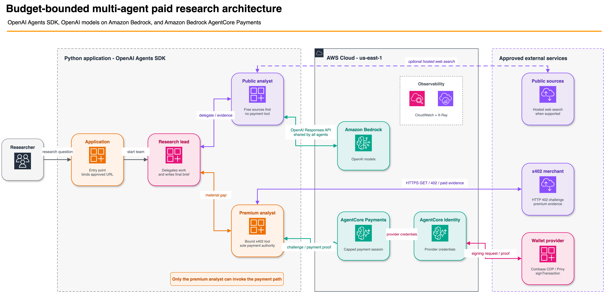

# Pay for Research with an OpenAI Agent

| Information | Details |
|:---|:---|
| Use case type | Budget-bounded purchase of premium research |
| Agent type | Multi-agent (research lead + 2 specialists, agents-as-tools) |
| Hosting | Local Python application using AWS credentials |
| Framework | OpenAI Agents SDK |
| LLM model | OpenAI models on Amazon Bedrock (`openai.gpt-5.5`) |
| Payment protocol | x402 (HTTP 402 Payment Required) |
| AgentCore components | AgentCore Payments, AgentCore Identity |
| Complexity | Advanced |

## Overview

This sample uses the OpenAI Agents SDK with OpenAI models on Amazon Bedrock and
AgentCore Payments to build a three-agent financial research workflow that can
buy x402-protected evidence without giving every agent payment authority.

The research lead delegates free-source discovery to a public evidence analyst.
Only when that work leaves a material gap can it call a premium evidence
analyst. The application binds that specialist to one exact merchant URL, and
AgentCore enforces the payment session's maximum spend and expiry outside every
model. The entire walkthrough runs from Python scripts.

This sample uses the public GA AgentCore Payments APIs and
[SDK](https://docs.aws.amazon.com/bedrock-agentcore/latest/devguide/agentcore-python-sdk-reference.html). The dependency
baseline in `requirements.txt` was verified on September 24, 2026:
`bedrock-agentcore` 1.23.1, `boto3` / `botocore` 1.43.102, `openai-agents` 0.22.3,
and `openai` 3.19.2.

> This is an educational testnet sample, not investment advice. Verify service
> availability, pricing, and model access before production use.

## Architecture

<p align="center">
  
</p>

*Figure 1 - Application, AWS Cloud, and approved external-service boundaries.*

The sample uses the OpenAI Agents SDK manager pattern: the lead retains the
conversation and final answer while specialists are exposed through
`Agent.as_tool()`.

### Why this sample uses a small framework adapter

AgentCore Payments currently provides framework-native integrations for
[Strands (plugin) and LangGraph (middleware)][framework-integrations]. It does
not provide a native plugin for the OpenAI Agents SDK, so this sample follows
the documented framework-agnostic path: it registers a small OpenAI
`function_tool` adapter.

This adapter does not reimplement payment processing. It reuses
`PaymentManager.generate_payment_header`, which validates the 402 challenge,
selects the network, calls `ProcessPayment`, and creates the version-aware x402
proof header. The local code only exposes that capability as an OpenAI function
tool, applies the sample's exact-URL and public-address policy, and performs an
initial GET followed by at most one GET with the SDK-generated proof. Both
requests connect to the same validated public IP while preserving the merchant's
TLS hostname; each uses a fresh client with redirects and environment proxies
disabled.

Each source is fetched once per research run. Repeated tool calls reuse the
recorded result, including failures, so the model cannot generate another payment
by repeating the same request. If signing succeeds but the paid response fails,
`payment_made` is `null`: the outcome is unknown and must be checked before a new
run. A successful paid response reports `payment_made: true`.

[framework-integrations]: https://docs.aws.amazon.com/bedrock-agentcore/latest/devguide/payments-framework-integrations.html

<p align="center">
  
</p>

*Figure 2 - Public evidence comes first; the payment path begins only for a
material gap.*

| Agent | Responsibility | Capabilities |
|---|---|---|
| Research lead | Plans delegation and synthesizes the cited brief | Public and premium specialists as tools |
| Public evidence analyst | Analyzes public evidence and identifies residual gaps | OpenAI hosted web search, when supported |
| Premium evidence analyst | Acquires one approved source and reports remaining budget | Bound x402 fetch and read-only session status |

The lead and public analyst have no payment function tool. If the application
does not supply a premium URL, it omits the premium specialist from the lead's
tool list entirely.

## Control Boundaries

| Question | Control |
|---|---|
| What public evidence is available? | Public evidence analyst |
| Is a remaining evidence gap material? | Research lead |
| Which agent can spend? | Premium evidence analyst only |
| Which merchant may be called? | Application-bound URL plus exact host allowlist |
| May a person approve the purchase? | Optional nested Agents SDK tool approval |
| How much and for how long? | AgentCore payment session budget and TTL |
| Who may raise a budget vs. spend it? | Separate AWS permissions; select the appropriate profile for session scripts and research |
| What happened across agents and payment? | Agent run output plus AgentCore telemetry |

## Prerequisites

- Python 3.10+
- AWS CLI v2 configured with an active AWS credential profile
- AWS credentials that can invoke the configured OpenAI models on Amazon Bedrock
- An AgentCore Payment Manager, connector, active instrument, and delegated
  testnet wallet configured with a supported wallet provider

Complete the shared
[AgentCore Payments setup](../../00-getting-started/00-setup-agentcore-payments/)
first. For provisioning through Python, use its
[`setup_agentcore_payments.py`](../../00-getting-started/00-setup-agentcore-payments/setup_agentcore_payments.py)
script, described under
[Alternatives](../../00-getting-started/00-setup-agentcore-payments/#alternatives).
Choose a supported wallet provider and follow the
[shared wallet-provider setup guide](../../00-getting-started/00-setup-agentcore-payments/providers/)
for provider-specific credentials, delegation, and testnet funding.
Keep provider credentials in the shared setup's ignored environment file.
This sample needs only payment resource identifiers and AWS credentials.

The session scripts need `bedrock-agentcore:CreatePaymentSession` and
`bedrock-agentcore:DeletePaymentSession`, respectively. The research process needs
`bedrock-agentcore:GetPaymentInstrument`, `bedrock-agentcore:GetPaymentSession`,
and `bedrock-agentcore:ProcessPayment` on the configured manager, plus Bedrock
model invocation access. For role separation, run the scripts with the matching
management or execution profile from the shared setup.

## Running the Use Case

This is a local Python use case. It reuses the Payment Manager, connector,
instrument, and delegated wallet created by the shared setup; it does not deploy
another AgentCore Runtime.

| Script | Purpose |
|---|---|
| `inspect_sample.py` | Inspect configuration presence, SDK versions, the prompt, and agent tools offline |
| `create_payment_session.py` | Create one session with an explicit budget and expiry |
| `pay_for_research.py` | Run the research lead and its specialists |
| `e2e.py` | Check the merchant, model delegation, and optionally payment |
| `cleanup_payment_session.py` | Delete one selected payment session |

### Step 1: Create the environment

From the repository root:

```bash
cd 01-features/08-agents-that-transact/02-use-cases/pay-for-research-with-openai-agent
python3.12 -m venv .venv  # Python 3.10 or 3.11 also works
source .venv/bin/activate
python -m pip install --upgrade -r requirements.txt
```

### Step 2: Check AWS access

```bash
export AWS_PROFILE=<your-profile>
export AWS_REGION=us-east-1
aws --version              # AWS CLI v2
aws sts get-caller-identity
```

The live model smoke test in Step 4 confirms that the selected
profile can invoke `openai.gpt-5.5` through Amazon Bedrock.

### Step 3: Configure the sample

```bash
cp .env.sample .env
```

Populate `.env` with the data-plane identifiers from the shared AgentCore
Payments setup:

| This sample | Shared setup output |
|---|---|
| `PAYMENT_MANAGER_ARN` | `PAYMENT_MANAGER_ARN` |
| `PAYMENT_INSTRUMENT_ID` | `INSTRUMENT_ID` |
| `PAYMENT_USER_ID` | `USER_ID` |
| `PAYMENT_SESSION_ID` | Leave blank until Step 5 |

`PAID_RESEARCH_ALLOWED_HOSTS` must contain the exact hostname from
`PAID_RESEARCH_URL`. Do not copy wallet-provider credentials into this sample.
The OpenAI Agents SDK uses a short-lived Bedrock bearer token from the active
AWS credential chain; no OpenAI API key is required.
`AWS_REGION` selects the Bedrock model region. The payment scripts derive their
region from `PAYMENT_MANAGER_ARN`, so a manager in another supported region works
without changing the model endpoint.

### Step 4: Inspect and verify the sample

Inspect the configuration and three-agent team without making any network calls:

```bash
python inspect_sample.py
python inspect_sample.py --public-only
```

The output reports only whether payment settings are present, never their values.
Inspection builds the same agent topology as the research script but cannot invoke
a model, query AWS, or spend. It does not establish that the configured resources
exist or that the wallet is ready.

Install the test dependencies and run the offline suite:

```bash
python -m pip install -r test/requirements.txt
python -m pytest -q test/unit
python -m ruff check .
python -m ruff format --check .
python -m pip check
```

Inspect the current merchant challenge and quoted price without AWS credentials:

```bash
python e2e.py --merchant-only
```

Then, with an active AWS profile, run the model and merchant smoke test:

```bash
python e2e.py
```

This command invokes OpenAI models on Amazon Bedrock, verifies
lead-to-public-specialist delegation, and confirms that the configured merchant
returns a supported x402 v1 or v2 `402 Payment Required` challenge. It does not make an
AgentCore payment, although standard model-invocation charges may apply. The
JSON report shows `"payment": {"status": "skipped", ...}`.

### Step 5: Create a per-run payment session

The application backend, not the agent, creates the financial boundary:

```bash
python create_payment_session.py --budget 0.25 --expiry-minutes 60
export PAYMENT_SESSION_ID=<printed-session-id>
```

AgentCore supports session expiry values from 15 to 480 minutes. The helper
uses a fresh idempotency token and creates a USD-denominated maximum spend.
Sub-cent limits are preserved, with up to six decimal places; non-finite,
zero, negative, and over-precision values are rejected rather than rounded.

### Step 6: Run the complete research workflow

```bash
python pay_for_research.py \
  "Assess the material near-term drivers and risks for AMZN" \
  --paid-url https://x402-test.genesisblock.ai/api/market-news
```

The lead calls the public specialist first. If a material evidence gap remains,
it delegates to the premium specialist, which alone can use the bound payment
tool. A successful paid run returns the final cited brief and a paid-data
ledger containing the payment outcome and remaining session budget.

To run without a premium specialist, including when `.env` contains a paid URL:

```bash
python pay_for_research.py "Assess the material near-term drivers and risks for AMZN" --public-only
```

This mode needs model access but no payment resources. When hosted search is
disabled, supply public evidence in the question; the public specialist reports
that it cannot retrieve current sources.

To require human review before the premium specialist spends:

```bash
python pay_for_research.py \
  "Assess the material near-term drivers and risks for AMZN" \
  --paid-url https://x402-test.genesisblock.ai/api/market-news \
  --require-payment-approval
```

### Step 7: Run the deterministic paid E2E check

```bash
python create_payment_session.py --budget 0.25 --expiry-minutes 60
export PAYMENT_SESSION_ID=<printed-session-id>
python e2e.py --payment
```

This uses a fresh capped session and spends testnet USDC. Success requires all
three report sections to show `"status": "passed"`: model delegation, merchant
challenge, and payment. The payment section must also show
`"payment_made": true` and `"status_code": 200`.
The check exercises lead-to-public delegation and the payment adapter directly;
Step 6 exercises the complete model-directed research workflow.

## Model and Web Search Configuration

The sample obtains a short-lived Bedrock bearer token from the active AWS
credential chain and configures the OpenAI Agents SDK for the Bedrock Responses
API. Defaults are in `.env.sample`.

Amazon Bedrock supports [hosted web search](https://docs.aws.amazon.com/bedrock/latest/userguide/web-search.html)
on the `bedrock-mantle` Responses endpoint in supported regions. Hosted search
remains disabled by default here because the sample's previous live verification
encountered a rejection of the optional `filters` field emitted by the Agents
SDK. The SDK still serializes that field, so enable
`BEDROCK_OPENAI_WEB_SEARCH_ENABLED=true` only after confirming the endpoint
accepts the current schema and the AWS identity has the required search permissions.

With search disabled, the public specialist evaluates supplied evidence and
discloses that it cannot retrieve current public sources. It must not invent
citations or claim that training knowledge is newly verified research.

## Sample Prompts

```text
Assess the material near-term drivers and risks for AMZN. Use premium evidence
only when public sources leave a material gap.
```

```text
Compare the latest public and premium evidence on a company's revenue outlook.
Separate direct evidence from inference and include a paid-data ledger.
```

```text
Produce the best supported brief possible within the current session budget.
If a purchase is rejected, disclose the remaining evidence gap.
```

## Test the Hard Limit

First inspect the merchant's current quote:

```bash
python e2e.py --merchant-only
```

For USDC, divide `amount_base_units` by 1,000,000 to obtain the token amount.
For example, if the quote is `2000` base units (`0.002` USDC), create a new
session with a smaller cap:

```bash
python create_payment_session.py --budget 0.001 --expiry-minutes 15
export PAYMENT_SESSION_ID=<newly-printed-session-id>
python e2e.py --payment
```

Choose a cap below the actual quote if it has changed. This check is expected
to exit nonzero with `Payment rejected: InsufficientBudget`. The adapter stops
without a paid GET. The research workflow reports the rejection and remaining
evidence gap; it has no tool that can raise the session limit.

## What the Checks Cover

The offline suite covers agent topology and payment-tool isolation, public-only
mode, the free path, SDK-generated x402 headers, terminal payment outcomes,
repeated tool calls, merchant allowlisting, IP pinning, cookie isolation,
budget validation, session operations, and script inspection. Live model access,
wallet delegation, funding, and settlement are checked by the commands above.

Before running the live payment command, complete the
[shared wallet-provider setup guide](../../00-getting-started/00-setup-agentcore-payments/providers/).
Follow the instructions for your selected provider to configure credentials,
complete end-user delegation, and fund the testnet wallet.

### Expected live output

A successful `python e2e.py --payment` report includes:

```json
{
  "model": {
    "provider": "bedrock",
    "model": "openai.gpt-5.5",
    "delegated_tools": "research_public_evidence",
    "status": "passed"
  },
  "merchant_challenge": {
    "status_code": 402,
    "x402_version": 2,
    "status": "passed"
  },
  "payment": {
    "payment_attempts": 1,
    "payment_made": true,
    "status_code": 200,
    "status": "passed"
  }
}
```

This is the expected report shape, not a substitute for running live validation
with your configured profile and wallet.

## Clean Up

Delete the session after inspecting the research result:

```bash
python cleanup_payment_session.py
unset PAYMENT_SESSION_ID
```

To delete an earlier session, pass its exact identifier with
`python cleanup_payment_session.py --session-id <session-id>`. The script uses
the configured manager and user and deletes only that session. Deletion prevents
further use; it does not reverse completed payments. Sessions also expire after
their configured TTL.

To remove shared resources created during setup, follow the
[shared cleanup instructions](../../00-getting-started/00-setup-agentcore-payments/#clean-up).
