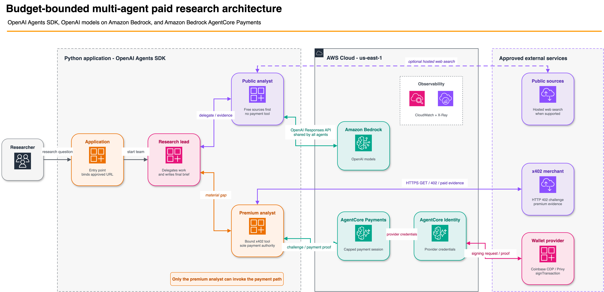
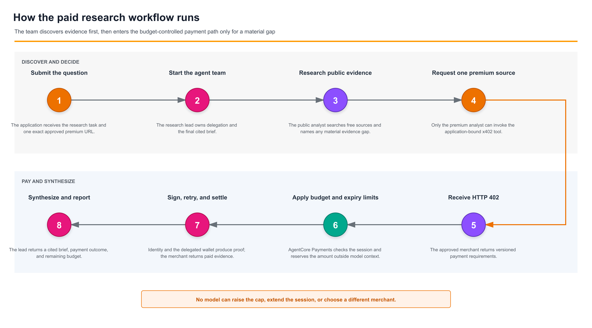

# Pay for Research with an OpenAI Agent

| Information | Details |
|:---|:---|
| Use case type | Budget-bounded purchase of premium research |
| Agent type | Research lead + two specialists, using agents-as-tools |
| Hosting | Local Python application using AWS credentials |
| Framework | OpenAI Agents SDK |
| LLM model | OpenAI models on Amazon Bedrock (`openai.gpt-5.5`) |
| Payment protocol | x402 (HTTP 402 Payment Required) |
| AgentCore components | AgentCore Payments, AgentCore Identity |
| Complexity | Advanced |

## Overview

This sample demonstrates a three-agent financial research workflow using the
OpenAI Agents SDK and the GA AgentCore Payments SDK. A research lead delegates
public research first, then requests premium evidence only if a material gap
remains. Only the premium specialist has a payment tool.

The application binds that tool to one exact merchant URL. AgentCore enforces
the payment session's budget and expiry outside the model. The sample runs
locally and reuses the shared payment setup; it does not deploy another runtime.

> This is an educational testnet sample, not investment advice. Testnet USDC has
> no monetary value; AWS, model, and wallet-provider usage charges can still apply.

## Architecture



The lead keeps the conversation and final answer. It calls specialists through
the OpenAI Agents SDK's `Agent.as_tool()`:

| Agent | Responsibility | Tools |
|---|---|---|
| Research lead | Delegate work and synthesize a cited brief | Public and premium specialists |
| Public evidence analyst | Analyze public evidence and identify gaps | Hosted web search, when enabled and supported |
| Premium evidence analyst | Acquire one approved source | Bound x402 fetch and read-only session status |



AgentCore has [native integrations for Strands and LangGraph][framework-integrations].
For the OpenAI Agents SDK, this sample uses the framework-agnostic
`PaymentManager.generate_payment_header()` API. The SDK handles the x402
challenge, payment processing, and proof header; the local adapter handles the
HTTP requests and exposes them as a function tool.

[framework-integrations]: https://docs.aws.amazon.com/bedrock-agentcore/latest/devguide/payments-framework-integrations.html

### Files

- `pay_for_research.py` — configure Bedrock, build the three agents, and run research.
- `payment.py` — fetch the bound source through the AgentCore Payments SDK.
- `create_payment_session.py` — create a session with a budget and expiry.
- `cleanup_payment_session.py` — delete one selected session.

## Prerequisites and security

- Python 3.10+ and AWS CLI v2.
- An AWS execution profile with access to the configured OpenAI model on Bedrock.
- For paid research, a payment manager, a `READY` connector, and an active,
  funded, delegated testnet wallet. Complete the
  [one-time payment setup](#one-time-payment-setup) below if needed.
- For either Coinbase setup mode, activate the
  [Coinbase Marketplace subscription][marketplace] after reviewing its pricing
  and terms. An active wallet is not sufficient if the connector reports
  `AWS_MARKETPLACE_SUBSCRIPTION_REQUIRED`.

Before configuring payment access, read the
[AgentCore Payments security best practices][security]. In particular:

- Separate session management from payment execution. The session scripts need
  `CreatePaymentSession` / `DeletePaymentSession`; research needs
  `GetPaymentInstrument`, `GetPaymentSession`, and `ProcessPayment` on the
  configured manager, plus Bedrock access. The research role must not raise budgets.
  See the [AgentCore Payments IAM role guidance][payments-iam].
- Keep wallet-provider credentials in AgentCore Identity, not in this sample,
  agent prompts, or tool arguments.
- Use conservative budgets and short sessions, and require end-user delegation.
- For production, add merchant-recipient (`payTo`) validation, provider policies,
  and audit logging as described in the security guide. This sample's URL checks
  and session limits are not a complete production security boundary.

[setup]: ../../00-getting-started/00-setup-agentcore-payments/
[providers]: ../../00-getting-started/00-setup-agentcore-payments/providers/
[marketplace]: https://docs.aws.amazon.com/bedrock-agentcore/latest/devguide/payments-marketplace-subscription.html
[security]: https://docs.aws.amazon.com/bedrock-agentcore/latest/devguide/payments-security-best-practices.html
[payments-quick-start]: https://docs.aws.amazon.com/bedrock-agentcore/latest/devguide/payments-getting-started.html
[payments-iam]: https://docs.aws.amazon.com/bedrock-agentcore/latest/devguide/payments-iam-roles.html

## One-time payment setup

Skip this section for public-only research or if you already have the required
payment resources. Use a setup/admin AWS profile for provisioning, separate
from the management and execution profiles used below. Follow the
[AgentCore Payments GA quick start][payments-quick-start] for current prerequisites,
provider portal steps, and console/SDK options.

The existing [shared setup tutorial][setup] provides the infrastructure walkthrough:

1. [Choose a wallet provider][setup-provider]. For Coinbase, use Quick create
   or supply your existing CDP credentials as described in the
   [provider setup guide][providers]. Follow the GA quick start for current
   credential-generation and project-level delegated-signing steps.
2. [Create the payment manager and connector][setup-manager]. Complete the
   Coinbase authorization flow if using Quick create, then confirm the connector
   is `READY` before proceeding.
3. [Create the per-user wallet][setup-wallet]. Use the same user ID throughout
   setup and research, and a real email address for wallet consent.
   For the default Genesis Block merchant, choose `NETWORK=ETHEREUM` and
   fund the wallet on **Base Sepolia**, not Base mainnet.
4. [Fund the wallet and grant delegated signing][setup-funding]. Coinbase
   project-level delegated signing does not replace the end user's WalletHub
   consent. Follow the [GA wallet funding and delegation guide][payments-wallet]
   and [verify the chain-specific balance][setup-verify] before running research.

With the GA SDK, the Coinbase WalletHub `redirectUrl` is inside
`paymentInstrumentDetails.embeddedCryptoWallet`. Wallet creation is asynchronous:
if the address or URL is not ready, retrieve the same instrument with
`get_payment_instrument` rather than creating another wallet.

Keep the manager ARN, instrument ID, and user ID. Return to this sample and copy
only those identifiers in [step 2](#2-configure-payment-identifiers) below.
Create a fresh, capped session with this sample's script instead of reusing the
tutorial's session. Provider credentials stay in the shared setup and AgentCore
Identity; do not copy them into this sample.

[setup-provider]: ../../00-getting-started/00-setup-agentcore-payments/#step-1--capture-wallet-provider-credentials-pick-one-provider
[setup-manager]: ../../00-getting-started/00-setup-agentcore-payments/#step-2--provision-the-shared-stack-with-the-agentcore-cli
[setup-wallet]: ../../00-getting-started/00-setup-agentcore-payments/#step-3--create-the-per-user-wallet-and-session-with-the-agentcore-sdk
[setup-funding]: ../../00-getting-started/00-setup-agentcore-payments/#step-4--fund-the-wallet-and-grant-delegated-signing-once-per-user
[setup-verify]: ../../00-getting-started/00-setup-agentcore-payments/#inspect--verify
[payments-wallet]: https://docs.aws.amazon.com/bedrock-agentcore/latest/devguide/payments-how-it-works.html

## Run the sample

### 1. Install and select your AWS profile

From the repository root:

```bash
cd 01-features/08-agents-that-transact/02-use-cases/pay-for-research-with-openai-agent
python3.12 -m venv .venv
source .venv/bin/activate
python -m pip install -r requirements.txt
cp .env.sample .env

export AWS_REGION=us-east-1
export AWS_PROFILE=<your-management-profile>
aws sts get-caller-identity
```

Select the profile explicitly in this terminal; an AWS profile selected in
another application is not necessarily inherited by these scripts.
The sample uses a short-lived Bedrock bearer token from the AWS credential
chain, not an OpenAI API key.

### 2. Configure payment identifiers

Copy these non-secret identifiers from the shared setup into `.env`:

| This sample | Shared setup output |
|---|---|
| `PAYMENT_MANAGER_ARN` | `PAYMENT_MANAGER_ARN` |
| `PAYMENT_INSTRUMENT_ID` | `INSTRUMENT_ID` |
| `PAYMENT_USER_ID` | `USER_ID` |
| `PAYMENT_SESSION_ID` | Leave blank; create a fresh session below |

Set `PAID_RESEARCH_URL` to the exact approved HTTPS endpoint and include its
hostname in `PAID_RESEARCH_ALLOWED_HOSTS`. The default endpoint is the Genesis
Block Base Sepolia merchant. Do not copy provider credentials into this file.

`AWS_REGION` selects the model region. Payment clients use the region in
`PAYMENT_MANAGER_ARN`, independently of the model endpoint.

### 3. Create a budgeted session

Using the management profile:

```bash
python create_payment_session.py --budget 0.01 --expiry-minutes 15
export PAYMENT_SESSION_ID=<printed-session-id>
```

Choose the maximum you are willing to spend. Budgets preserve sub-cent values
with up to six decimal places; expiry must be 15–480 minutes. A session limits
spending but does not fund the wallet.

For the GA budget and expiry options, see
[Create a payment session](https://docs.aws.amazon.com/bedrock-agentcore/latest/devguide/payments-create-session.html).

### 4. Run research

Switch to the execution profile and run with human approval enabled:

```bash
export AWS_PROFILE=<your-execution-profile>
python pay_for_research.py \
  "Assess the material near-term drivers and risks for AMZN" \
  --paid-url https://x402-test.genesisblock.ai/api/market-news \
  --require-payment-approval
```

The lead asks the public specialist first. If a material gap remains, the
premium specialist requests the bound source. The CLI pauses before the paid
tool call; enter `y` to approve or any other response to reject. Omit
`--require-payment-approval` only when unattended spending within the session
budget is intended.

The result is a research brief with sources, limitations, and a paid-data ledger.
The model decides whether premium evidence is needed, so a run need not spend.

For public-only research, skip payment configuration and session creation:

```bash
python pay_for_research.py \
  "Summarize this public evidence: <paste an excerpt and its source URL>" \
  --public-only
```

This mode requires model access but has no premium specialist or payment tools.

### 5. Clean up the session

Switch back to the management profile:

```bash
export AWS_PROFILE=<your-management-profile>
python cleanup_payment_session.py
unset PAYMENT_SESSION_ID
```

To delete a different session, pass `--session-id <session-id>`. Deletion stops
future use but does not reverse completed payments. For shared infrastructure,
follow the [shared cleanup instructions][cleanup].

[cleanup]: ../../00-getting-started/00-setup-agentcore-payments/#clean-up

## Payment behavior

The [GA payment-processing guide](https://docs.aws.amazon.com/bedrock-agentcore/latest/devguide/payments-process-payment.html)
explains how instruments, sessions, and signed payment results fit together.

The adapter requires an allowed HTTPS host, rejects private/non-routable
addresses, and pins both requests to the same validated IP while retaining TLS
hostname verification. Requests use fresh clients without redirects or
environment proxies.

There is at most one signing attempt and one paid GET per research run.
Repeated calls return the recorded result, including failures. A successful
paid response reports `payment_made: true`; failure after signing reports
`payment_made: null` because settlement is unknown. Stop and inspect the session
and payment telemetry before starting another run. The model has no tool to
increase the budget or change the merchant.

## Model and public evidence

`.env.sample` contains the model settings. Hosted web search is disabled by
default because the previous live check rejected an optional field emitted by
the Agents SDK. Enable `BEDROCK_OPENAI_WEB_SEARCH_ENABLED=true` only after
confirming compatibility and permissions for
[Bedrock hosted web search](https://docs.aws.amazon.com/bedrock/latest/userguide/web-search.html).

With search disabled, supply public evidence in the question. The public
specialist reports that it cannot retrieve current sources rather than
inventing citations or treating remembered information as verified research.
