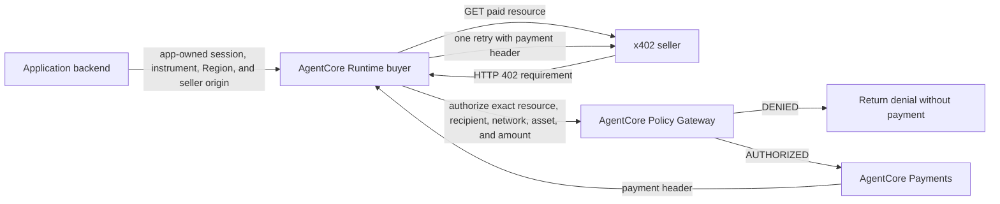

# Policy-Enforced Payment Buyer

> **Caution:** This sample is provided for experimental and educational purposes
> only. It is not intended for direct use in production environments.

## Overview

This sample shows the buyer-side pattern for an agent that must obtain an
Amazon Bedrock AgentCore Policy decision before it can ask Amazon Bedrock
AgentCore Payments to create an x402 payment header for a paid resource.

The buyer reads the seller's HTTP 402 requirement, sends the exact resource,
recipient, network, asset, and amount to an AgentCore Policy Gateway, and
retries the seller only after the Gateway returns `AUTHORIZED`. It exposes one
bounded purchase tool rather than a general-purpose HTTP tool.

This directory is a buyer-side reference implementation. It does not deploy an
AgentCore Policy Gateway, an x402 seller, an AgentCore Runtime, or AgentCore
Payments lifecycle resources. Those components are deliberate external
prerequisites.

## Sample Details

| Information | Details |
|:--|:--|
| Use case type | Policy-enforced x402 buyer |
| AgentCore components | Amazon Bedrock AgentCore Policy, Payments, Runtime |
| Agent framework | Strands Agents |
| Payment protocol | x402 `exact` (one selected requirement) |
| Buyer interface | AgentCore Runtime entry point |
| Example complexity | Intermediate |
| Included code | Buyer, Policy Gateway client, Runtime context validation, and Cedar templates |

### Protocol Scope

Amazon Bedrock AgentCore Payments supports x402 and MPP payment flows. This
sample intentionally implements only the x402 `exact` path: it reads the first
seller offer in `accepts`, requires its integer `amount`, and authorizes that
single requirement before retrying once. It does not implement multiple offers,
x402 `upto`, MPP, or settlement verification.

Use [Pay for Inference with x402 UpTo](../../00-getting-started/09-pay-per-use-with-upto/)
when the seller must measure work after authorization and settle an amount up
to a buyer-approved ceiling. Keep that flow separate: an `upto` ceiling is not
the final settlement amount, and it needs its own payment and settlement
validation.

## Prerequisites

- Python 3.11 or newer.
- An AgentCore Policy Gateway target with an `authorize_payment` tool.
- A Policy Engine attached to that Gateway in **ENFORCE** mode.
- A Gateway execution role with `bedrock-agentcore:AuthorizeAction`,
  `bedrock-agentcore:PartiallyAuthorizeActions`, and
  `bedrock-agentcore:GetPolicyEngine`.
- An x402 `exact` HTTPS seller URL that returns an HTTP 402 requirement with a
  base64-encoded `Payment-Required` header and `accepts[0].amount`.
- A default-deny policy that permits the expected recipient, network, asset,
  amount, caller, and Gateway action.

Author and validate policies in `LOG_ONLY` mode first. Promote an isolated
Gateway to `ENFORCE` only after the policy limits the seller resource,
recipient, network, asset, amount, caller, and Gateway action.

## Configure Payments With Quick Create

Complete the [AgentCore Payments quick start](https://docs.aws.amazon.com/bedrock-agentcore/latest/devguide/payments-getting-started.html)
to create current AgentCore Payments resources. The repository's
[Tutorial 00](../../00-getting-started/00-setup-agentcore-payments/) is companion
material for this sample.

For Coinbase, use **Quick create with Coinbase** when adding a connector to your
Payment Manager:

1. Subscribe to **Coinbase Wallets for AgentCore Payments** in AWS Marketplace.
2. In the AgentCore Payments console, create a Payment Manager, add a Coinbase
   connector, and choose **Quick create with Coinbase**.
3. Complete Coinbase authorization in the browser and wait for the connector to
   become `READY`.
4. Create the Payment Session and Payment Instrument from your application
   backend.

Quick Create avoids manually obtaining or storing Coinbase credentials. It is
a setup convenience, not a requirement of the buyer code: the buyer remains
provider-neutral and can use another configured Payment Manager.

**Warning:** Invoking the Runtime buyer against a live paid seller can create a
payment proof and may result in settlement. Use an isolated test Payment Session
and testnet seller for integration testing. A Coinbase Payment Instrument starts
unfunded; use its redirect URL to have the end user fund the test wallet and
grant the agent permission before a paid canary.

## Layout

```text
policy-enforced-payment-buyer/
├── README.md                     # this guide
├── requirements.txt              # public Python dependencies
├── buyer/
│   ├── core.py                   # 402 parsing and policy-before-retry flow
│   ├── gateway.py                # SigV4-signed Policy Gateway client
│   ├── runtime_context.py         # Runtime payload and seller-origin validation
│   └── runtime_agent.py          # AgentCore Runtime entry point
└── policies/                     # Cedar templates for the Gateway
```

## How the Buyer Flow Works



The application backend, rather than the Runtime agent, creates the Payment
Session and Payment Instrument. The Runtime buyer is restricted to the
payment-processing operation for the supplied context.

The buyer does not follow HTTP redirects for the initial 402 request or the
payment retry. Configure the final seller HTTPS URL in `seller_base_url`; this
prevents a payment header from being forwarded to another origin.

**Important:** Gateway authorization and a generated payment header are not
evidence of seller settlement. This sample does not include a live settlement
canary.

## Policy Gateway Contract

The Gateway target must expose an `authorize_payment` tool. The buyer invokes
it with the following input:

```json
{
  "resourceUrl": "https://seller.example/premium",
  "payTo": "0x...",
  "amount": 1000,
  "network": "eip155:84532",
  "asset": "0x..."
}
```

For an authorization, the target must return a JSON-RPC tool result containing
this JSON text:

```json
{"decision": "AUTHORIZED"}
```

The policy should default-deny. Permit only the intended caller, Gateway
action, recipient, network, asset, amount ceiling, and seller resource.

## Policy Design and Cedar Examples

This sample covers a **point-in-time payment authorization**. The Gateway
evaluates the current tool call and either permits or denies it. The included
templates demonstrate a small policy set:

| Template | Use it for | Default |
|:--|:--|:--|
| [`payment_authorization_for_iam_principal.cedar`](policies/payment_authorization_for_iam_principal.cedar) | The Runtime's exact IAM principal plus the tool, Gateway, seller resource, recipient, network, asset, and maximum amount | Recommended starting point for an IAM-authenticated Runtime |
| [`deny_above_ceiling.cedar`](policies/deny_above_ceiling.cedar) | A defense-in-depth block for requests above the amount ceiling | Optional |
| [`payment_authorization_with_buyer_role.cedar`](policies/payment_authorization_with_buyer_role.cedar) | The baseline rule plus a JWT/OAuth principal-role condition | Optional; only for a Gateway with matching token claims |

Start with one complete `permit` statement. Do **not** divide the resource,
recipient, network, asset, and amount checks among separate `permit` policies:
Cedar treats matching permits as alternatives. A request is allowed when at
least one permit matches and no forbid matches.

The optional `forbid` policy is a safeguard for later changes. Cedar uses
default deny and forbid-overrides-permit evaluation, so a matching `forbid`
always denies the request even when another `permit` would allow it.

Before attaching a policy in `ENFORCE` mode, validate it against the Gateway
schema and correct all semantic findings. Use `LOG_ONLY` to observe policy
decisions first. The Cedar templates use placeholders and cannot be deployed
until they contain your exact Gateway ARN, caller identity, seller URL,
recipient, network, asset, and ceiling.

### Policy Settings

The values below are deployment settings, not application constants. Set them
to the exact values accepted by the buyer and seller you operate:

| Setting | Policy field | Example purpose |
|:--|:--|:--|
| Gateway ARN | `resource` | Bind authorization to one Gateway |
| Target and tool name | `action` | Bind authorization to `PaymentPolicyTools___authorize_payment` |
| Seller URL | `context.input.resourceUrl` | Prevent payment approval for another resource |
| Recipient | `context.input.payTo` | Prevent a seller-provided recipient substitution |
| Network and asset | `context.input.network`, `context.input.asset` | Limit the payment method |
| Maximum amount | `context.input.amount` | Cap one authorization request; the templates use `1000` as an example |
| Caller identity | `principal` | Bind the SigV4 runner to one IAM role or a JWT/OAuth Gateway to an approved role tag |

The Runtime uses SigV4. Start with the IAM-bound template and replace
`<caller-iam-arn>` with the Runtime IAM ARN accepted by the Gateway. The
role-aware template is an alternative for a Gateway with JWT/OAuth inbound
authorization; AgentCore Policy maps token claims to principal tags. Do not
apply that condition to an IAM-authenticated Gateway.

For a multi-step rule such as “allow purchase only after a separate discovery
tool was called in this session,” use a temporal policy. Temporal policies are
written in Dogwood, which is compatible with Cedar, and require a stable Policy
session ID across the related calls. This sample does not include that flow.

### Cedar Resources

- [Getting started with Policy in AgentCore](https://docs.aws.amazon.com/bedrock-agentcore/latest/devguide/policy-getting-started.html)
- [How AgentCore Payments supports x402 and MPP](https://docs.aws.amazon.com/bedrock-agentcore/latest/devguide/payments-how-it-works.html)
- [Understanding Cedar policies in AgentCore](https://docs.aws.amazon.com/bedrock-agentcore/latest/devguide/policy-understanding-cedar.html)
- [AgentCore Policy authorization flow](https://docs.aws.amazon.com/bedrock-agentcore/latest/devguide/policy-authorization-flow.html)
- [Policy scope and IAM versus OAuth principals](https://docs.aws.amazon.com/bedrock-agentcore/latest/devguide/policy-scope.html)
- [Validate and test policies](https://docs.aws.amazon.com/bedrock-agentcore/latest/devguide/policy-validate-policies.html)
- [Cedar policy examples](https://docs.cedarpolicy.com/policies/policy-examples.html)
- [Temporal policies in AgentCore](https://docs.aws.amazon.com/bedrock-agentcore/latest/devguide/policy-temporal.html)

## Runtime Integration

The Runtime entry point is `buyer/runtime_agent.py`. Its invocation payload is
created by the application backend:

```json
{
  "prompt": "Purchase the premium resource",
  "payment_manager_arn": "arn:...",
  "payment_session_id": "payment-session-...",
  "payment_instrument_id": "payment-instrument-...",
  "user_id": "customer-123",
  "aws_region": "your-aws-region",
  "policy_gateway_url": "https://...",
  "policy_target_name": "PaymentPolicyTools",
  "seller_base_url": "https://seller.example"
}
```

`aws_region` is application-owned configuration. Use the Region where the
Payment Manager and Policy Gateway are deployed; it overrides `AWS_REGION` or
`AWS_DEFAULT_REGION` configured for the Runtime. `seller_base_url` is required.
The buyer rejects a resource URL outside that origin before it retrieves a 402
requirement.

The Runtime exposes one tool: `purchase_paid_resource`. It does not expose a
generic HTTP tool or a direct payment-header function.

## Key Notes

- Do not treat a Policy `ALLOW`, a payment header, or a seller retry as proof
  of seller settlement.
- Do not give the Runtime role permission to create or increase a Payment
  Session.
- Keep testnet funding, token approvals, and mainnet payments outside this
  sample's initial deployment.
- A stable `policy_session_id` is required only for an advanced temporal
  discover-before-purchase policy. This sample validates a single
  authorization decision.

## Next Steps

- Add a live testnet canary only after an isolated test Payment Session, Policy
  Gateway, and seller are available.
- Add a temporal-policy variant that persists the Policy session ID across
  discovery and purchase authorization.
