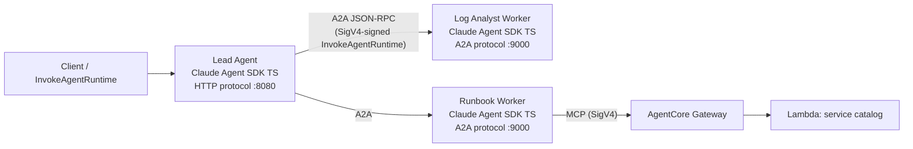

# Multi-Agent DevOps Triage Copilot — Claude Agent SDK (TypeScript) with A2A on Amazon Bedrock AgentCore

Three [Claude Agent SDK](https://docs.claude.com/en/api/agent-sdk/overview) agents written in **TypeScript**, hosted on [Amazon Bedrock AgentCore Runtime](https://docs.aws.amazon.com/bedrock-agentcore/latest/devguide/agents-tools-runtime.html), communicating via the [Agent-to-Agent (A2A) protocol](https://a2a-protocol.org/latest/), with one agent consuming a tool through **AgentCore Gateway** (MCP) — authenticated end to end with **IAM/SigV4**.

The scenario is a DevOps incident-triage copilot: a **lead agent** takes an incident description, delegates to a **log-analyst worker** and a **runbook worker** over A2A, and composes a triage summary. The runbook worker looks up service ownership and runbook steps through an MCP tool exposed by AgentCore Gateway (backed by a Lambda target).

| Component | Technology |
|---|---|
| Agent framework | Claude Agent SDK (TypeScript) |
| Hosting | AgentCore Runtime: HTTP protocol (lead), A2A protocol (workers) |
| Agent ↔ agent | A2A JSON-RPC over SigV4-signed `InvokeAgentRuntime` |
| Agent ↔ tools | MCP via AgentCore Gateway (IAM auth), in-process SigV4 signing |
| Infrastructure | CDK (Gateway, Lambda target, IAM, ECR) + deploy script |

## Architecture



- The **lead** uses the AgentCore **HTTP protocol** (port 8080) because its caller is an application, not an agent.
- The **workers** use the **A2A protocol** path (port 9000).
- The **runbook worker** consumes its tool over **MCP**. In dev mode, it's a local mock server and when being deployed the real Gateway (SigV4).

## What this sample provides beyond the scenario

A2A hosting itself comes from the AgentCore TypeScript SDK: the workers call `serveA2A()` from [`bedrock-agentcore/runtime/a2a`](https://github.com/aws/bedrock-agentcore-sdk-typescript), which implements the A2A container contract and propagates the AgentCore-injected request context. What the SDK does not cover — and this sample adds — are two scenario-agnostic packages:

| Package | What it does |
|---|---|
| [`packages/claude-a2a-executor`](packages/claude-a2a-executor/) | `ClaudeAgentExecutor` — bridges a Claude Agent SDK `query()` stream to the `@a2a-js/sdk` `AgentExecutor` interface that `serveA2A()` hosts (task lifecycle, streaming, cancellation). The TypeScript counterpart of the Python SDK's `StrandsA2AExecutor`, for Claude. |
| [`packages/aws-sigv4-fetch`](packages/aws-sigv4-fetch/) | `createSigV4Fetch` — a fetch-shaped SigV4 signer usable by any fetch-injectable client (MCP SDK, a2a-js). `createMcpProxy` — an in-process MCP server that mirrors the Gateway's tools over the signing fetch and plugs into the Claude Agent SDK as an SDK MCP server. |

## Prerequisites

1. **AWS account** with Amazon Bedrock model access (Claude models enabled in your region)
2. **AWS CLI** configured with credentials
3. **Node.js 20+** and npm 9+
4. **Docker** (or another engine) with `linux/arm64` build support — for compose mode and deployment. `deploy.sh` auto-detects `docker`, `podman`, or `finch`; set `CONTAINER_ENGINE` to choose. A shell *alias* isn't enough — the script needs a real executable on `PATH`.
5. **A local `bedrock-agentcore` build** — the SDK's A2A support is merged but not yet on npm, so `npm ci` needs the tarball described in [`vendor/README.md`](vendor/README.md). This step disappears with the next SDK release.
6. **CDK bootstrapped** in the target account/region — for deployment

Defaults: region `us-east-1`, model `global.anthropic.claude-haiku-4-5-20251001-v1:0` — both overridable via `AWS_REGION` / `ANTHROPIC_MODEL`.

## Running locally (no AWS deployment)

Only Bedrock model access is required; the Gateway is stood in for by a local MCP mock.

```bash
npm ci
npm run build
npm test                      # unit tests (no AWS access needed)

# Terminal 1–4, or use docker compose (below):
npm run dev:mock-catalog                                     # :8900
A2A_PORT=9001 npm run dev:log-analyst                        # A2A worker
A2A_PORT=9002 SERVICE_CATALOG_MCP_URL=http://localhost:8900/mcp \
  npm run dev:runbook                                        # A2A worker
LOG_ANALYST_URL=http://localhost:9001 RUNBOOK_URL=http://localhost:9002 \
  npm run dev:lead                                           # :8080

# Ask the copilot:
curl -s -X POST localhost:8080/invocations \
  -H 'Content-Type: application/json' \
  -H "x-amzn-bedrock-agentcore-runtime-session-id: $(uuidgen)" \
  -d '{"prompt": "orders-api latency spiked after the 14:00 deploy. Logs: ERROR timeout connecting to postgres-orders x40 since 14:02. What happened?"}'
```

The two workers run on 9001/9002 locally so they don't collide, and `serveA2A()` warns that the port differs from the 9000 contract port. Off-platform that warning is expected — deployed, the runtime always proxies to 9000.

Or run everything with compose:

```bash
eval "$(aws configure export-credentials --format env)"
docker compose up --build
```

The end-to-end integration test (spawns all four processes, calls Bedrock):

```bash
npm run test:integration
```

## Deploying to AWS

```bash
npm ci                                # CDK deps live in the infra workspace
cd infra && npx cdk deploy            # Gateway + Lambda target + roles + ECR
cd .. && ./deploy.sh                  # push arm64 image, create/update 3 runtimes

# End-to-end against the deployed stack (deploy.sh prints the ARNs).
# With no prompt, a full built-in incident report is sent:
./invoke.sh <lead-runtime-arn>

# Or pass your own:
./invoke.sh <lead-runtime-arn> 'payments-svc p99 is degrading, logs: …'
```

Deployed topology: the lead's A2A calls go through SigV4-signed `InvokeAgentRuntime` URLs (derived from the worker runtime ARNs), and the runbook worker reaches the real Gateway through the in-process SigV4 MCP proxy. The same agent code runs in all three modes (local processes, docker compose, deployed).

To confirm a worker really came up on the A2A protocol path:

```bash
aws bedrock-agentcore-control get-agent-runtime \
  --agent-runtime-id <worker-runtime-id> --query protocolConfiguration
# {"serverProtocol": "A2A"}
```

## Sample prompts

Use these as the `prompt` in the local `curl` above or with `./invoke.sh` when deployed. Ownership and runbook facts in the answers come from the service-catalog tool — the mock and the Gateway Lambda serve the same three services (`orders-api`, `payments-svc`, `inventory-svc`).

**Include the evidence in the prompt.** The log-analyst worker is instructed to reason only over the log lines and metrics you send and never to invent them, so a bare "why is orders-api slow?" comes back asking for data rather than a triage. `./invoke.sh` with no prompt sends a complete report (logs, metrics, deploy timeline) that exercises both workers — read it in the script for the shape to copy.

- `orders-api latency spiked after the 14:00 deploy. Logs: ERROR timeout connecting to postgres-orders x40 since 14:02. What happened and what should we do?`
- `orders-api error rate jumped on POST /checkout right after a config change — which team owns this and how do we mitigate?`
- `payments-svc p99 latency has been degrading for 30 minutes with no recent deploys. Who is on call and what are the first steps?`

## Cleanup

```bash
./cleanup.sh                          # delete runtimes, empty ECR, cdk destroy
```

## How it works

### The A2A bridge (`packages/claude-a2a-executor`)

`ClaudeAgentExecutor` translates the Claude Agent SDK's message stream into the A2A task lifecycle:

| Claude Agent SDK event | A2A event published |
|---|---|
| `execute()` called | `task` event, state `SUBMITTED` |
| query starts | `statusUpdate` → `WORKING` |
| each `assistant` message | `statusUpdate` → `WORKING` with streaming text |
| `result` (success) | `artifactUpdate` with the answer, then `statusUpdate` → `COMPLETED` |
| error / cancellation | `statusUpdate` → `FAILED` / `CANCELED` |

Hosting that executor is the SDK's job, not the sample's: `serveA2A()` from `bedrock-agentcore/runtime/a2a` serves the AgentCore A2A container contract in one call — JSON-RPC at `POST /` on `0.0.0.0:9000`, the agent card at `/.well-known/agent-card.json` (URL resolved from `AGENTCORE_RUNTIME_URL`), and `GET /ping`. It also propagates the AgentCore-injected headers (session id, request id, workload access token) into the same request context the HTTP path uses, so `getContext()` and the identity wrappers work inside an executor. Each worker is therefore an executor plus one `serveA2A()` call:

```typescript
await serveA2A({
  agentCard: buildAgentCard({ name: 'log-analyst', description: '…', skills: [/* … */] }),
  executor: new ClaudeAgentExecutor({ systemPrompt: SYSTEM_PROMPT, queryOptions: { /* … */ } }),
  port: PORT,
});
```

### In-process SigV4 signing (`packages/aws-sigv4-fetch`)

AgentCore Gateway under IAM auth and `InvokeAgentRuntime` both require SigV4-signed requests. `createSigV4Fetch` returns a drop-in `fetch` replacement that signs with the standard credential chain — one wrapper serves both the a2a-js client (agent → agent) and the MCP client (agent → Gateway). The Claude Agent SDK's built-in HTTP MCP client doesn't accept a custom fetch, so `createMcpProxy` bridges it: an in-process MCP server forwards `tools/list` / `tools/call` to the Gateway over the signing fetch.

### Delegation as tools

The lead agent exposes `delegate_to_log_analyst` and `delegate_to_runbook` as in-process SDK tools whose handlers perform the A2A calls. Claude decides which workers to consult and in what order — the A2A mechanics stay out of the prompt entirely. One tool uses A2A `stream()` and the other `send()`, so both interaction styles are exercised.

### Observability: the delegation trail

Every component emits one-line, greppable `[a2a]` log entries (delegation sent/answered on the lead; RPC received, tool calls, task result on workers). Filter any agent's CloudWatch log group on `[a2a]` to reconstruct an invocation end to end. Log lines include truncated prompt/response content — set `A2A_LOG_CONTENT=0` to log metadata only.

Deployed, each runtime logs to `/aws/bedrock-agentcore/runtimes/<runtime-id>-DEFAULT`:

```bash
aws logs tail /aws/bedrock-agentcore/runtimes/<worker-runtime-id>-DEFAULT --since 15m \
  | grep '\[a2a\]'
```

A healthy worker shows `executor task.received` (with the `sessionId` the lead propagated), any `tool.call` lines, then `executor task.result`. Locally the trail is the same, minus `sessionId` — nothing sets the runtime session header outside AgentCore.

## Repository layout

```
packages/claude-a2a-executor/   # Claude Agent SDK ↔ A2A executor bridge (hosted by the SDK's serveA2A)
packages/aws-sigv4-fetch/       # SigV4 fetch wrapper + in-process MCP proxy
agents/log-analyst/             # A2A worker: reasons over log snippets
agents/runbook/                 # A2A worker: service catalog via MCP (mock or Gateway)
agents/lead/                    # HTTP-protocol lead; A2A client (plain or SigV4) to workers
scripts/mock-service-catalog/   # Local MCP stand-in for Gateway + Lambda
infra/                          # CDK: Gateway, Lambda target, IAM, ECR
tests/integration/              # lead → workers → tool → composed answer
docker/ + docker-compose.yaml   # one arm64 image for all agents, local stack
deploy.sh / invoke.sh / cleanup.sh
```

## Disclaimer

This sample is for learning and prototyping. It omits production concerns such as authentication hardening, retries, and full observability — review and adapt before any production use.

