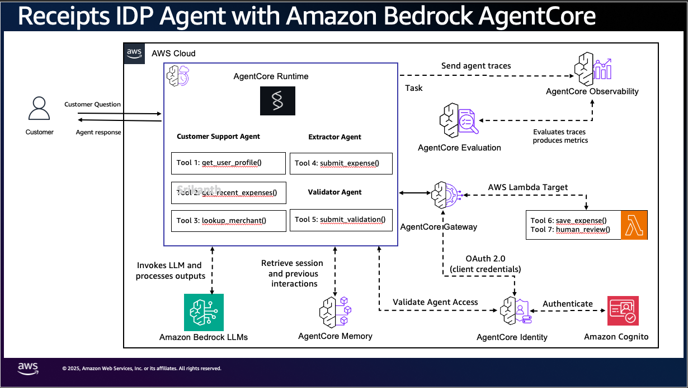
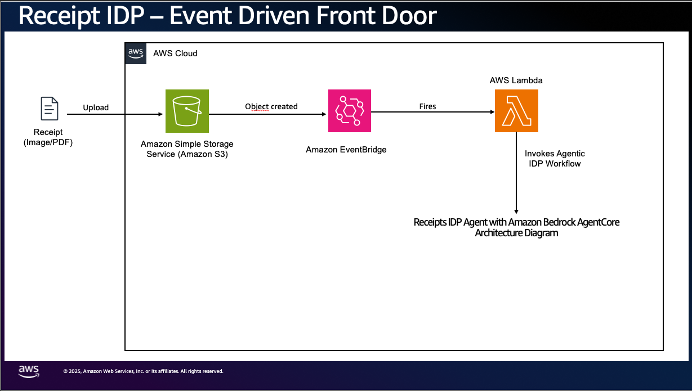

# Receipt processing and evaluation on Amazon Bedrock AgentCore

This sample processes expense receipts with AI agents on Amazon Bedrock AgentCore, and
shows how to evaluate those agents.

When a receipt image lands in Amazon S3, Amazon Textract reads it and three agents take
over: an **extractor** turns the text into a structured expense, a **validator** checks it
and either saves it or holds it for a person to review, and for a held receipt a third
agent writes a short note for the reviewer. A separate **chat assistant** answers an
employee's questions about their own expenses. If a model runs short of capacity, a
**degradation ladder** steps down to other models, then sends every receipt to review
without the validator, then queues receipts for later.

The sample includes **evaluators** that measure whether the agents' decisions are right:
whether the extracted values match the receipt, whether each receipt was saved or held
correctly and for the right reason, and whether chat answers are correct and complete.
Three of them score live traffic in AgentCore; the rest score a labelled set of receipts
and conversations sent through the deployed stack.

## Overview

### Use case details

| Information             | Details                                                                |
| ----------------------- | ---------------------------------------------------------------------- |
| **Use case type**       | Event-driven and conversational                                        |
| **Agent type**          | Multi-agent: three pipeline agents and a chat agent                    |
| **Use case components** | Gateway tools, Cedar policy, receipt images, observability, evaluation |
| **Use case vertical**   | Finance (expense management)                                           |
| **Example complexity**  | Advanced                                                               |
| **SDK used**            | Strands Agents, AgentCore SDK and CLI, AWS CDK, boto3                  |
| **Time to deploy**      | About 10 minutes                                                       |

Demo of the original pipeline: [demo.mp4](demo.mp4).

### What it does

How a receipt moves through the pipeline:

1. **It arrives.** Uploading an image under `receipts/<user_id>/` in the inbox bucket fires
  an EventBridge rule, and a trigger Lambda invokes the pipeline Runtime.
2. **The extractor reads it.** Textract's OCR goes to the extractor, which returns the
  merchant, date, line items, tax, tip and total, with a confidence score.
3. **The validator decides.** It checks whether the parts add up and whether anything looks
  wrong, then calls one of two tools: save, or send to review. Both tools are pinned to the
   extractor's expense, so the validator chooses the route but cannot change what is written.
4. **The Gateway enforces the limit.** The save goes through an AgentCore Gateway tool, where
  a Cedar policy denies any automatic save of $2,000 or more, whatever the validator chose.
   The receipt is held instead.
5. **A held receipt gets a note.** The third agent writes a short explanation for the reviewer.
6. **The run is recorded.** The run ledger keeps one row per receipt: processed,
  needs_review, deferred or error.

The **chat assistant** runs on its own Runtime and answers questions like "how much did I
spend at Blue Bottle Coffee?" and follow-ups like "and at Ferry Building Cafe?". It can only
read expenses for the user identified by a verified KMS-signed identity token. The demo
scripts mint that token for the selected user; the agent does not trust a user ID supplied
in the request body.

### Architecture



The event-driven front door (upload, S3, EventBridge, trigger Lambda, Runtime):



A receipt arrives as an S3 event, so no user is signed in while the pipeline runs. The agent
therefore calls the Gateway as itself, with a machine-to-machine token from Amazon Cognito,
and keeps users apart in the data: the Expenses table is partitioned by `userId`. The full
walkthrough is in [docs/ARCHITECTURE.md](docs/ARCHITECTURE.md).

### Key features: the AgentCore services

- **Runtime:** two Runtimes, one for the pipeline and one for chat. They run the same code,
kept separate so each is evaluated on its own traffic
([ADR-0018](docs/decisions/0018-separate-chat-runtime.md)).
- **Gateway:** five tools, each a Lambda function, exposed to the agents over MCP.
- **Policy:** Cedar rules checked on each tool call's input before the tool runs.
- **Observability:** OpenTelemetry traces in CloudWatch. Each pipeline trace also records the
receipt's outcome (status, total, merchant), which the evaluators read.
- **Evaluations:** code-based evaluators, built-in and third-party judges, and a live
evaluation configuration per Runtime
([ADR-0017](docs/decisions/0017-evaluators-from-business-outcomes.md)).

## Prerequisites

- An AWS account with credentials permitted to deploy the sample
- The AWS CLI (`aws`)
- Node.js 20 or later
- The AgentCore CLI (`@aws/agentcore`)
- Python 3.12 with `boto3`, and `uv`
- Access to Anthropic Claude models in Amazon Bedrock

The detailed checks are in [docs/deployment.md](docs/deployment.md).

## Deploy

Run from this sample's root directory. The examples below use `us-west-2`; use your
deployment region consistently if you choose another region:

```bash
./deploy.sh us-west-2
```

The script installs dependencies, validates the configuration, and deploys the AgentCore
resources and supporting AWS infrastructure through CDK. It then applies the chat live
evaluation configuration through the AgentCore API and seeds the sample user `user-001`
in DynamoDB. The region defaults to `us-west-2` if omitted.

### Verify the deployment

Run the pipeline on the included sample receipt:

```bash
python3 scripts/test_invoke.py --region us-west-2
```

Textract reads receipts from the inbox bucket, so this command first uploads
`tests/fixtures/sample-receipt.png` there under `samples/`. It then invokes the pipeline
for `user-001` and prints the response in your terminal. Only uploads under `receipts/`
start the pipeline on their own, so the `samples/` upload doesn't also run it in the
background ([ADR-0006](docs/decisions/0006-s3-eventbridge-over-direct-invoke.md)).

To test another local receipt or one already in S3:

```bash
python3 scripts/test_invoke.py --region us-west-2 --file /path/to/receipt.png
python3 scripts/test_invoke.py --region us-west-2 \
    --s3-uri s3://receipts-inbox-<account>-us-west-2/samples/receipt.png
```

Use `--user-id` to select a different user. With `--s3-uri`, the script skips the upload.
An object already uploaded under `receipts/` may have been processed automatically;
invoking it here starts another run.

## Usage

### Process receipts automatically

Upload a receipt to the inbox bucket under `receipts/<user_id>/` to start the pipeline
automatically. Replace `<account>` with your AWS account ID and use your deployment region.
For example, this receipt has totals that do not add up, so the validator should route it
to human review:

```bash
aws s3 cp evals/fixtures/non_reconciling.png \
    s3://receipts-inbox-<account>-us-west-2/receipts/user-001/non_reconciling.png
```

The pipeline gets the user ID from the object key. A key without a user segment, such as
`receipts/receipt.png`, falls back to the configured default user (`user-001` by default).
Retries and a dead-letter queue handle failed trigger attempts.

### Run ledger

Every run emits one event, and a writer Lambda records one row per receipt in the
`ProcessingRuns` table. A run that ends in `error` notifies an SNS topic
([ADR-0015](docs/decisions/0015-processing-runs-ledger.md)).
Automatic processing runs in the background. After it finishes and the ledger is updated,
check the receipt from the upload above:

```bash
python3 scripts/receipt_status.py --region us-west-2 \
    --s3-uri s3://receipts-inbox-<account>-us-west-2/receipts/user-001/non_reconciling.png
```

If no ledger row appears yet, wait and run the lookup again.

To list runs routed to human review:

```bash
python3 scripts/receipt_status.py --region us-west-2 --status needs_review
```

### Cedar guardrail

A save of $2,000 or more is denied at the Gateway, whatever the agents decide. This receipt
is clean and reconciles, so the validator should choose to save it. The policy should
block the save and route it to review:

```bash
aws s3 cp evals/fixtures/over_threshold.png \
    s3://receipts-inbox-<account>-us-west-2/receipts/user-001/over_threshold.png
```

After processing finishes, check the result:

```bash
python3 scripts/receipt_status.py --region us-west-2 \
    --s3-uri s3://receipts-inbox-<account>-us-west-2/receipts/user-001/over_threshold.png
```

The expected ledger row shows `validatorRouting: AUTO_PERSIST`, `cedarBlocked: true` and
`status: needs_review` ([ADR-0012](docs/decisions/0012-cedar-on-tool-input.md)).

### Chat

```bash
python3 scripts/chat.py --region us-west-2 --user user-001
# you> how much did I spend at Blue Bottle Coffee?
# you> and at Ferry Building Cafe?
python3 scripts/ask.py --region us-west-2 --user user-001 "what are my most recent expenses?"
```

`chat.py` starts an interactive conversation; type `exit` or `quit` to leave. `ask.py`
answers one question in a new session. Both scripts require `kms:GenerateMac` permission
on the stack's identity key to sign the selected user's identity token.

`chat.py` keeps one Runtime session, so follow-ups see the earlier turns. History is kept per
verified user and session, so a session id reused under another identity starts empty. The
read tools are pinned to the verified user
([ADR-0016](docs/decisions/0016-conversational-identity-no-idor.md)).

## Sample prompts

After the sample test and both automatic uploads finish successfully, `user-001` should
have a processed expense at Blue Bottle Coffee and receipts held for review at Ferry
Building Cafe and Moscone Center Catering. Ask these in
one `scripts/chat.py` session, in order, so the follow-ups use the earlier answers:

- "how much did I spend at Blue Bottle Coffee?"
- "and at Ferry Building Cafe?"
- "what are my most recent expenses?"
- "why is the Ferry Building one on hold?"

## Evaluation

### How the evaluators were chosen

Two questions, asked together:

- **What does the business need to know, however the work is done?** If a person typed the
receipts in by hand, these numbers would still matter: the share of receipts saved with no
person involved, how many dollars the extracted totals are off by, how often a receipt over
the limit is saved automatically, and how many held receipts really needed review. For
chat: how many questions are answered without help, and how many answers are correct.
- **Which failures does this design make likely?** An extractor inventing values the OCR
never contained, a validator making the right call for the wrong reason, a chat assistant
forgetting earlier turns. Evaluators aimed at these explain why a business number moved.

Every evaluator judges one decision a model makes, against a right answer or a clear
reference. Before it was trusted, each was run on pairs of cases that differ in exactly one
thing, and its verdict had to change with that one thing.

### The evaluators

| Evaluator | What it measures | Where it runs |
|---|---|---|
| `ReceiptsThresholdControl` | Whether the recorded total of $2,000 or more was saved automatically: `held`, `breach`, or `not_engaged`. Monitors the control's outcome. | Live pipeline sessions |
| `ThirdParty.DeepEval.ConversationCompleteness` | Share of the employee's requests handled in a conversation. | Live chat sessions |
| `ThirdParty.DeepEval.KnowledgeRetention` | Whether the assistant uses information from earlier turns. A diagnostic score. | Live chat sessions |
| `ReceiptsExtractionAccuracy` | Total, date, currency, subtotal, tax, and tip against labelled values. Reports the dollar gap on the total and an error verdict. | Labelled receipts |
| `ReceiptsRoutingOutcome` | Whether the validator chose the right route for the extraction it received. Identifies `FalseClear` and `FalseAlarm` decisions. | Labelled receipts |
| `Builtin.ToolParameterAccuracy` | Whether extracted values are supported by the OCR text. | Labelled receipts; trace through the extractor |
| `Builtin.GoalSuccessRate` | Whether the validator identified the actual problem, using assertions. | Labelled receipts; trace through the validator |
| `Builtin.Correctness` | Whether each chat answer matches the expected answer for that turn. | Labelled conversations |

The three `Receipts*` evaluators are code-based Lambda evaluators. The `Builtin.*` and
`ThirdParty.*` evaluators are managed judges. Extraction verdicts are `exact`,
`minor_error`, `field_error`, or `material_error` (a total gap greater than $50). The
threshold monitor checks the recorded total; extraction accuracy catches a misread total
that could fall below the policy limit.

A live configuration has no right answers to compare against, so the evaluators that need
labels run on demand instead. Two findings shaped the design; both are in
[ADR-0017](docs/decisions/0017-evaluators-from-business-outcomes.md):

- **Show each judge only its own agent's part of the trace.** The extractor, validator and
note writer share one trace. A judge scoring the extractor also sees later agents repeat the
extractor's output, and then accepts invented values as supported. The harness cuts the
trace off after the agent being judged.
- **Without a right answer, a judge can't tell a wrong answer from a right one.**
ConversationCompleteness scores a confident wrong answer as handled; only Correctness,
which compares against an expected answer, catches it. That is why both are kept.

### Evaluators and the degradation ladder

The default ladder has five rungs, configured through AppConfig
([docs/CONFIGURATION.md](docs/CONFIGURATION.md)):

| Rung         | What runs                                              |
| ------------ | ------------------------------------------------------ |
| L0 (default) | Opus 4.8, full pipeline                                |
| L1           | Opus 4.7, full pipeline                                |
| L2           | Opus 4.6, no validator: every receipt goes to review   |
| L3           | Sonnet 4.6, no validator: every receipt goes to review |
| L4           | no model: receipts are queued for later                |

**The evaluators assume L0.** Each trace records its rung as `receipts.ladder.rung`:

- **L1** runs another model, so compare scores per rung, never pooled.
- **L2 and L3** send every receipt to review by configuration. `ReceiptsRoutingOutcome` would
count those as the validator's calls, so score routing only on L0 and L1 runs.
- **L4** defers the receipt with no extraction, so `ReceiptsThresholdControl` reports
`MISSING_REQUIRED_FIELD` for those sessions instead of a score.

The labelled runs in `evals/` run at L0 unless the active rung has been changed.

### Running the evaluators

**Live:** nothing to do. `ReceiptsLive` (in `agentcore.json`) and `ReceiptsAgent_ChatLive`
(created by `scripts/chat_online_eval.py`, because the CloudFormation schema does not yet
accept managed third-party evaluator ids) score each session once it has been idle for a few
minutes (5 for chat). Results land in CloudWatch under
`/aws/bedrock-agentcore/evaluations/results/`. After the first deploy in an account, allow
about 10 minutes for CloudWatch Transaction Search to start indexing traces; sessions before
that are not scored.

**Against the deployed stack**, with the labelled set in `evals/fixtures/`:

```bash
cd evals
uv venv --python 3.12 && uv pip install --python .venv/bin/python -r ../app/receiptsagent/requirements.txt "bedrock-agentcore>=1.22" pillow
.venv/bin/python run_deployed.py              # uploads the receipts, runs the chat conversations
.venv/bin/python score_saved.py --run out/deployed-<id>        # routing, right reason, invented values
.venv/bin/python score_chat.py  --run out/deployed-chat-<id>   # completeness, retention, correctness
```

See [evals/README.md](evals/README.md).

## Clean up

```bash
./destroy.sh us-west-2
```

The script attempts to delete the chat live-evaluation configuration, then deletes the
stack. With the default removal settings, this also deletes the sample's DynamoDB tables
and S3 bucket contents. If stack deletion fails, it retries, then retains and reports any
resources that still need manual deletion. Check its output for remaining resources.
See [docs/deployment.md](docs/deployment.md) for recovery commands.

CloudWatch log groups are not part of the stack, so they remain (the Runtimes, CodeBuild,
the Lambdas and the evaluation results). List them, then delete the ones you don't want.
The filter below finds names containing `Receipts` or `receipts`; also check for Runtime
and CodeBuild log groups whose names do not contain those strings:

```bash
aws logs describe-log-groups --region us-west-2 \
    --query "logGroups[?contains(logGroupName,'Receipts') || contains(logGroupName,'receipts')].logGroupName" \
    --output text
aws logs delete-log-group --region us-west-2 --log-group-name <name>
```

## Layout

- `agentcore/`: `agentcore.json` (Runtimes, Gateway, Cedar, evaluators, live config) and the
CDK app (`cdk/lib/cdk-stack.ts`, `cdk/lib/infra-construct.ts`).
- `app/receiptsagent/`: the agent. `config.py` reads all of its settings.
- `evaluators/business_outcomes/`: the code-based evaluators, one codebase deployed as one Lambda per evaluator.
- `evals/`: the evaluation harness, labelled receipts and conversations.
- `lambdas/`: Gateway tools, trigger, controller, drain, ledger writer, Transaction Search.
- `scripts/`, `tests/`, `docs/`.

## Docs

- [docs/ARCHITECTURE.md](docs/ARCHITECTURE.md): how it works.
- [docs/decisions/](docs/decisions/): 19 ADRs, the why behind each choice.
- [docs/CONFIGURATION.md](docs/CONFIGURATION.md): env vars, the ladder config, Cedar, tuning.
- [docs/tutorial.md](docs/tutorial.md): a guided run and experiments.
- [docs/deployment.md](docs/deployment.md): deploy, destroy, local dev, live tests.
- [evals/README.md](evals/README.md): running and extending the evaluation suite.

## Disclaimer

> [!IMPORTANT]
> This sample is for experimental and educational purposes only. It demonstrates
> concepts and techniques but is not intended for direct use in production. Make sure to
> have Amazon Bedrock Guardrails in place to protect against
> [prompt injection](https://docs.aws.amazon.com/bedrock/latest/userguide/prompt-injection.html).
