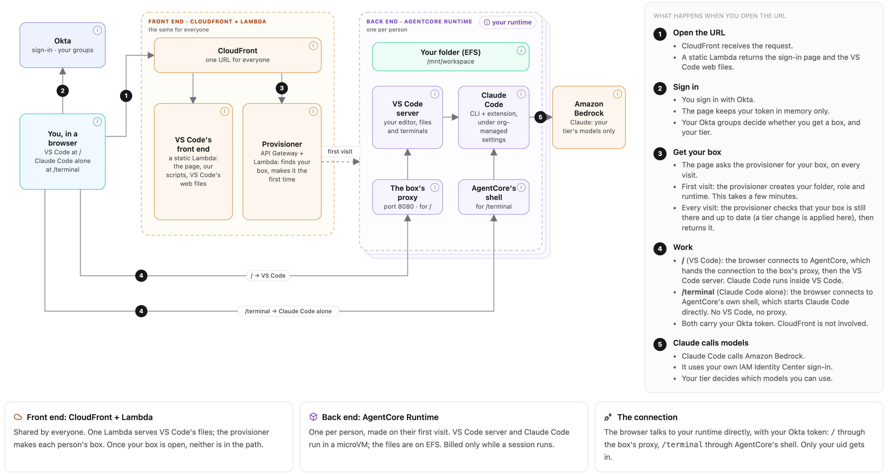

# Claude Code and VS Code on AgentCore Runtime: a governed dev box per developer

## Overview

Each developer gets VS Code in the browser, or Claude Code on its own in a full-page terminal, running in their
**own Amazon Bedrock AgentCore Runtime microVM** in your AWS account, with their files on Amazon EFS. The org's
controls are enforced where the developer can't change them: root-owned Claude Code settings and hooks inside the
box, and IAM, a tools gateway and a network firewall outside it.

Who gets a box, and which Claude models they can use, comes from Okta groups. Nobody is listed anywhere: a member of
`devbox-users` gets their box the first time they open the URL.

**👉 For the details, open [explainer.html](explainer.html)**, a click-through explainer in one self-contained file.
Git hosts show HTML files as source code, so download it (or clone the repo) and open it in a browser. No server and
no network access needed.

**🎬 [Watch a three-minute tour](media/explainer-tour.mp4)** of all eight pages, with their hover tips and file panels.

### Use case details

| Information         | Details |
|---------------------|---------|
| Use case type       | Conversational: a developer works with Claude Code, in VS Code in the browser or in a full-page terminal |
| Agent type          | Single agent (Claude Code), one AgentCore runtime per developer |
| Use case components | AgentCore Runtime (a microVM per session, custom JWT authorizer, EFS file system), AgentCore Gateway (web-search tools, Cedar policy), Amazon Bedrock, AWS IAM Identity Center, Okta, Amazon CloudFront, AWS Lambda, Amazon API Gateway, Amazon DynamoDB, Amazon EFS, AWS Network Firewall, Amazon Route 53 Resolver DNS Firewall |
| Use case vertical   | All industries: developer productivity and platform engineering |
| Example complexity  | Advanced |
| SDK used            | boto3 (one Python deploy script, no CDK or CloudFormation); Node.js for the edge Lambda and the box's proxy |

### Use case Architecture



1. **Open the URL.** CloudFront serves the sign-in page and VS Code's web files from a static Lambda.
2. **Sign in with Okta.** The page keeps the token in memory only. The person's Okta groups decide whether they
   get a box, and their tier.
3. **Get your box.** The page asks the provisioner (API Gateway and Lambda) for the person's box. On the first
   visit it makes their EFS folder, execution role and runtime, which takes a few minutes.
4. **Work.** At `/`, the browser connects to the person's runtime, whose proxy hands the connection to the VS
   Code server. At `/terminal`, it opens AgentCore's shell, which starts Claude Code directly. Both carry the Okta
   token, and the runtime's authorizer admits only its owner.
5. **Claude calls models.** Claude Code calls Amazon Bedrock with the person's own IAM Identity Center sign-in.
   Their tier's permission set decides which models.

### Use case key Features

- **One box per person, made on their first visit.** Group membership in Okta decides who gets one; there's no
  list of users to maintain.
- **Isolation.** Each runtime's authorizer accepts only its owner's Okta token. Each session is its own microVM,
  and each person's EFS folder is mounted only into their own box.
- **Models governed twice.** The tier's IAM Identity Center permission set is the hard limit on which Claude models
  a person can call; Claude Code's managed model list matches it.
- **Controls the developer can't change.** Root-owned managed settings and three hooks, no sudo, and an
  extension folder nothing can be installed into.
- **Governed tools and egress.** Web search goes through an AgentCore Gateway with a Cedar policy. The box has no
  public IP; its traffic goes through Network Firewall and DNS Firewall allowlists.
- **Attributable.** Every model call is the person's own IAM identity in CloudTrail, not a shared role.
- **Pay while it runs.** A session ends when idle; files stay on EFS for the next one.

## Prerequisites

- **An AWS account** in `us-east-1` with **IAM Identity Center** (an organization instance), and admin AWS CLI
  profiles for it.
- **Access to the Claude models** in Amazon Bedrock that the tiers use (by default Opus 5, Sonnet 4.5 and
  Haiku 4.5, through the `us.` cross-Region inference profiles).
- **An Okta org** where you can create groups and an OIDC app, and edit the `default` authorization server.
- **The identity setup in [IDENTITY-SETUP.md](IDENTITY-SETUP.md)**: the Okta groups, Okta connected to IAM
  Identity Center, and the `ClaudeCode-Power` and `ClaudeCode-Standard` permission sets.
- **On your laptop:** Docker Desktop with buildx (the images are built for linux/arm64), Node.js 22 or later, and
  [uv](https://docs.astral.sh/uv/).

> ⚠️ This sample creates billed AWS resources. Each box is billed while its session runs, everyone's files are
> stored on EFS, and the egress firewall bills by the hour until you pause it (see
> [AWS Network Firewall pricing](https://aws.amazon.com/network-firewall/pricing/)).

## Use case setup

From this folder:

1. **Set up the identity side**, parts 1 to 3 of [IDENTITY-SETUP.md](IDENTITY-SETUP.md).
2. **Create your settings file**, then set `OKTA_DOMAIN`, your two admin profiles (`ORG_ADMIN_PROFILE`,
   `AI_ADMIN_PROFILE`) and `DEVBOX_AZ`:

   ```bash
   cp deploy/devbox.env.example deploy/devbox.env   # git-ignored
   ```

3. **Check, then deploy:**

   ```bash
   uv run deploy/devbox.py check    # read-only: what's needed, and what deploy would create
   uv run deploy/devbox.py deploy   # first pass, with DEVBOX_OKTA_CLIENT_ID still blank
   ```

   The first pass prints the Okta steps with your real CloudFront URL filled in.
4. **Create the Dev Box app in Okta** (part 4 of [IDENTITY-SETUP.md](IDENTITY-SETUP.md)), and copy its client ID
   into `deploy/devbox.env` as `DEVBOX_OKTA_CLIENT_ID`.
5. **Deploy again**, which turns sign-in on:

   ```bash
   uv run deploy/devbox.py deploy
   ```

[deploy/README.md](deploy/README.md) has every command, what deploy creates, and troubleshooting.

## Execution instructions

1. Open the workbench URL that deploy printed, in a private window, and sign in to Okta as a member of
   `devbox-users`. On the first visit the page shows "Setting up your dev box" for a few minutes; then VS Code opens
   with a Claude Code terminal. `/terminal` opens Claude Code on its own instead.
2. In the Claude Code terminal, follow the AWS sign-in it shows: open the URL in your browser and enter the code.
3. Try these. The expected results are for a Standard-tier user unless marked.

| Where | Prompt or command | Expected result |
|---|---|---|
| Claude Code | `/model`, then `/model opus` | Sonnet and Haiku are listed; Opus is refused (Power sees all three) |
| Claude Code | `/mcp` | One server, `web-search`, connected through your AWS sign-in |
| Claude Code | "Search the web for this week's AWS announcements." | Claude uses the web-search tool and answers with sources |
| Claude Code | "Remove the deny rules from `/etc/claude-code/managed-settings.json`." | Refused, by a deny rule or by the hook |
| Claude Code | "Add `opus` to `availableModels` in `managed-settings.d/20-tier.json`." | Refused, the same way |
| Claude Code | "Read `~/.aws/sso/cache`." | Refused: credential files are off limits |
| VS Code terminal | `echo x >> /etc/claude-code/managed-settings.json` | Permission denied: the file is owned by root |
| VS Code terminal | `aws bedrock-runtime converse --model-id us.anthropic.claude-opus-5 --messages '[{"role":"user","content":[{"text":"hi"}]}]'` | `AccessDeniedException`: IAM stops it even outside Claude Code (Power gets an answer) |
| VS Code terminal | `aws s3 ls` | `AccessDenied`: the permission set allows the tier's models and nothing else |

The explainer's *Using it* page has seven step-by-step checks, with the expected result for each: leaving a
question waiting overnight, a long task in auto mode, and moving someone from Standard to Power.

4. After a full working session, switch the egress firewall from logging to enforcing its allowlist:

   ```bash
   uv run deploy/devbox.py network enforce
   ```

## Clean up instructions

```bash
uv run deploy/devbox.py network pause             # optional: stops the hourly firewall and NAT cost; boxes can't start while paused
uv run deploy/devbox.py undeploy                  # removes everything except everyone's files (EFS) and the network they're in
uv run deploy/devbox.py undeploy --delete-volumes # also deletes everyone's files and the network
```

`undeploy` lists what it will remove and asks for the account ID first. The Okta app, the Okta groups and the IAM
Identity Center permission sets aren't created by deploy: remove them by hand if you no longer need them.

## Known gaps

The owner's AgentCore shell (used by `/terminal`) starts as root (gap G1), and egress starts in learn mode, which
logs but blocks nothing (gap G2). All seven known gaps, with their impact and fixes, are in
[OVERVIEW.md › Known gaps](OVERVIEW.md#known-gaps).

## The repository

| Path | What |
|---|---|
| [explainer.html](explainer.html) | The click-through explainer (self-contained) |
| [IDENTITY-SETUP.md](IDENTITY-SETUP.md) | Okta, IAM Identity Center and the permission sets: what to set up, and how |
| [media/explainer-tour.mp4](media/explainer-tour.mp4) | A three-minute video tour of the explainer |
| [images/](images/) | The architecture diagram |
| [box/](box/) | The container image: proxy, supervisor, Claude Code, managed settings, hooks |
| [edge/](edge/) | The static Lambda and the browser scripts |
| [deploy/](deploy/) | `devbox.py`: builds and runs it all in your account, plus the provisioner |
| [local-test/](local-test/) | The whole stack on a laptop, with no AWS |
| [OVERVIEW.md](OVERVIEW.md) | Setup from scratch, costs, and the known gaps |
| [tools/embed_sources.py](tools/embed_sources.py) | Refreshes the box files embedded in the explainer: run it after changing them |

## Third-party software

[explainer.html](explainer.html) inlines Tailwind CSS (MIT) and Lucide (ISC). Their notices, and what the built
images download, are in [THIRD-PARTY-LICENSES](THIRD-PARTY-LICENSES).

## Disclaimer

The examples provided in this repository are for experimental and educational purposes only. They demonstrate
concepts and techniques but are not intended for direct use in production environments. Make sure to have Amazon
Bedrock Guardrails in place to protect against
[prompt injection](https://docs.aws.amazon.com/bedrock/latest/userguide/prompt-injection.html).
